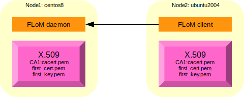

# Channel Encryption Debugging
This debug session uses two different nodes; these are the names used during all the session:

* node1, name: *ubuntu1004.brenta.org*, operating system: Ubuntu Linux 10.04 (64 bit)
* node2, name: *ubuntu2004.brenta.org*, operating system: Ubuntu Linux 20.04 (64 bit)

## Native FLoM debugging tool
Sometimes debugging becomes difficult, especially when you have to deal with networks, firewalls, public and private addresses and so on.   
For some complex features, FLoM provide a native debugging tool that can help the system engineer in understanding the root cause of an issue.

## Setting up the certification authority and the required certificates

### Creating a CA (Certification Authority) of name *CA1*
Connect to node1, and execute these commands to create the directory structure:

~~~
tiian@ubuntu1004:~$ mkdir flom_ssl
tiian@ubuntu1004:~$ cd flom_ssl
tiian@ubuntu1004:~/flom_ssl$ mkdir CA1
tiian@ubuntu1004:~/flom_ssl$ cd CA1
tiian@ubuntu1004:~/flom_ssl/CA1$ mkdir certs crl newcerts private
tiian@ubuntu1004:~/flom_ssl/CA1$ echo "01" > serial
tiian@ubuntu1004:~/flom_ssl/CA1$ cp /dev/null index.txt
tiian@ubuntu1004:~/flom_ssl/CA1$ ls -la
total 28
drwxr-xr-x 6 tiian tiian 4096 2020-11-14 12:04 .
drwxr-xr-x 3 tiian tiian 4096 2020-11-14 12:04 ..
drwxr-xr-x 2 tiian tiian 4096 2020-11-14 12:04 certs
drwxr-xr-x 2 tiian tiian 4096 2020-11-14 12:04 crl
-rw-r--r-- 1 tiian tiian    0 2020-11-14 12:04 index.txt
drwxr-xr-x 2 tiian tiian 4096 2020-11-14 12:04 newcerts
drwxr-xr-x 2 tiian tiian 4096 2020-11-14 12:04 private
-rw-r--r-- 1 tiian tiian    3 2020-11-14 12:04 serial
~~~

Pick-up a *openssl.cnf* example file; FLoM provide a pre-configured file in directory */usr/local/share/doc/flom/*:

~~~
tiian@ubuntu1004:~/flom_ssl/CA1$ ls -la /usr/local/share/doc/flom/flom_openssl.conf 
-rw-r--r-- 1 root root 9433 2020-11-13 21:39 /usr/local/share/doc/flom/flom_openssl.conf
~~~

copy it locally:

~~~
tiian@ubuntu1004:~/flom_ssl/CA1$ cp /usr/local/share/doc/flom/flom_openssl.conf .
~~~

Generate the certificate for the CA, use a secret password and pass something
like "CA for FLoM Channel Encryption" for the Common Name:

~~~
tiian@ubuntu1004:~/flom_ssl/CA1$ openssl req -new -x509 -keyout private/cakey.pem -out cacert.pem -days 3650 -config flom_openssl.conf 
Generating a 2048 bit RSA private key
...............................................................................................+++
................................................+++
writing new private key to 'private/cakey.pem'
Enter PEM pass phrase:
Verifying - Enter PEM pass phrase:
-----
You are about to be asked to enter information that will be incorporated
into your certificate request.
What you are about to enter is what is called a Distinguished Name or a DN.
There are quite a few fields but you can leave some blank
For some fields there will be a default value,
If you enter '.', the field will be left blank.
-----
Country Name (2 letter code) [IT]:
State or Province Name (full name) [Treviso]:
Locality Name (eg, city) [Mogliano Veneto]:
Organization Name (eg, company) [www.tiian.org]:
Organizational Unit Name (eg, section) [FLoM Project]:
Common Name (eg, YOUR name) []:CA for FLoM Channel Encryption
Email Address []:
~~~

File *cacert.pem* contains the **X.509 certificate** of the certification authority you have just created and file *private/cakey.pem* contains the **private key** associated to the certification authority.

~~~
tiian@ubuntu1004:~/flom_ssl/CA1$ ls -la cacert.pem private/cakey.pem 
-rw-r--r-- 1 tiian tiian 1667 2020-11-14 12:15 cacert.pem
-rw-r--r-- 1 tiian tiian 1743 2020-11-14 12:15 private/cakey.pem
~~~

### Creating a first X.509 certificate ###
To implement a *channel encryption* configuration just one certificate is enough.

Now you have to execute 4 commands; reply with the password used before when the system asks for it, pass something like "Generic FLoM node" for the Common Name:

~~~
tiian@ubuntu1004:~/flom_ssl/CA1$ openssl req -nodes -new -x509 -keyout first_key.pem -out first_req.pem -days 3650 -config flom_openssl.conf
tiian@ubuntu1004:~/flom_ssl/CA1$ openssl x509 -x509toreq -in first_req.pem -signkey first_key.pem -out tmp.pem
tiian@ubuntu1004:~/flom_ssl/CA1$ openssl ca -config flom_openssl.conf -policy policy_anything -out first_cert.pem -infiles tmp.pem
tiian@ubuntu1004:~/flom_ssl/CA1$ rm tmp.pem
~~~

The output should be something like this:

~~~
tiian@ubuntu1004:~/flom_ssl/CA1$ openssl req -nodes -new -x509 -keyout first_key.pem -out first_req.pem -days 3650 -config flom_openssl.conf
Generating a 2048 bit RSA private key
................................................+++
.............................................................................................................+++
writing new private key to 'first_key.pem'
-----
You are about to be asked to enter information that will be incorporated
into your certificate request.
What you are about to enter is what is called a Distinguished Name or a DN.
There are quite a few fields but you can leave some blank
For some fields there will be a default value,
If you enter '.', the field will be left blank.
-----
Country Name (2 letter code) [IT]:
State or Province Name (full name) [Treviso]:
Locality Name (eg, city) [Mogliano Veneto]:
Organization Name (eg, company) [www.tiian.org]:
Organizational Unit Name (eg, section) [FLoM Project]:
Common Name (eg, YOUR name) []:Generic FLoM node
Email Address []:
tiian@ubuntu1004:~/flom_ssl/CA1$ openssl x509 -x509toreq -in first_req.pem -signkey first_key.pem -out tmp.pem
Getting request Private Key
Generating certificate request
tiian@ubuntu1004:~/flom_ssl/CA1$ openssl ca -config flom_openssl.conf -policy policy_anything -out first_cert.pem -infiles tmp.pem
Using configuration from flom_openssl.conf
Enter pass phrase for ./private/cakey.pem:
Check that the request matches the signature
Signature ok
Certificate Details:
        Serial Number: 1 (0x1)
        Validity
            Not Before: Nov 14 11:23:35 2020 GMT
            Not After : Nov 14 11:23:35 2021 GMT
        Subject:
            countryName               = IT
            stateOrProvinceName       = Treviso
            localityName              = Mogliano Veneto
            organizationName          = www.tiian.org
            organizationalUnitName    = FLoM Project
            commonName                = Generic FLoM node
        X509v3 extensions:
            X509v3 Basic Constraints: 
                CA:FALSE
            Netscape Comment: 
                OpenSSL Generated Certificate
            X509v3 Subject Key Identifier: 
                6C:DB:B3:80:DD:3A:CB:56:A0:F9:BF:36:30:04:D3:AB:22:11:1E:65
            X509v3 Authority Key Identifier: 
                keyid:E1:6A:F2:1C:8F:A3:C9:B1:5E:6C:C5:A8:13:81:B9:31:FD:46:E1:97

Certificate is to be certified until Nov 14 11:23:35 2021 GMT (365 days)
Sign the certificate? [y/n]:y

1 out of 1 certificate requests certified, commit? [y/n]y
Write out database with 1 new entries
Data Base Updated
tiian@ubuntu1004:~/flom_ssl/CA1$ rm tmp.pem
~~~

Don't forget to remove the file "tmp.pem". If everything is fine, you must have two files: *first_cert.pem* contains the **X.509 certificate** for your FLoM node(s) and *first_key.pem* contains the **private key** associated to the certicate:

~~~
tiian@ubuntu1004:~/flom_ssl/CA1$ ls -la first_cert.pem first_key.pem 
-rw-r--r-- 1 tiian tiian 4655 2020-11-14 12:23 first_cert.pem
-rw-r--r-- 1 tiian tiian 1675 2020-11-14 12:23 first_key.pem
~~~

### Certificate *"installation"* ###
Only 3 files are needed to FLoM process (*flom*):

* *first_cert.pem*
* *first_key.pem*
* *cacert.pem*

copy them in a *easy to use place* on both systems.
Local copy:

~~~
tiian@ubuntu1004:~/flom_ssl/CA1$ mkdir /tmp/flom_ssl
tiian@ubuntu1004:~/flom_ssl/CA1$ cp cacert.pem first_cert.pem first_key.pem /tmp/flom_ssl/
tiian@ubuntu1004:~/flom_ssl/CA1$ ls -la /tmp/flom_ssl/
total 24
drwxr-xr-x 2 tiian tiian 4096 2020-11-14 12:27 .
drwxrwxrwt 6 root  root  4096 2020-11-14 12:27 ..
-rw-r--r-- 1 tiian tiian 1667 2020-11-14 12:27 cacert.pem
-rw-r--r-- 1 tiian tiian 4655 2020-11-14 12:27 first_cert.pem
-rw-r--r-- 1 tiian tiian 1675 2020-11-14 12:27 first_key.pem
~~~

Remote copy:

~~~
tiian@ubuntu1004:~/flom_ssl/CA1$ scp -r /tmp/flom_ssl/ tiian@ubuntu2004.brenta.org:/tmp
Enter passphrase for key '/home/tiian/.ssh/id_rsa': 
first_cert.pem                                100% 4655     4.6KB/s   00:00    
cacert.pem                                    100% 1667     1.6KB/s   00:00    
first_key.pem                                 100% 1675     1.6KB/s   00:00    
~~~

Check the content in node2:

~~~
tiian@ubuntu2004:~$ ls -la /tmp/flom_ssl/
total 24
drwxr-xr-x  2 tiian tiian 4096 Nov 14 12:29 .
drwxrwxrwt 14 root  root  4096 Nov 14 12:29 ..
-rw-r--r--  1 tiian tiian 1667 Nov 14 12:29 cacert.pem
-rw-r--r--  1 tiian tiian 4655 Nov 14 12:29 first_cert.pem
-rw-r--r--  1 tiian tiian 1675 Nov 14 12:29 first_key.pem
~~~

### Debugging TLS (channel encryption security level) with FLoM

The picture shows the debug scenario:

Setting a *trace mask* to trace the messages produced by *flom_tls* and *flom_debug* modules can help to troubleshoot a possible issue.

These are the commands to activate tracing and start a FLoM debug server using TLS inside node1:

~~~
tiian@ubuntu1004:~$ export FLOM_TRACE_MASK=0x300000
tiian@ubuntu1004:~$ echo $FLOM_TRACE_MASK
0x300000
tiian@ubuntu1004:~$ flom --debug-feature=tls.server -a ubuntu1004.brenta.org --tls-certificate=/tmp/flom_ssl/first_cert.pem --tls-private-key=/tmp/flom_ssl/first_key.pem --tls-ca-certificate=/tmp/flom_ssl/cacert.pem --tls-check-peer-id=no
~~~

These are the commands to activate tracing and to start a FLoM debug client using TLS inside node2:

~~~
tiian@ubuntu2004:~$ export FLOM_TRACE_MASK=0x300000
tiian@ubuntu2004:~$ echo $FLOM_TRACE_MASK
0x270000
tiian@ubuntu2004:~$ flom --debug-feature=tls.client -a ubuntu1004.brenta.org --tls-certificate=/tmp/flom_ssl/first_cert.pem --tls-private-key=/tmp/flom_ssl/first_key.pem --tls-ca-certificate=/tmp/flom_ssl/cacert.pem --tls-check-peer-id=no
~~~

This is the output obtained on node1 (debug server):

~~~
2020-11-14 21:26:35.082056 [1254/0x1ced540] flom_debug_features
2020-11-14 21:26:35.082105 [1254/0x1ced540] flom_debug_features: name='tls.server'
2020-11-14 21:26:35.082110 [1254/0x1ced540] flom_debug_features_tls_server
2020-11-14 21:26:35.082122 [1254/0x1ced540] flom_tls_init: calling SSL_library_init()...
2020-11-14 21:26:35.082170 [1254/0x1ced540] flom_tls_init: calling SSL_load_error_strings()...
2020-11-14 21:26:35.082497 [1254/0x1ced540] flom_tls_init: calling OpenSSL_add_all_algorithms()...
2020-11-14 21:26:35.082549 [1254/0x1ced540] flom_tls_context
2020-11-14 21:26:35.082554 [1254/0x1ced540] flom_tls_context: setting TLS/SSL method to TLSv1_server_method()
2020-11-14 21:26:35.082681 [1254/0x1ced540] flom_tls_context: SSL_CTX_set_verify(0x1d18b90, 3, flom_tls_callback)
2020-11-14 21:26:35.082692 [1254/0x1ced540] flom_tls_context/excp=2/ret_cod=0/errno=2
2020-11-14 21:26:35.082696 [1254/0x1ced540] flom_tls_set_cert
2020-11-14 21:26:35.082699 [1254/0x1ced540] flom_tls_set_cert: SSL_CTX_use_certificate_file(obj->ctx, '/tmp/flom_ssl/first_cert.pem', SSL_FILETYPE_PEM)
2020-11-14 21:26:35.082802 [1254/0x1ced540] flom_tls_set_cert: SSL_CTX_use_PrivateKey_file(obj->ctx, '/tmp/flom_ssl/first_key.pem', SSL_FILETYPE_PEM)
2020-11-14 21:26:35.082839 [1254/0x1ced540] flom_tls_set_cert: SSL_CTX_check_private_key(obj->ctx)
2020-11-14 21:26:35.082844 [1254/0x1ced540] flom_tls_set_cert: SSL_CTX_load_verify_locations(obj->ctx, '/tmp/flom_ssl/cacert.pem', NULL)
2020-11-14 21:26:35.082887 [1254/0x1ced540] flom_tls_set_cert/excp=4/ret_cod=0/errno=2
2020-11-14 21:27:04.563407 [1254/0x1ced540] flom_debug_features_tls_server: incoming connection address data: addrlen=16; IPv4 address, sin_port=53050, sin_addr='192.168.123.92'
2020-11-14 21:27:04.563446 [1254/0x1ced540] flom_tls_accept
2020-11-14 21:27:04.563450 [1254/0x1ced540] flom_tls_prepare
2020-11-14 21:27:04.563485 [1254/0x1ced540] flom_tls_prepare/excp=3/ret_cod=0/errno=22
2020-11-14 21:27:04.564085 [1254/0x1ced540] flom_tls_accept/SSL_accept: SSL error=1 (SSL_ERROR_SSL)
2020-11-14 21:27:04.564094 [1254/0x1ced540] flom_tls_accept/SSL_accept: error:1408F10B:SSL routines:SSL3_GET_RECORD:wrong version number
2020-11-14 21:27:04.564111 [1254/0x1ced540] flom_tls_accept/excp=1/ret_cod=-405/errno=0
2020-11-14 21:27:04.564146 [1254/0x1ced540] flom_debug_features_tls_server/excp=6/ret_cod=-405/errno=0
2020-11-14 21:27:04.564149 [1254/0x1ced540] flom_debug_features/excp=1/ret_cod=-405/errno=0
~~~

This is the output obtained on node2 (debug client):

~~~
2020-11-14 21:27:04.562478 [1172/0x55686eafc600] flom_debug_features
2020-11-14 21:27:04.562523 [1172/0x55686eafc600] flom_debug_features: name='tls.client'
2020-11-14 21:27:04.562527 [1172/0x55686eafc600] flom_debug_features_tls_client
2020-11-14 21:27:04.562532 [1172/0x55686eafc600] flom_tls_init: calling OPENSSL_init_ssl()...
2020-11-14 21:27:04.563365 [1172/0x55686eafc600] flom_tls_init: calling SSL_load_error_strings()...
2020-11-14 21:27:04.563458 [1172/0x55686eafc600] flom_tls_init: calling OpenSSL_add_all_algorithms()...
2020-11-14 21:27:04.563465 [1172/0x55686eafc600] flom_tls_context
2020-11-14 21:27:04.563467 [1172/0x55686eafc600] flom_tls_context: setting TLS/SSL method to TLS_client_method()
2020-11-14 21:27:04.563542 [1172/0x55686eafc600] flom_tls_context: SSL_CTX_set_verify(0x55686eb037d0, 1, flom_tls_callback)
2020-11-14 21:27:04.563547 [1172/0x55686eafc600] flom_tls_context/excp=2/ret_cod=0/errno=2
2020-11-14 21:27:04.563549 [1172/0x55686eafc600] flom_tls_set_cert
2020-11-14 21:27:04.563551 [1172/0x55686eafc600] flom_tls_set_cert: SSL_CTX_use_certificate_file(obj->ctx, '/tmp/flom_ssl/first_cert.pem', SSL_FILETYPE_PEM)
2020-11-14 21:27:04.563652 [1172/0x55686eafc600] flom_tls_set_cert: SSL_CTX_use_PrivateKey_file(obj->ctx, '/tmp/flom_ssl/first_key.pem', SSL_FILETYPE_PEM)
2020-11-14 21:27:04.563690 [1172/0x55686eafc600] flom_tls_set_cert: SSL_CTX_check_private_key(obj->ctx)
2020-11-14 21:27:04.563702 [1172/0x55686eafc600] flom_tls_set_cert: SSL_CTX_load_verify_locations(obj->ctx, '/tmp/flom_ssl/cacert.pem', NULL)
2020-11-14 21:27:04.563752 [1172/0x55686eafc600] flom_tls_set_cert/excp=4/ret_cod=0/errno=2
2020-11-14 21:27:04.565337 [1172/0x55686eafc600] flom_tls_connect
2020-11-14 21:27:04.565352 [1172/0x55686eafc600] flom_tls_prepare
2020-11-14 21:27:04.565387 [1172/0x55686eafc600] flom_tls_prepare/excp=3/ret_cod=0/errno=22
2020-11-14 21:27:04.566002 [1172/0x55686eafc600] flom_tls_connect/SSL_connect: SSL error=1 (SSL_ERROR_SSL)
2020-11-14 21:27:04.566015 [1172/0x55686eafc600] flom_tls_connect/SSL_connect: error:1425F102:SSL routines:ssl_choose_client_version:unsupported protocol
2020-11-14 21:27:04.566029 [1172/0x55686eafc600] flom_tls_connect/excp=1/ret_cod=-406/errno=0
2020-11-14 21:27:04.566058 [1172/0x55686eafc600] flom_debug_features_tls_client/excp=4/ret_cod=-406/errno=0
2020-11-14 21:27:04.566061 [1172/0x55686eafc600] flom_debug_features/excp=1/ret_cod=-406/errno=0
~~~

Ubuntu 10.04 uses an old version of the TLS protocol and it can't handshake with Ubuntu 20.04 (by default). Repeating the test using a couple of recent systems like CentOS 8.2 and Ubuntu 20.04, a different result is obtained.

The picture shows the new debug scenario:

### Certificate *"installation"* ###

Copy the 3 files both to CentOS 8.2 and to Ubuntu 20.04:

~~~
tiian@ubuntu1004:~/flom_ssl/CA1$ mkdir /tmp/flom_ssl
tiian@ubuntu1004:~/flom_ssl/CA1$ cp cacert.pem first_cert.pem first_key.pem /tmp/flom_ssl/
tiian@ubuntu1004:~/flom_ssl/CA1$ ls -la /tmp/flom_ssl/
total 24
drwxr-xr-x 2 tiian tiian 4096 2020-11-14 19:15 .
drwxrwxrwt 5 root  root  4096 2020-11-14 19:15 ..
-rw-r--r-- 1 tiian tiian 1667 2020-11-14 19:15 cacert.pem
-rw-r--r-- 1 tiian tiian 4655 2020-11-14 19:15 first_cert.pem
-rw-r--r-- 1 tiian tiian 1675 2020-11-14 19:15 first_key.pem
tiian@ubuntu1004:~/flom_ssl/CA1$ scp -r /tmp/flom_ssl/ tiian@centos8.brenta.org:/tmp
Enter passphrase for key '/home/tiian/.ssh/id_rsa': 
first_cert.pem                                100% 4655     4.6KB/s   00:00    
cacert.pem                                    100% 1667     1.6KB/s   00:00    
first_key.pem                                 100% 1675     1.6KB/s   00:00    
tiian@ubuntu1004:~/flom_ssl/CA1$ scp -r /tmp/flom_ssl/ tiian@ubuntu2004.brenta.org:/tmp
Enter passphrase for key '/home/tiian/.ssh/id_rsa': 
first_cert.pem                                100% 4655     4.6KB/s   00:00    
cacert.pem                                    100% 1667     1.6KB/s   00:00    
first_key.pem                                 100% 1675     1.6KB/s   00:00    
~~~

Activate a debug TLS server in the first node (CentOS 8.2):

~~~
[tiian@centos8 ~]$ export FLOM_TRACE_MASK=0x300000
[tiian@centos8 ~]$ echo $FLOM_TRACE_MASK
0x300000
[tiian@centos8 ~]$ flom --debug-feature=tls.server -a centos8.brenta.org --tls-certificate=/tmp/flom_ssl/first_cert.pem --tls-private-key=/tmp/flom_ssl/first_key.pem --tls-ca-certificate=/tmp/flom_ssl/cacert.pem --tls-check-peer-id=no
2020-11-14 19:29:48.335478 [58709/0x14dfc00] flom_debug_features
2020-11-14 19:29:48.335525 [58709/0x14dfc00] flom_debug_features: name='tls.server'
2020-11-14 19:29:48.335529 [58709/0x14dfc00] flom_debug_features_tls_server
2020-11-14 19:29:48.335536 [58709/0x14dfc00] flom_tls_init: calling OPENSSL_init_ssl()...
2020-11-14 19:29:48.336621 [58709/0x14dfc00] flom_tls_init: calling SSL_load_error_strings()...
2020-11-14 19:29:48.336856 [58709/0x14dfc00] flom_tls_init: calling OpenSSL_add_all_algorithms()...
2020-11-14 19:29:48.336871 [58709/0x14dfc00] flom_tls_context
2020-11-14 19:29:48.336874 [58709/0x14dfc00] flom_tls_context: setting TLS/SSL method to TLS_server_method()
2020-11-14 19:29:48.337268 [58709/0x14dfc00] flom_tls_context: SSL_CTX_set_verify(0x14e6da0, 3, flom_tls_callback)
2020-11-14 19:29:48.337284 [58709/0x14dfc00] flom_tls_context/excp=2/ret_cod=0/errno=2
2020-11-14 19:29:48.337287 [58709/0x14dfc00] flom_tls_set_cert
2020-11-14 19:29:48.337290 [58709/0x14dfc00] flom_tls_set_cert: SSL_CTX_use_certificate_file(obj->ctx, '/tmp/flom_ssl/first_cert.pem', SSL_FILETYPE_PEM)
2020-11-14 19:29:48.337549 [58709/0x14dfc00] flom_tls_set_cert: SSL_CTX_use_PrivateKey_file(obj->ctx, '/tmp/flom_ssl/first_key.pem', SSL_FILETYPE_PEM)
2020-11-14 19:29:48.337602 [58709/0x14dfc00] flom_tls_set_cert: SSL_CTX_check_private_key(obj->ctx)
2020-11-14 19:29:48.337611 [58709/0x14dfc00] flom_tls_set_cert: SSL_CTX_load_verify_locations(obj->ctx, '/tmp/flom_ssl/cacert.pem', NULL)
2020-11-14 19:29:48.337950 [58709/0x14dfc00] flom_tls_set_cert/excp=4/ret_cod=0/errno=2
2020-11-14 19:30:02.306300 [58709/0x14dfc00] flom_debug_features_tls_server: incoming connection address data: addrlen=16; IPv4 address, sin_port=35308, sin_addr='192.168.123.92'
2020-11-14 19:30:02.306345 [58709/0x14dfc00] flom_tls_accept
2020-11-14 19:30:02.306352 [58709/0x14dfc00] flom_tls_prepare
2020-11-14 19:30:02.306408 [58709/0x14dfc00] flom_tls_prepare/excp=3/ret_cod=0/errno=22
2020-11-14 19:30:02.310324 [58709/0x14dfc00] flom_tls_callback: preverify_ok=1
2020-11-14 19:30:02.310341 [58709/0x14dfc00] flom_tls_callback: ret_cod=1
2020-11-14 19:30:02.310579 [58709/0x14dfc00] flom_tls_callback: preverify_ok=1
2020-11-14 19:30:02.310593 [58709/0x14dfc00] flom_tls_callback: ret_cod=1
2020-11-14 19:30:02.311028 [58709/0x14dfc00] flom_tls_accepted: connection accepted with TLS_AES_256_GCM_SHA384 encryption
2020-11-14 19:30:02.311043 [58709/0x14dfc00] flom_tls_cert_parse
2020-11-14 19:30:02.311057 [58709/0x14dfc00] flom_tls_cert_struct_fill
2020-11-14 19:30:02.311066 [58709/0x14dfc00] flom_tls_cert_struct_fill/excp=7/ret_cod=0/errno=0
2020-11-14 19:30:02.311071 [58709/0x14dfc00] flom_tls_cert_struct_fill
2020-11-14 19:30:02.311075 [58709/0x14dfc00] flom_tls_cert_struct_fill/excp=7/ret_cod=0/errno=0
2020-11-14 19:30:02.311079 [58709/0x14dfc00] flom_tls_cert_struct_fill
2020-11-14 19:30:02.311083 [58709/0x14dfc00] flom_tls_cert_struct_fill/excp=7/ret_cod=0/errno=0
2020-11-14 19:30:02.311089 [58709/0x14dfc00] flom_tls_cert_struct_fill
2020-11-14 19:30:02.311094 [58709/0x14dfc00] flom_tls_cert_struct_fill/excp=7/ret_cod=0/errno=0
2020-11-14 19:30:02.311101 [58709/0x14dfc00] flom_tls_cert_struct_fill
2020-11-14 19:30:02.311105 [58709/0x14dfc00] flom_tls_cert_struct_fill/excp=7/ret_cod=0/errno=0
2020-11-14 19:30:02.311358 [58709/0x14dfc00] flom_tls_cert_struct_fill
2020-11-14 19:30:02.311365 [58709/0x14dfc00] flom_tls_cert_struct_fill/excp=7/ret_cod=0/errno=0
2020-11-14 19:30:02.311371 [58709/0x14dfc00] flom_tls_cert_parse: issuer fields are C=IT/ST=Treviso/L=Mogliano Veneto/O=www.tiian.org/OU=FLoM Project/emailAddress={null}/CN=CA for FLoM Channel Encryption
2020-11-14 19:30:02.311682 [58709/0x14dfc00] flom_tls_cert_struct_fill
2020-11-14 19:30:02.311698 [58709/0x14dfc00] flom_tls_cert_struct_fill/excp=7/ret_cod=0/errno=0
2020-11-14 19:30:02.311701 [58709/0x14dfc00] flom_tls_cert_struct_fill
2020-11-14 19:30:02.311704 [58709/0x14dfc00] flom_tls_cert_struct_fill/excp=7/ret_cod=0/errno=0
2020-11-14 19:30:02.311706 [58709/0x14dfc00] flom_tls_cert_struct_fill
2020-11-14 19:30:02.311709 [58709/0x14dfc00] flom_tls_cert_struct_fill/excp=7/ret_cod=0/errno=0
2020-11-14 19:30:02.311714 [58709/0x14dfc00] flom_tls_cert_struct_fill
2020-11-14 19:30:02.311716 [58709/0x14dfc00] flom_tls_cert_struct_fill/excp=7/ret_cod=0/errno=0
2020-11-14 19:30:02.311718 [58709/0x14dfc00] flom_tls_cert_struct_fill
2020-11-14 19:30:02.311721 [58709/0x14dfc00] flom_tls_cert_struct_fill/excp=7/ret_cod=0/errno=0
2020-11-14 19:30:02.311723 [58709/0x14dfc00] flom_tls_cert_struct_fill
2020-11-14 19:30:02.311725 [58709/0x14dfc00] flom_tls_cert_struct_fill/excp=7/ret_cod=0/errno=0
2020-11-14 19:30:02.311728 [58709/0x14dfc00] flom_tls_cert_parse: subject fields are C=IT/ST=Treviso/L=Mogliano Veneto/O=www.tiian.org/OU=FLoM Project/emailAddress={null}/CN=Generic FLoM node
2020-11-14 19:30:02.311743 [58709/0x14dfc00] flom_tls_cert_parse/excp=4/ret_cod=0/errno=0
2020-11-14 19:30:02.311746 [58709/0x14dfc00] flom_tls_accept/excp=3/ret_cod=0/errno=0
2020-11-14 19:30:02.311750 [58709/0x14dfc00] flom_tls_recv_msg
2020-11-14 19:30:02.311753 [58709/0x14dfc00] flom_tls_recv_msg: closing_tag='</msg>', closing_tag_len=6, closing_tag_last='>'
2020-11-14 19:30:02.311766 [58709/0x14dfc00] flom_tls_recv_msg: read_bytes=6 'aa0025'
2020-11-14 19:30:02.311906 [58709/0x14dfc00] flom_tls_recv_msg: read_bytes=6 '217cc2'
2020-11-14 19:30:02.311914 [58709/0x14dfc00] flom_tls_recv_msg: read_bytes=6 '4efb98'
2020-11-14 19:30:02.311917 [58709/0x14dfc00] flom_tls_recv_msg: read_bytes=6 '3dff5b'
2020-11-14 19:30:02.311919 [58709/0x14dfc00] flom_tls_recv_msg: read_bytes=6 'fb3611'
2020-11-14 19:30:02.311922 [58709/0x14dfc00] flom_tls_recv_msg: read_bytes=2 '29'
2020-11-14 19:30:02.311932 [58709/0x14dfc00] flom_tls_recv_msg: read_bytes=6 '</msg>'
2020-11-14 19:30:02.311935 [58709/0x14dfc00] flom_tls_recv_msg: received message is 'aa0025217cc24efb983dff5bfb361129</msg>' of 38 chars
2020-11-14 19:30:02.311937 [58709/0x14dfc00] flom_tls_recv_msg/excp=3/ret_cod=0/errno=0
2020-11-14 19:30:02.311940 [58709/0x14dfc00] flom_debug_features_tls_server: received 38 bytes, 'aa0025217cc24efb983dff5bfb361129</msg>'
2020-11-14 19:30:02.312001 [58709/0x14dfc00] flom_debug_features_tls_server: sending 32 bytes, 'b4eae148592d4d128df8f76987b9ac08'
2020-11-14 19:30:02.312007 [58709/0x14dfc00] flom_tls_send
2020-11-14 19:30:02.312075 [58709/0x14dfc00] flom_tls_send/excp=2/ret_cod=0/errno=0
2020-11-14 19:30:02.312083 [58709/0x14dfc00] flom_debug_features_tls_server: sending 6 bytes, '</msg>'
2020-11-14 19:30:02.312087 [58709/0x14dfc00] flom_tls_send
2020-11-14 19:30:02.312096 [58709/0x14dfc00] flom_tls_send/excp=2/ret_cod=0/errno=0
2020-11-14 19:30:02.312300 [58709/0x14dfc00] flom_debug_features_tls_server/excp=15/ret_cod=0/errno=0
2020-11-14 19:30:02.312311 [58709/0x14dfc00] flom_debug_features/excp=1/ret_cod=0/errno=0
~~~

Activate a debug TLS client in the second node (Ubuntu 20.04):

~~~
tiian@ubuntu2004:~/flom$ export FLOM_TRACE_MASK=0x300000
tiian@ubuntu2004:~/flom$ echo $FLOM_TRACE_MASK
0x300000
tiian@ubuntu2004:~/flom$ flom --debug-feature=tls.client -a centos8.brenta.org --tls-certificate=/tmp/flom_ssl/first_cert.pem --tls-private-key=/tmp/flom_ssl/first_key.pem --tls-ca-certificate=/tmp/flom_ssl/cacert.pem --tls-check-peer-id=no
2020-11-14 19:30:02.307742 [1348/0x561122ac9600] flom_debug_features
2020-11-14 19:30:02.307831 [1348/0x561122ac9600] flom_debug_features: name='tls.client'
2020-11-14 19:30:02.307847 [1348/0x561122ac9600] flom_debug_features_tls_client
2020-11-14 19:30:02.307864 [1348/0x561122ac9600] flom_tls_init: calling OPENSSL_init_ssl()...
2020-11-14 19:30:02.309783 [1348/0x561122ac9600] flom_tls_init: calling SSL_load_error_strings()...
2020-11-14 19:30:02.310013 [1348/0x561122ac9600] flom_tls_init: calling OpenSSL_add_all_algorithms()...
2020-11-14 19:30:02.310038 [1348/0x561122ac9600] flom_tls_context
2020-11-14 19:30:02.310058 [1348/0x561122ac9600] flom_tls_context: setting TLS/SSL method to TLS_client_method()
2020-11-14 19:30:02.310252 [1348/0x561122ac9600] flom_tls_context: SSL_CTX_set_verify(0x561122ad0710, 1, flom_tls_callback)
2020-11-14 19:30:02.310276 [1348/0x561122ac9600] flom_tls_context/excp=2/ret_cod=0/errno=2
2020-11-14 19:30:02.310288 [1348/0x561122ac9600] flom_tls_set_cert
2020-11-14 19:30:02.310299 [1348/0x561122ac9600] flom_tls_set_cert: SSL_CTX_use_certificate_file(obj->ctx, '/tmp/flom_ssl/first_cert.pem', SSL_FILETYPE_PEM)
2020-11-14 19:30:02.310540 [1348/0x561122ac9600] flom_tls_set_cert: SSL_CTX_use_PrivateKey_file(obj->ctx, '/tmp/flom_ssl/first_key.pem', SSL_FILETYPE_PEM)
2020-11-14 19:30:02.310623 [1348/0x561122ac9600] flom_tls_set_cert: SSL_CTX_check_private_key(obj->ctx)
2020-11-14 19:30:02.310647 [1348/0x561122ac9600] flom_tls_set_cert: SSL_CTX_load_verify_locations(obj->ctx, '/tmp/flom_ssl/cacert.pem', NULL)
2020-11-14 19:30:02.310804 [1348/0x561122ac9600] flom_tls_set_cert/excp=4/ret_cod=0/errno=2
2020-11-14 19:30:02.312219 [1348/0x561122ac9600] flom_tls_connect
2020-11-14 19:30:02.312235 [1348/0x561122ac9600] flom_tls_prepare
2020-11-14 19:30:02.312259 [1348/0x561122ac9600] flom_tls_prepare/excp=3/ret_cod=0/errno=22
2020-11-14 19:30:02.314662 [1348/0x561122ac9600] flom_tls_callback: preverify_ok=1
2020-11-14 19:30:02.314685 [1348/0x561122ac9600] flom_tls_callback: ret_cod=1
2020-11-14 19:30:02.314747 [1348/0x561122ac9600] flom_tls_callback: preverify_ok=1
2020-11-14 19:30:02.314755 [1348/0x561122ac9600] flom_tls_callback: ret_cod=1
2020-11-14 19:30:02.316070 [1348/0x561122ac9600] flom_tls_connect: connection established with TLS_AES_256_GCM_SHA384 encryption
2020-11-14 19:30:02.316087 [1348/0x561122ac9600] flom_tls_cert_parse
2020-11-14 19:30:02.316101 [1348/0x561122ac9600] flom_tls_cert_struct_fill
2020-11-14 19:30:02.316107 [1348/0x561122ac9600] flom_tls_cert_struct_fill/excp=7/ret_cod=0/errno=0
2020-11-14 19:30:02.316113 [1348/0x561122ac9600] flom_tls_cert_struct_fill
2020-11-14 19:30:02.316118 [1348/0x561122ac9600] flom_tls_cert_struct_fill/excp=7/ret_cod=0/errno=0
2020-11-14 19:30:02.316123 [1348/0x561122ac9600] flom_tls_cert_struct_fill
2020-11-14 19:30:02.316128 [1348/0x561122ac9600] flom_tls_cert_struct_fill/excp=7/ret_cod=0/errno=0
2020-11-14 19:30:02.316133 [1348/0x561122ac9600] flom_tls_cert_struct_fill
2020-11-14 19:30:02.316138 [1348/0x561122ac9600] flom_tls_cert_struct_fill/excp=7/ret_cod=0/errno=0
2020-11-14 19:30:02.316143 [1348/0x561122ac9600] flom_tls_cert_struct_fill
2020-11-14 19:30:02.316148 [1348/0x561122ac9600] flom_tls_cert_struct_fill/excp=7/ret_cod=0/errno=0
2020-11-14 19:30:02.316153 [1348/0x561122ac9600] flom_tls_cert_struct_fill
2020-11-14 19:30:02.316158 [1348/0x561122ac9600] flom_tls_cert_struct_fill/excp=7/ret_cod=0/errno=0
2020-11-14 19:30:02.316163 [1348/0x561122ac9600] flom_tls_cert_parse: issuer fields are C=IT/ST=Treviso/L=Mogliano Veneto/O=www.tiian.org/OU=FLoM Project/emailAddress={null}/CN=CA for FLoM Channel Encryption
2020-11-14 19:30:02.316204 [1348/0x561122ac9600] flom_tls_cert_struct_fill
2020-11-14 19:30:02.316216 [1348/0x561122ac9600] flom_tls_cert_struct_fill/excp=7/ret_cod=0/errno=0
2020-11-14 19:30:02.316223 [1348/0x561122ac9600] flom_tls_cert_struct_fill
2020-11-14 19:30:02.316228 [1348/0x561122ac9600] flom_tls_cert_struct_fill/excp=7/ret_cod=0/errno=0
2020-11-14 19:30:02.316233 [1348/0x561122ac9600] flom_tls_cert_struct_fill
2020-11-14 19:30:02.316238 [1348/0x561122ac9600] flom_tls_cert_struct_fill/excp=7/ret_cod=0/errno=0
2020-11-14 19:30:02.316243 [1348/0x561122ac9600] flom_tls_cert_struct_fill
2020-11-14 19:30:02.316248 [1348/0x561122ac9600] flom_tls_cert_struct_fill/excp=7/ret_cod=0/errno=0
2020-11-14 19:30:02.316253 [1348/0x561122ac9600] flom_tls_cert_struct_fill
2020-11-14 19:30:02.316258 [1348/0x561122ac9600] flom_tls_cert_struct_fill/excp=7/ret_cod=0/errno=0
2020-11-14 19:30:02.316262 [1348/0x561122ac9600] flom_tls_cert_struct_fill
2020-11-14 19:30:02.316267 [1348/0x561122ac9600] flom_tls_cert_struct_fill/excp=7/ret_cod=0/errno=0
2020-11-14 19:30:02.316272 [1348/0x561122ac9600] flom_tls_cert_parse: subject fields are C=IT/ST=Treviso/L=Mogliano Veneto/O=www.tiian.org/OU=FLoM Project/emailAddress={null}/CN=Generic FLoM node
2020-11-14 19:30:02.316285 [1348/0x561122ac9600] flom_tls_cert_parse/excp=4/ret_cod=0/errno=0
2020-11-14 19:30:02.316291 [1348/0x561122ac9600] flom_tls_connect/excp=3/ret_cod=0/errno=0
2020-11-14 19:30:02.316327 [1348/0x561122ac9600] flom_debug_features_tls_client: sending 32 bytes, 'aa0025217cc24efb983dff5bfb361129'
2020-11-14 19:30:02.316336 [1348/0x561122ac9600] flom_tls_send
2020-11-14 19:30:02.316374 [1348/0x561122ac9600] flom_tls_send/excp=2/ret_cod=0/errno=0
2020-11-14 19:30:02.316384 [1348/0x561122ac9600] flom_debug_features_tls_client: sending 6 bytes, '</msg>'
2020-11-14 19:30:02.316389 [1348/0x561122ac9600] flom_tls_send
2020-11-14 19:30:02.316398 [1348/0x561122ac9600] flom_tls_send/excp=2/ret_cod=0/errno=0
2020-11-14 19:30:02.316405 [1348/0x561122ac9600] flom_tls_recv_msg
2020-11-14 19:30:02.316410 [1348/0x561122ac9600] flom_tls_recv_msg: closing_tag='</msg>', closing_tag_len=6, closing_tag_last='>'
2020-11-14 19:30:02.318252 [1348/0x561122ac9600] flom_tls_recv_msg: read_bytes=6 'b4eae1'
2020-11-14 19:30:02.318400 [1348/0x561122ac9600] flom_tls_recv_msg: read_bytes=6 '48592d'
2020-11-14 19:30:02.318526 [1348/0x561122ac9600] flom_tls_recv_msg: read_bytes=6 '4d128d'
2020-11-14 19:30:02.318631 [1348/0x561122ac9600] flom_tls_recv_msg: read_bytes=6 'f8f769'
2020-11-14 19:30:02.318688 [1348/0x561122ac9600] flom_tls_recv_msg: read_bytes=6 '87b9ac'
2020-11-14 19:30:02.318782 [1348/0x561122ac9600] flom_tls_recv_msg: read_bytes=2 '08'
2020-11-14 19:30:02.318839 [1348/0x561122ac9600] flom_tls_recv_msg: read_bytes=6 '</msg>'
2020-11-14 19:30:02.319046 [1348/0x561122ac9600] flom_tls_recv_msg: received message is 'b4eae148592d4d128df8f76987b9ac08</msg>' of 38 chars
2020-11-14 19:30:02.319142 [1348/0x561122ac9600] flom_tls_recv_msg/excp=3/ret_cod=0/errno=0
2020-11-14 19:30:02.319274 [1348/0x561122ac9600] flom_debug_features_tls_client: received 38 bytes, 'b4eae148592d4d128df8f76987b9ac08</msg>'
2020-11-14 19:30:02.319600 [1348/0x561122ac9600] flom_debug_features_tls_client/excp=12/ret_cod=0/errno=0
2020-11-14 19:30:02.319718 [1348/0x561122ac9600] flom_debug_features/excp=1/ret_cod=0/errno=0
~~~

#### The key messages are the following ones:

The debug client send its unique ID:
~~~
2020-11-14 19:30:02.316327 [1348/0x561122ac9600] flom_debug_features_tls_client: sending 32 bytes, 'aa0025217cc24efb983dff5bfb361129'
~~~

the debug server receives the unique ID sent by the debug client and replies with its own unique ID:

~~~
2020-11-14 19:30:02.311940 [58709/0x14dfc00] flom_debug_features_tls_server: received 38 bytes, 'aa0025217cc24efb983dff5bfb361129</msg>'
2020-11-14 19:30:02.312001 [58709/0x14dfc00] flom_debug_features_tls_server: sending 32 bytes, 'b4eae148592d4d128df8f76987b9ac08'
~~~

the debug client receives the unique ID sent by the debug server:

~~~
2020-11-14 19:30:02.319274 [1348/0x561122ac9600] flom_debug_features_tls_client: received 38 bytes, 'b4eae148592d4d128df8f76987b9ac08</msg>'
~~~

Remove *trace mask* , then restart the debug server on node1:

~~~
[tiian@centos8 ~]$ unset FLOM_TRACE_MASK
[tiian@centos8 ~]$ flom --debug-feature=tls.server -a centos8.brenta.org --tls-certificate=/tmp/flom_ssl/first_cert.pem --tls-private-key=/tmp/flom_ssl/first_key.pem --tls-ca-certificate=/tmp/flom_ssl/cacert.pem --tls-check-peer-id=no
[tiian@centos8 ~]$ echo $?
0
~~~

Remove *trace mask*, then restart the debug client on node2:

~~~
tiian@ubuntu2004:~/flom$ unset FLOM_TRACE_MASK
tiian@ubuntu2004:~/flom$ flom --debug-feature=tls.client -a centos8.brenta.org --tls-certificate=/tmp/flom_ssl/first_cert.pem --tls-private-key=/tmp/flom_ssl/first_key.pem --tls-ca-certificate=/tmp/flom_ssl/cacert.pem --tls-check-peer-id=no
tiian@ubuntu2004:~/flom$ echo $?
0
~~~

When everything is fine, no messages on the terminal are printed and the exit code of the *flom* command is 0.

### Configuration hints
A more convenient way to setup all the TLS parameters is to use a FLoM [configuration](../Configuration.md) file: these are the keys you have to customize:

~~~
[TLS]
# Name of the file that contains the X.509 certificate assigned to this peer
# (Uncomment below row if necessary)
#TlsCertificate=cert.pem
# Name of the file that contains the private key of this peer
# (Uncomment below row if necessary)
#TlsPrivateKey=priv_key.pem
# Name of the file that contains the X.509 certificate of the certification
# authority used to sign the certificate of this peer
# (Uncomment below row if necessary)
#TlsCaCertificate=ca_cert.pem
# Check if the CommonName (CN) of the peer certificate matches the peer unique
# identifier; valid values are "yes" and "no" (case insensitive)
# (Uncomment below row if necessary)
#TlsCheckPeerId=yes
~~~

### System message logging

Both client and server write logging messages on the system log.

On the server side (*node1*):

~~~
[tiian@centos8 ~]$ sudo tail /var/log/messages
Nov 14 19:33:59 centos8 flom[58719]: FLM011I X.509 CA certificate fields are C=IT/ST=Treviso/L=Mogliano Veneto/O=www.tiian.org/OU=FLoM Project/emailAddress={null}/CN=CA for FLoM Channel Encryption
Nov 14 19:33:59 centos8 flom[58719]: FLM012I X.509 peer certificate fields are C=IT/ST=Treviso/L=Mogliano Veneto/O=www.tiian.org/OU=FLoM Project/emailAddress={null}/CN=Generic FLoM node
~~~

On the client side (*node2*), these are the corresponding messages:

~~~
tiian@ubuntu2004:~/flom$ sudo tail /var/log/syslog
Nov 14 19:33:59 ubuntu2004 flom: FLM011I X.509 CA certificate fields are C=IT/ST=Treviso/L=Mogliano Veneto/O=www.tiian.org/OU=FLoM Project/emailAddress={null}/CN=CA for FLoM Channel Encryption
Nov 14 19:33:59 ubuntu2004 flom: FLM012I X.509 peer certificate fields are C=IT/ST=Treviso/L=Mogliano Veneto/O=www.tiian.org/OU=FLoM Project/emailAddress={null}/CN=Generic FLoM node
~~~

