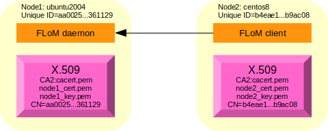

# Mutual Authentication Debug
This debug session uses two different nodes; these are the names used during all the session:

* node1, name: *ubuntu2004.brenta.org*, operating system: Ubuntu Linux 20.04 (64 bit)
* node2, name: *centos8.brenta.org*, operating system: CentOS 8.2 (64 bit)

It is suggested to try [Channel Encryption Debug](Channel_Encryption_Debug.md) before proceeding with this more complex one.

## Native FLoM debugging tool

Sometimes debugging becomes difficult, especially when you have to deal with networks, firewalls, public and private addresses and so on.   
For some complex features, FLoM provide a native debugging tool that can help the system engineer in understanding the root cause of an issue.

## Setting up the certification authority and the required certificates
The instructions that are shown below are sufficient for a basic TLS set-up, for more advanced configurations please refer to specific documentaion like for exampe [OpenSSL Certificate Authority](https://jamielinux.com/docs/openssl-certificate-authority/index.html).

### Creating a CA (Certification Authority) of name *CA2*
Connect to node1, and execute these commands to create the directory structure:

~~~
tiian@ubuntu2004:~$ mkdir -p flom_ssl/CA2
tiian@ubuntu2004:~$ cd flom_ssl/CA2/
tiian@ubuntu2004:~/flom_ssl/CA2$ mkdir certs crl newcerts private
tiian@ubuntu2004:~/flom_ssl/CA2$ echo "01" > serial
tiian@ubuntu2004:~/flom_ssl/CA2$ cp /dev/null index.txt
tiian@ubuntu2004:~/flom_ssl/CA2$ ls -la
total 28
drwxrwxr-x 6 tiian tiian 4096 Nov 14 21:39 .
drwxrwxr-x 3 tiian tiian 4096 Nov 14 21:38 ..
drwxrwxr-x 2 tiian tiian 4096 Nov 14 21:38 certs
drwxrwxr-x 2 tiian tiian 4096 Nov 14 21:38 crl
-rw-rw-r-- 1 tiian tiian    0 Nov 14 21:39 index.txt
drwxrwxr-x 2 tiian tiian 4096 Nov 14 21:38 newcerts
drwxrwxr-x 2 tiian tiian 4096 Nov 14 21:38 private
-rw-rw-r-- 1 tiian tiian    3 Nov 14 21:39 serial
~~~

Pick-up a *openssl.cnf* example file; FLoM provide a pre-configured file in directory */usr/local/share/doc/flom/*:

~~~
tiian@ubuntu2004:~/flom_ssl/CA2$ ls -la /usr/local/share/doc/flom/flom_openssl.conf
-rw-r--r-- 1 root root 9433 Nov 14 11:43 /usr/local/share/doc/flom/flom_openssl.conf
~~~

copy it locally:

~~~
tiian@ubuntu2004:~/flom_ssl/CA2$ cp /usr/local/share/doc/flom/flom_openssl.conf .
~~~

Generate the certificate for the CA, use a secret password and pass something like "CA for FLoM Mutual Authentication" for the Common Name:

~~~
tiian@ubuntu2004:~/flom_ssl/CA2$ openssl req -new -x509 -keyout private/cakey.pem -out cacert.pem -days 3650 -config flom_openssl.conf
Generating a RSA private key
........+++++
...............+++++
writing new private key to 'private/cakey.pem'
Enter PEM pass phrase:
Verifying - Enter PEM pass phrase:
-----
You are about to be asked to enter information that will be incorporated
into your certificate request.
What you are about to enter is what is called a Distinguished Name or a DN.
There are quite a few fields but you can leave some blank
For some fields there will be a default value,
If you enter '.', the field will be left blank.
-----
Country Name (2 letter code) [IT]:
State or Province Name (full name) [Treviso]:
Locality Name (eg, city) [Mogliano Veneto]:
Organization Name (eg, company) [www.tiian.org]:
Organizational Unit Name (eg, section) [FLoM Project]:
Common Name (eg, YOUR name) []:CA for FLoM Mutual Authentication
Email Address []:
~~~

File *cacert.pem* contains the **X.509 certificate** of the certification authority you have just created and file *private/cakey.pem* contains the **private key** associated to the certification authority.

~~~
tiian@ubuntu2004:~/flom_ssl/CA2$ ls -la cacert.pem private/cakey.pem
-rw-rw-r-- 1 tiian tiian 1712 Nov 14 21:44 cacert.pem
-rw------- 1 tiian tiian 1854 Nov 14 21:44 private/cakey.pem
~~~

### Creating the first X.509 certificate
To implement a *mutual authentication* configuration a distinct certificate for every node is necessary.

#### Retrieving node/system unique ID ####
FLoM generates unique IDs using [D-Bus](https://www.freedesktop.org/wiki/Software/dbus/).

Creating a unique ID with FLoM is like using the command *dbus-uuidgen \-\-get*:

~~~
tiian@ubuntu2004:~/flom_ssl/CA2$ flom --unique-id
aa0025217cc24efb983dff5bfb361129
~~~

From the above text, the **unique ID** of node1 is *aa0025217cc24efb983dff5bfb361129*.    
The *unique ID* must be passed to the *openssl* command when the *Common Name* associated to the certificate is asked.

Now you have to execute 4 commands:

* the *unique ID* must be passed to the first command
* the third command asks for a password: the same password used for the certification authority (see above).

~~~
tiian@ubuntu2004:~/flom_ssl/CA2$ openssl req -nodes -new -x509 -keyout node1_key.pem -out node1_req.pem -days 3650 -config flom_openssl.conf
tiian@ubuntu2004:~/flom_ssl/CA2$ openssl x509 -x509toreq -in node1_req.pem -signkey node1_key.pem -out tmp.pem
tiian@ubuntu2004:~/flom_ssl/CA2$ openssl ca -config flom_openssl.conf -policy policy_anything -out node1_cert.pem -infiles tmp.pem
tiian@ubuntu2004:~/flom_ssl/CA2$ rm tmp.pem
~~~

The output should be something like this:

~~~
tiian@ubuntu2004:~/flom_ssl/CA2$ openssl req -nodes -new -x509 -keyout node1_key.pem -out node1_req.pem -days 3650 -config flom_openssl.conf
Generating a RSA private key
................+++++
............+++++
writing new private key to 'node1_key.pem'
-----
You are about to be asked to enter information that will be incorporated
into your certificate request.
What you are about to enter is what is called a Distinguished Name or a DN.
There are quite a few fields but you can leave some blank
For some fields there will be a default value,
If you enter '.', the field will be left blank.
-----
Country Name (2 letter code) [IT]:
State or Province Name (full name) [Treviso]:
Locality Name (eg, city) [Mogliano Veneto]:
Organization Name (eg, company) [www.tiian.org]:
Organizational Unit Name (eg, section) [FLoM Project]:
Common Name (eg, YOUR name) []:aa0025217cc24efb983dff5bfb361129
Email Address []:

tiian@ubuntu2004:~/flom_ssl/CA2$ openssl x509 -x509toreq -in node1_req.pem -signkey node1_key.pem -out tmp.pem
Getting request Private Key
Generating certificate request

tiian@ubuntu2004:~/flom_ssl/CA2$ openssl ca -config flom_openssl.conf -policy policy_anything -out node1_cert.pem -infiles tmp.pem
Using configuration from flom_openssl.conf
Enter pass phrase for ./private/cakey.pem:
Check that the request matches the signature
Signature ok
Certificate Details:
        Serial Number: 1 (0x1)
        Validity
            Not Before: Nov 14 20:50:09 2020 GMT
            Not After : Nov 14 20:50:09 2021 GMT
        Subject:
            countryName               = IT
            stateOrProvinceName       = Treviso
            localityName              = Mogliano Veneto
            organizationName          = www.tiian.org
            organizationalUnitName    = FLoM Project
            commonName                = aa0025217cc24efb983dff5bfb361129
        X509v3 extensions:
            X509v3 Basic Constraints: 
                CA:FALSE
            Netscape Comment: 
                OpenSSL Generated Certificate
            X509v3 Subject Key Identifier: 
                D7:60:23:B6:0D:D2:AF:29:E6:18:1B:85:1A:7B:B9:CD:E5:54:E3:1E
            X509v3 Authority Key Identifier: 
                keyid:B5:CF:FF:8A:C1:F9:A5:37:47:CF:30:EB:2D:DD:56:EF:02:C3:60:AF

Certificate is to be certified until Nov 14 20:50:09 2021 GMT (365 days)
Sign the certificate? [y/n]:y

1 out of 1 certificate requests certified, commit? [y/n]y
Write out database with 1 new entries
Data Base Updated

tiian@ubuntu2004:~/flom_ssl/CA2$ rm tmp.pem 
~~~

If everything is fine, you must have two files: *node1_cert.pem* contains the **X.509 certificate** for *node1* (*ubuntu2004*) and *node1_key.pem* contains the **private key** associated to the certicate:

~~~
tiian@ubuntu2004:~/flom_ssl/CA2$ ls -la node1_cert.pem node1_key.pem
-rw-rw-r-- 1 tiian tiian 4706 Nov 14 21:50 node1_cert.pem
-rw------- 1 tiian tiian 1704 Nov 14 21:48 node1_key.pem
~~~

### Creating the second X.509 certificate
To implement a *mutual authentication* configuration a distinct certificate for every node is necessary.

Connect to *node2* and retrieve the *unique ID*:

~~~
[tiian@centos8 ~]$ flom --unique-id
b4eae148592d4d128df8f76987b9ac08
~~~

From the above text, the **unique ID** of node2 is *ib4eae148592d4d128df8f76987b9ac08*.   
The *unique ID* must be passed to the *openssl* command when the *Common Name* associated to the certificate is asked.

Connect to *node1* and execute the 4 commands you need to generate the certificate for *node2* (it's the same procedure already done for *node1*, but a different certificate for a different FLoM node will be created):

* the *unique ID* must be passed to the first command
* the third command asks for a password: the same password used for the certification authority (see above).

~~~
tiian@ubuntu2004:~/flom_ssl/CA2$ openssl req -nodes -new -x509 -keyout node2_key.pem -out node2_req.pem -days 3650 -config flom_openssl.conf
tiian@ubuntu2004:~/flom_ssl/CA2$ openssl x509 -x509toreq -in node2_req.pem -signkey node2_key.pem -out tmp.pem
tiian@ubuntu2004:~/flom_ssl/CA2$ openssl ca -config flom_openssl.conf -policy policy_anything -out node2_cert.pem -infiles tmp.pem
tiian@ubuntu2004:~/flom_ssl/CA2$ rm tmp.pem
~~~

The output should be something like this:

~~~
tiian@ubuntu2004:~/flom_ssl/CA2$ openssl req -nodes -new -x509 -keyout node2_key.pem -out node2_req.pem -days 3650 -config flom_openssl.conf
Generating a RSA private key
.......................+++++
...................................+++++
writing new private key to 'node2_key.pem'
-----
You are about to be asked to enter information that will be incorporated
into your certificate request.
What you are about to enter is what is called a Distinguished Name or a DN.
There are quite a few fields but you can leave some blank
For some fields there will be a default value,
If you enter '.', the field will be left blank.
-----
Country Name (2 letter code) [IT]:
State or Province Name (full name) [Treviso]:
Locality Name (eg, city) [Mogliano Veneto]:
Organization Name (eg, company) [www.tiian.org]:
Organizational Unit Name (eg, section) [FLoM Project]:
Common Name (eg, YOUR name) []:b4eae148592d4d128df8f76987b9ac08
Email Address []:

tiian@ubuntu2004:~/flom_ssl/CA2$ openssl x509 -x509toreq -in node2_req.pem -signkey node2_key.pem -out tmp.pem
Getting request Private Key
Generating certificate request

tiian@ubuntu2004:~/flom_ssl/CA2$ openssl ca -config flom_openssl.conf -policy policy_anything -out node2_cert.pem -infiles tmp.pem
Using configuration from flom_openssl.conf
Enter pass phrase for ./private/cakey.pem:
Check that the request matches the signature
Signature ok
Certificate Details:
        Serial Number: 2 (0x2)
        Validity
            Not Before: Nov 14 20:56:21 2020 GMT
            Not After : Nov 14 20:56:21 2021 GMT
        Subject:
            countryName               = IT
            stateOrProvinceName       = Treviso
            localityName              = Mogliano Veneto
            organizationName          = www.tiian.org
            organizationalUnitName    = FLoM Project
            commonName                = b4eae148592d4d128df8f76987b9ac08
        X509v3 extensions:
            X509v3 Basic Constraints: 
                CA:FALSE
            Netscape Comment: 
                OpenSSL Generated Certificate
            X509v3 Subject Key Identifier: 
                A2:1F:E3:1A:69:EC:CC:FD:08:3E:70:58:CE:97:5E:F5:A1:E5:21:0F
            X509v3 Authority Key Identifier: 
                keyid:B5:CF:FF:8A:C1:F9:A5:37:47:CF:30:EB:2D:DD:56:EF:02:C3:60:AF

Certificate is to be certified until Nov 14 20:56:21 2021 GMT (365 days)
Sign the certificate? [y/n]:y

1 out of 1 certificate requests certified, commit? [y/n]y
Write out database with 1 new entries
Data Base Updated

tiian@ubuntu2004:~/flom_ssl/CA2$ rm tmp.pem 
~~~

If everything is fine, you must have two new files: *node2_cert.pem* contains the **X.509 certificate** for *node2* (*centos8*) and *node2_key.pem* contains the **private key** associated to the certicate:

~~~
tiian@ubuntu2004:~/flom_ssl/CA2$ ls -la node2_cert.pem node2_key.pem
-rw-rw-r-- 1 tiian tiian 4706 Nov 14 21:56 node2_cert.pem
-rw------- 1 tiian tiian 1704 Nov 14 21:54 node2_key.pem
~~~

### Certificate *"installation"* ###
Only 3 files are needed to FLoM process (*flom*):

* *node?_cert.pem*
* *node?_key.pem*
* *cacert.pem*

copy them in a *easy to use place* on both systems.     
Pay attention you have to copy different certificate and key to different systems.     
Local copy:

~~~
tiian@ubuntu2004:~/flom_ssl/CA2$ mkdir /tmp/flom_ssl/
tiian@ubuntu2004:~/flom_ssl/CA2$ cp cacert.pem node1_cert.pem node1_key.pem /tmp/flom_ssl/
tiian@ubuntu2004:~/flom_ssl/CA2$ ls -la /tmp/flom_ssl/
total 24
drwxrwxr-x  2 tiian tiian 4096 Nov 14 22:00 .
drwxrwxrwt 12 root  root  4096 Nov 14 22:00 ..
-rw-rw-r--  1 tiian tiian 1712 Nov 14 22:00 cacert.pem
-rw-rw-r--  1 tiian tiian 4706 Nov 14 22:00 node1_cert.pem
-rw-------  1 tiian tiian 1704 Nov 14 22:00 node1_key.pem
~~~

Remote copy (directory */tmp/flom_ssl/* on node2 must be created in advance):

~~~
tiian@ubuntu2004:~/flom_ssl/CA2$ scp -r cacert.pem node2_cert.pem node2_key.pem tiian@centos8.brenta.org:/tmp/flom_ssl/
tiian@centos8.brenta.org's password: 
cacert.pem                                    100% 1712     2.4MB/s   00:00    
node2_cert.pem                                100% 4706   159.8KB/s   00:00    
node2_key.pem                                 100% 1704     2.5MB/s   00:00   
~~~

Check the content in node2:

~~~
[tiian@centos8 ~]$ ls -la /tmp/flom_ssl/
total 20
drwxr-xr-x.  2 tiian tiian   67 Nov 14 22:02 .
drwxrwxrwt. 12 root  root  4096 Nov 14 22:01 ..
-rw-rw-r--.  1 tiian tiian 1712 Nov 14 22:02 cacert.pem
-rw-rw-r--.  1 tiian tiian 4706 Nov 14 22:02 node2_cert.pem
-rw-------.  1 tiian tiian 1704 Nov 14 22:02 node2_key.pem
~~~

### Debugging TLS (mutual authentication security level) with FLoM

The picture shows the debug scenario:

Setting a *trace mask* to trace the messaged produced by *flom_tls* and *flom_debug* modules can help to troubleshoot a possible issue.

These are the commands to activate tracing and to start a FLoM debug server using TLS inside node1:

~~~
tiian@ubuntu2004:~$ export FLOM_TRACE_MASK=0x300000
tiian@ubuntu2004:~$ echo $FLOM_TRACE_MASK
0x300000
tiian@ubuntu2004:~$ flom --debug-feature=tls.server -a ubuntu2004.brenta.org --tls-certificate=/tmp/flom_ssl/node1_cert.pem --tls-private-key=/tmp/flom_ssl/node1_key.pem --tls-ca-certificate=/tmp/flom_ssl/cacert.pem --tls-check-peer-id=yes
~~~

These are the commands to activate tracing and to start a FLoM client using TLS inside node2:

~~~
[tiian@centos8 ~]$ export FLOM_TRACE_MASK=0x300000
[tiian@centos8 ~]$ echo $FLOM_TRACE_MASK
0x300000
[tiian@centos8 ~]$ flom --debug-feature=tls.client -a ubuntu2004.brenta.org --tls-certificate=/tmp/flom_ssl/node2_cert.pem --tls-private-key=/tmp/flom_ssl/node2_key.pem --tls-ca-certificate=/tmp/flom_ssl/cacert.pem --tls-check-peer-id=yes
~~~

This is the output obtained on node1 (debug server):

~~~
2020-11-14 22:04:51.672299 [1416/0x55788ae7d600] flom_debug_features
2020-11-14 22:04:51.672387 [1416/0x55788ae7d600] flom_debug_features: name='tls.server'
2020-11-14 22:04:51.672398 [1416/0x55788ae7d600] flom_debug_features_tls_server
2020-11-14 22:04:51.672426 [1416/0x55788ae7d600] flom_tls_init: calling OPENSSL_init_ssl()...
2020-11-14 22:04:51.674089 [1416/0x55788ae7d600] flom_tls_init: calling SSL_load_error_strings()...
2020-11-14 22:04:51.674186 [1416/0x55788ae7d600] flom_tls_init: calling OpenSSL_add_all_algorithms()...
2020-11-14 22:04:51.674194 [1416/0x55788ae7d600] flom_tls_context
2020-11-14 22:04:51.674197 [1416/0x55788ae7d600] flom_tls_context: setting TLS/SSL method to TLS_server_method()
2020-11-14 22:04:51.674290 [1416/0x55788ae7d600] flom_tls_context: SSL_CTX_set_verify(0x55788ae848d0, 3, flom_tls_callback)
2020-11-14 22:04:51.674298 [1416/0x55788ae7d600] flom_tls_context/excp=2/ret_cod=0/errno=2
2020-11-14 22:04:51.674301 [1416/0x55788ae7d600] flom_tls_set_cert
2020-11-14 22:04:51.674304 [1416/0x55788ae7d600] flom_tls_set_cert: SSL_CTX_use_certificate_file(obj->ctx, '/tmp/flom_ssl/node1_cert.pem', SSL_FILETYPE_PEM)
2020-11-14 22:04:51.674466 [1416/0x55788ae7d600] flom_tls_set_cert: SSL_CTX_use_PrivateKey_file(obj->ctx, '/tmp/flom_ssl/node1_key.pem', SSL_FILETYPE_PEM)
2020-11-14 22:04:51.674531 [1416/0x55788ae7d600] flom_tls_set_cert: SSL_CTX_check_private_key(obj->ctx)
2020-11-14 22:04:51.674538 [1416/0x55788ae7d600] flom_tls_set_cert: SSL_CTX_load_verify_locations(obj->ctx, '/tmp/flom_ssl/cacert.pem', NULL)
2020-11-14 22:04:51.674612 [1416/0x55788ae7d600] flom_tls_set_cert/excp=4/ret_cod=0/errno=2
2020-11-14 22:06:20.762459 [1416/0x55788ae7d600] flom_debug_features_tls_server: incoming connection address data: addrlen=16; IPv4 address, sin_port=51856, sin_addr='192.168.123.227'
2020-11-14 22:06:20.762515 [1416/0x55788ae7d600] flom_tls_accept
2020-11-14 22:06:20.762522 [1416/0x55788ae7d600] flom_tls_prepare
2020-11-14 22:06:20.762593 [1416/0x55788ae7d600] flom_tls_prepare/excp=3/ret_cod=0/errno=22
2020-11-14 22:06:20.766610 [1416/0x55788ae7d600] flom_tls_callback: preverify_ok=1
2020-11-14 22:06:20.766635 [1416/0x55788ae7d600] flom_tls_callback: ret_cod=1
2020-11-14 22:06:20.766720 [1416/0x55788ae7d600] flom_tls_callback: preverify_ok=1
2020-11-14 22:06:20.766731 [1416/0x55788ae7d600] flom_tls_callback: ret_cod=1
2020-11-14 22:06:20.767422 [1416/0x55788ae7d600] flom_tls_accepted: connection accepted with TLS_AES_256_GCM_SHA384 encryption
2020-11-14 22:06:20.767442 [1416/0x55788ae7d600] flom_tls_cert_parse
2020-11-14 22:06:20.767460 [1416/0x55788ae7d600] flom_tls_cert_struct_fill
2020-11-14 22:06:20.767468 [1416/0x55788ae7d600] flom_tls_cert_struct_fill/excp=7/ret_cod=0/errno=0
2020-11-14 22:06:20.767474 [1416/0x55788ae7d600] flom_tls_cert_struct_fill
2020-11-14 22:06:20.767477 [1416/0x55788ae7d600] flom_tls_cert_struct_fill/excp=7/ret_cod=0/errno=0
2020-11-14 22:06:20.767484 [1416/0x55788ae7d600] flom_tls_cert_struct_fill
2020-11-14 22:06:20.767489 [1416/0x55788ae7d600] flom_tls_cert_struct_fill/excp=7/ret_cod=0/errno=0
2020-11-14 22:06:20.767495 [1416/0x55788ae7d600] flom_tls_cert_struct_fill
2020-11-14 22:06:20.767498 [1416/0x55788ae7d600] flom_tls_cert_struct_fill/excp=7/ret_cod=0/errno=0
2020-11-14 22:06:20.767503 [1416/0x55788ae7d600] flom_tls_cert_struct_fill
2020-11-14 22:06:20.767506 [1416/0x55788ae7d600] flom_tls_cert_struct_fill/excp=7/ret_cod=0/errno=0
2020-11-14 22:06:20.767510 [1416/0x55788ae7d600] flom_tls_cert_struct_fill
2020-11-14 22:06:20.767514 [1416/0x55788ae7d600] flom_tls_cert_struct_fill/excp=7/ret_cod=0/errno=0
2020-11-14 22:06:20.767521 [1416/0x55788ae7d600] flom_tls_cert_parse: issuer fields are C=IT/ST=Treviso/L=Mogliano Veneto/O=www.tiian.org/OU=FLoM Project/emailAddress={null}/CN=CA for FLoM Mutual Authentication
2020-11-14 22:06:20.767600 [1416/0x55788ae7d600] flom_tls_cert_struct_fill
2020-11-14 22:06:20.767610 [1416/0x55788ae7d600] flom_tls_cert_struct_fill/excp=7/ret_cod=0/errno=0
2020-11-14 22:06:20.767623 [1416/0x55788ae7d600] flom_tls_cert_struct_fill
2020-11-14 22:06:20.767626 [1416/0x55788ae7d600] flom_tls_cert_struct_fill/excp=7/ret_cod=0/errno=0
2020-11-14 22:06:20.767630 [1416/0x55788ae7d600] flom_tls_cert_struct_fill
2020-11-14 22:06:20.767633 [1416/0x55788ae7d600] flom_tls_cert_struct_fill/excp=7/ret_cod=0/errno=0
2020-11-14 22:06:20.767636 [1416/0x55788ae7d600] flom_tls_cert_struct_fill
2020-11-14 22:06:20.767640 [1416/0x55788ae7d600] flom_tls_cert_struct_fill/excp=7/ret_cod=0/errno=0
2020-11-14 22:06:20.767643 [1416/0x55788ae7d600] flom_tls_cert_struct_fill
2020-11-14 22:06:20.767649 [1416/0x55788ae7d600] flom_tls_cert_struct_fill/excp=7/ret_cod=0/errno=0
2020-11-14 22:06:20.767655 [1416/0x55788ae7d600] flom_tls_cert_struct_fill
2020-11-14 22:06:20.767659 [1416/0x55788ae7d600] flom_tls_cert_struct_fill/excp=7/ret_cod=0/errno=0
2020-11-14 22:06:20.767664 [1416/0x55788ae7d600] flom_tls_cert_parse: subject fields are C=IT/ST=Treviso/L=Mogliano Veneto/O=www.tiian.org/OU=FLoM Project/emailAddress={null}/CN=b4eae148592d4d128df8f76987b9ac08
2020-11-14 22:06:20.767682 [1416/0x55788ae7d600] flom_tls_cert_parse/excp=4/ret_cod=0/errno=0
2020-11-14 22:06:20.767689 [1416/0x55788ae7d600] flom_tls_accept/excp=3/ret_cod=0/errno=0
2020-11-14 22:06:20.767695 [1416/0x55788ae7d600] flom_tls_recv_msg
2020-11-14 22:06:20.767701 [1416/0x55788ae7d600] flom_tls_recv_msg: closing_tag='</msg>', closing_tag_len=6, closing_tag_last='>'
2020-11-14 22:06:20.767719 [1416/0x55788ae7d600] flom_tls_recv_msg: read_bytes=6 'b4eae1'
2020-11-14 22:06:20.767726 [1416/0x55788ae7d600] flom_tls_recv_msg: read_bytes=6 '48592d'
2020-11-14 22:06:20.767731 [1416/0x55788ae7d600] flom_tls_recv_msg: read_bytes=6 '4d128d'
2020-11-14 22:06:20.767737 [1416/0x55788ae7d600] flom_tls_recv_msg: read_bytes=6 'f8f769'
2020-11-14 22:06:20.767742 [1416/0x55788ae7d600] flom_tls_recv_msg: read_bytes=6 '87b9ac'
2020-11-14 22:06:20.767747 [1416/0x55788ae7d600] flom_tls_recv_msg: read_bytes=2 '08'
2020-11-14 22:06:20.767757 [1416/0x55788ae7d600] flom_tls_recv_msg: read_bytes=6 '</msg>'
2020-11-14 22:06:20.767763 [1416/0x55788ae7d600] flom_tls_recv_msg: received message is 'b4eae148592d4d128df8f76987b9ac08</msg>' of 38 chars
2020-11-14 22:06:20.767767 [1416/0x55788ae7d600] flom_tls_recv_msg/excp=3/ret_cod=0/errno=0
2020-11-14 22:06:20.767772 [1416/0x55788ae7d600] flom_debug_features_tls_server: received 38 bytes, 'b4eae148592d4d128df8f76987b9ac08</msg>'
2020-11-14 22:06:20.767786 [1416/0x55788ae7d600] flom_tls_cert_check
2020-11-14 22:06:20.767792 [1416/0x55788ae7d600] flom_tls_cert_check: peer address='192.168.123.227/51856', CN='b4eae148592d4d128df8f76987b9ac08', peer unique ID='b4eae148592d4d128df8f76987b9ac08'
2020-11-14 22:06:20.767806 [1416/0x55788ae7d600] flom_tls_cert_check/excp=2/ret_cod=0/errno=0
2020-11-14 22:06:20.767875 [1416/0x55788ae7d600] flom_debug_features_tls_server: sending 32 bytes, 'aa0025217cc24efb983dff5bfb361129'
2020-11-14 22:06:20.767888 [1416/0x55788ae7d600] flom_tls_send
2020-11-14 22:06:20.767902 [1416/0x55788ae7d600] flom_tls_send/excp=2/ret_cod=0/errno=0
2020-11-14 22:06:20.767908 [1416/0x55788ae7d600] flom_debug_features_tls_server: sending 6 bytes, '</msg>'
2020-11-14 22:06:20.767913 [1416/0x55788ae7d600] flom_tls_send
2020-11-14 22:06:20.767920 [1416/0x55788ae7d600] flom_tls_send/excp=2/ret_cod=0/errno=0
2020-11-14 22:06:20.767982 [1416/0x55788ae7d600] flom_debug_features_tls_server/excp=15/ret_cod=0/errno=0
2020-11-14 22:06:20.767990 [1416/0x55788ae7d600] flom_debug_features/excp=1/ret_cod=0/errno=0
~~~

This is the output obtained on node2 (debug client):

~~~
2020-11-14 22:06:20.749363 [5304/0x70ac00] flom_debug_features
2020-11-14 22:06:20.749447 [5304/0x70ac00] flom_debug_features: name='tls.client'
2020-11-14 22:06:20.749457 [5304/0x70ac00] flom_debug_features_tls_client
2020-11-14 22:06:20.749478 [5304/0x70ac00] flom_tls_init: calling OPENSSL_init_ssl()...
2020-11-14 22:06:20.752040 [5304/0x70ac00] flom_tls_init: calling SSL_load_error_strings()...
2020-11-14 22:06:20.752206 [5304/0x70ac00] flom_tls_init: calling OpenSSL_add_all_algorithms()...
2020-11-14 22:06:20.752224 [5304/0x70ac00] flom_tls_context
2020-11-14 22:06:20.752229 [5304/0x70ac00] flom_tls_context: setting TLS/SSL method to TLS_client_method()
2020-11-14 22:06:20.761475 [5304/0x70ac00] flom_tls_context: SSL_CTX_set_verify(0x711d40, 1, flom_tls_callback)
2020-11-14 22:06:20.761502 [5304/0x70ac00] flom_tls_context/excp=2/ret_cod=0/errno=2
2020-11-14 22:06:20.761507 [5304/0x70ac00] flom_tls_set_cert
2020-11-14 22:06:20.761509 [5304/0x70ac00] flom_tls_set_cert: SSL_CTX_use_certificate_file(obj->ctx, '/tmp/flom_ssl/node2_cert.pem', SSL_FILETYPE_PEM)
2020-11-14 22:06:20.761695 [5304/0x70ac00] flom_tls_set_cert: SSL_CTX_use_PrivateKey_file(obj->ctx, '/tmp/flom_ssl/node2_key.pem', SSL_FILETYPE_PEM)
2020-11-14 22:06:20.761742 [5304/0x70ac00] flom_tls_set_cert: SSL_CTX_check_private_key(obj->ctx)
2020-11-14 22:06:20.761747 [5304/0x70ac00] flom_tls_set_cert: SSL_CTX_load_verify_locations(obj->ctx, '/tmp/flom_ssl/cacert.pem', NULL)
2020-11-14 22:06:20.761844 [5304/0x70ac00] flom_tls_set_cert/excp=4/ret_cod=0/errno=2
2020-11-14 22:06:20.764483 [5304/0x70ac00] flom_tls_connect
2020-11-14 22:06:20.764497 [5304/0x70ac00] flom_tls_prepare
2020-11-14 22:06:20.764519 [5304/0x70ac00] flom_tls_prepare/excp=3/ret_cod=0/errno=22
2020-11-14 22:06:20.767053 [5304/0x70ac00] flom_tls_callback: preverify_ok=1
2020-11-14 22:06:20.767067 [5304/0x70ac00] flom_tls_callback: ret_cod=1
2020-11-14 22:06:20.767127 [5304/0x70ac00] flom_tls_callback: preverify_ok=1
2020-11-14 22:06:20.767133 [5304/0x70ac00] flom_tls_callback: ret_cod=1
2020-11-14 22:06:20.768396 [5304/0x70ac00] flom_tls_connect: connection established with TLS_AES_256_GCM_SHA384 encryption
2020-11-14 22:06:20.768408 [5304/0x70ac00] flom_tls_cert_parse
2020-11-14 22:06:20.768427 [5304/0x70ac00] flom_tls_cert_struct_fill
2020-11-14 22:06:20.768432 [5304/0x70ac00] flom_tls_cert_struct_fill/excp=7/ret_cod=0/errno=0
2020-11-14 22:06:20.768435 [5304/0x70ac00] flom_tls_cert_struct_fill
2020-11-14 22:06:20.768437 [5304/0x70ac00] flom_tls_cert_struct_fill/excp=7/ret_cod=0/errno=0
2020-11-14 22:06:20.768439 [5304/0x70ac00] flom_tls_cert_struct_fill
2020-11-14 22:06:20.768441 [5304/0x70ac00] flom_tls_cert_struct_fill/excp=7/ret_cod=0/errno=0
2020-11-14 22:06:20.768445 [5304/0x70ac00] flom_tls_cert_struct_fill
2020-11-14 22:06:20.768447 [5304/0x70ac00] flom_tls_cert_struct_fill/excp=7/ret_cod=0/errno=0
2020-11-14 22:06:20.768449 [5304/0x70ac00] flom_tls_cert_struct_fill
2020-11-14 22:06:20.768451 [5304/0x70ac00] flom_tls_cert_struct_fill/excp=7/ret_cod=0/errno=0
2020-11-14 22:06:20.768454 [5304/0x70ac00] flom_tls_cert_struct_fill
2020-11-14 22:06:20.768456 [5304/0x70ac00] flom_tls_cert_struct_fill/excp=7/ret_cod=0/errno=0
2020-11-14 22:06:20.768458 [5304/0x70ac00] flom_tls_cert_parse: issuer fields are C=IT/ST=Treviso/L=Mogliano Veneto/O=www.tiian.org/OU=FLoM Project/emailAddress={null}/CN=CA for FLoM Mutual Authentication
2020-11-14 22:06:20.768544 [5304/0x70ac00] flom_tls_cert_struct_fill
2020-11-14 22:06:20.768550 [5304/0x70ac00] flom_tls_cert_struct_fill/excp=7/ret_cod=0/errno=0
2020-11-14 22:06:20.768554 [5304/0x70ac00] flom_tls_cert_struct_fill
2020-11-14 22:06:20.768558 [5304/0x70ac00] flom_tls_cert_struct_fill/excp=7/ret_cod=0/errno=0
2020-11-14 22:06:20.768561 [5304/0x70ac00] flom_tls_cert_struct_fill
2020-11-14 22:06:20.768565 [5304/0x70ac00] flom_tls_cert_struct_fill/excp=7/ret_cod=0/errno=0
2020-11-14 22:06:20.768568 [5304/0x70ac00] flom_tls_cert_struct_fill
2020-11-14 22:06:20.768571 [5304/0x70ac00] flom_tls_cert_struct_fill/excp=7/ret_cod=0/errno=0
2020-11-14 22:06:20.768575 [5304/0x70ac00] flom_tls_cert_struct_fill
2020-11-14 22:06:20.768587 [5304/0x70ac00] flom_tls_cert_struct_fill/excp=7/ret_cod=0/errno=0
2020-11-14 22:06:20.768590 [5304/0x70ac00] flom_tls_cert_struct_fill
2020-11-14 22:06:20.768593 [5304/0x70ac00] flom_tls_cert_struct_fill/excp=7/ret_cod=0/errno=0
2020-11-14 22:06:20.768597 [5304/0x70ac00] flom_tls_cert_parse: subject fields are C=IT/ST=Treviso/L=Mogliano Veneto/O=www.tiian.org/OU=FLoM Project/emailAddress={null}/CN=aa0025217cc24efb983dff5bfb361129
2020-11-14 22:06:20.768615 [5304/0x70ac00] flom_tls_cert_parse/excp=4/ret_cod=0/errno=0
2020-11-14 22:06:20.768619 [5304/0x70ac00] flom_tls_connect/excp=3/ret_cod=0/errno=0
2020-11-14 22:06:20.768941 [5304/0x70ac00] flom_debug_features_tls_client: sending 32 bytes, 'b4eae148592d4d128df8f76987b9ac08'
2020-11-14 22:06:20.768954 [5304/0x70ac00] flom_tls_send
2020-11-14 22:06:20.769011 [5304/0x70ac00] flom_tls_send/excp=2/ret_cod=0/errno=0
2020-11-14 22:06:20.769022 [5304/0x70ac00] flom_debug_features_tls_client: sending 6 bytes, '</msg>'
2020-11-14 22:06:20.769026 [5304/0x70ac00] flom_tls_send
2020-11-14 22:06:20.769036 [5304/0x70ac00] flom_tls_send/excp=2/ret_cod=0/errno=0
2020-11-14 22:06:20.769042 [5304/0x70ac00] flom_tls_recv_msg
2020-11-14 22:06:20.769046 [5304/0x70ac00] flom_tls_recv_msg: closing_tag='</msg>', closing_tag_len=6, closing_tag_last='>'
2020-11-14 22:06:20.770316 [5304/0x70ac00] flom_tls_recv_msg: read_bytes=6 'aa0025'
2020-11-14 22:06:20.770331 [5304/0x70ac00] flom_tls_recv_msg: read_bytes=6 '217cc2'
2020-11-14 22:06:20.770336 [5304/0x70ac00] flom_tls_recv_msg: read_bytes=6 '4efb98'
2020-11-14 22:06:20.770340 [5304/0x70ac00] flom_tls_recv_msg: read_bytes=6 '3dff5b'
2020-11-14 22:06:20.770343 [5304/0x70ac00] flom_tls_recv_msg: read_bytes=6 'fb3611'
2020-11-14 22:06:20.770347 [5304/0x70ac00] flom_tls_recv_msg: read_bytes=2 '29'
2020-11-14 22:06:20.770356 [5304/0x70ac00] flom_tls_recv_msg: read_bytes=6 '</msg>'
2020-11-14 22:06:20.770358 [5304/0x70ac00] flom_tls_recv_msg: received message is 'aa0025217cc24efb983dff5bfb361129</msg>' of 38 chars
2020-11-14 22:06:20.770361 [5304/0x70ac00] flom_tls_recv_msg/excp=3/ret_cod=0/errno=0
2020-11-14 22:06:20.770363 [5304/0x70ac00] flom_debug_features_tls_client: received 38 bytes, 'aa0025217cc24efb983dff5bfb361129</msg>'
2020-11-14 22:06:20.770378 [5304/0x70ac00] flom_tls_cert_check
2020-11-14 22:06:20.770380 [5304/0x70ac00] flom_tls_cert_check: peer address='192.168.123.92/28015', CN='aa0025217cc24efb983dff5bfb361129', peer unique ID='aa0025217cc24efb983dff5bfb361129'
2020-11-14 22:06:20.770403 [5304/0x70ac00] flom_tls_cert_check/excp=2/ret_cod=0/errno=0
2020-11-14 22:06:20.770523 [5304/0x70ac00] flom_debug_features_tls_client/excp=12/ret_cod=0/errno=0
2020-11-14 22:06:20.770533 [5304/0x70ac00] flom_debug_features/excp=1/ret_cod=0/errno=0
~~~

The server side checks the match between the unique ID presented by the peer and the CN in the certificate:

~~~
2020-11-14 22:06:20.767792 [1416/0x55788ae7d600] flom_tls_cert_check: peer address='192.168.123.227/51856', CN='b4eae148592d4d128df8f76987b9ac08', peer unique ID='b4eae148592d4d128df8f76987b9ac08'
~~~

Symmetrically, the client side checks the match between the unique ID presented by the peer and the CN in the certificate:

~~~
2020-11-14 22:06:20.770380 [5304/0x70ac00] flom_tls_cert_check: peer address='192.168.123.92/28015', CN='aa0025217cc24efb983dff5bfb361129', peer unique ID='aa0025217cc24efb983dff5bfb361129'
~~~

In the event that unique IDs and CNs don't match, mutual authentication fails.

Remove *trace mask*, then restart the debug server on node1:

~~~
tiian@ubuntu2004:~$ unset FLOM_TRACE_MASK
tiian@ubuntu2004:~$ flom --debug-feature=tls.server -a ubuntu2004.brenta.org --tls-certificate=/tmp/flom_ssl/node1_cert.pem --tls-private-key=/tmp/flom_ssl/node1_key.pem --tls-ca-certificate=/tmp/flom_ssl/cacert.pem --tls-check-peer-id=yes
tiian@ubuntu2004:~$ echo $?
0
~~~

Remove *trace mask*, then restart the client on node2:

~~~
[tiian@centos8 ~]$ unset FLOM_TRACE_MASK
[tiian@centos8 ~]$ flom --debug-feature=tls.client -a ubuntu2004.brenta.org --tls-certificate=/tmp/flom_ssl/node2_cert.pem --tls-private-key=/tmp/flom_ssl/node2_key.pem --tls-ca-certificate=/tmp/flom_ssl/cacert.pem --tls-check-peer-id=yes
[tiian@centos8 ~]$ echo $?
0
~~~

### Configuration hints
A more convenient way to setup all the TLS parameters is to use a FLoM [configuration](../Configuration.md) file: these are the keys you have to customize:

~~~
[TLS]
# Name of the file that contains the X.509 certificate assigned to this peer
# (Uncomment below row if necessary)
#TlsCertificate=cert.pem
# Name of the file that contains the private key of this peer
# (Uncomment below row if necessary)
#TlsPrivateKey=priv_key.pem
# Name of the file that contains the X.509 certificate of the certification
# authority used to sign the certificate of this peer
# (Uncomment below row if necessary)
#TlsCaCertificate=ca_cert.pem
# Check if the CommonName (CN) of the peer certificate matches the peer unique
# identifier; valid values are "yes" and "no" (case insensitive)
# (Uncomment below row if necessary)
#TlsCheckPeerId=yes
~~~

### System message logging

Both client and server writes logging messages on the system log.

These are the messages produced on syslog by the debug server:

~~~
Nov 14 22:16:46 ubuntu2004 flom: FLM011I X.509 CA certificate fields are C=IT/ST=Treviso/L=Mogliano Veneto/O=www.tiian.org/OU=FLoM Project/emailAddress={null}/CN=CA for FLoM Mutual Authentication
Nov 14 22:16:46 ubuntu2004 flom: FLM012I X.509 peer certificate fields are C=IT/ST=Treviso/L=Mogliano Veneto/O=www.tiian.org/OU=FLoM Project/emailAddress={null}/CN=b4eae148592d4d128df8f76987b9ac08
Nov 14 22:16:46 ubuntu2004 flom: FLM014I peer '192.168.123.227/51858' with unique ID 'b4eae148592d4d128df8f76987b9ac08' was authenticated using CN field 'b4eae148592d4d128df8f76987b9ac08' inside the presented X.509 certificate
~~~

These are the messages produced on syslog by the debug client:

~~~
Nov 14 22:16:46 centos8 flom[5330]: FLM011I X.509 CA certificate fields are C=IT/ST=Treviso/L=Mogliano Veneto/O=www.tiian.org/OU=FLoM Project/emailAddress={null}/CN=CA for FLoM Mutual Authentication
Nov 14 22:16:46 centos8 flom[5330]: FLM012I X.509 peer certificate fields are C=IT/ST=Treviso/L=Mogliano Veneto/O=www.tiian.org/OU=FLoM Project/emailAddress={null}/CN=aa0025217cc24efb983dff5bfb361129
Nov 14 22:16:46 centos8 flom[5330]: FLM014I peer '192.168.123.92/28015' with unique ID 'aa0025217cc24efb983dff5bfb361129' was authenticated using CN field 'aa0025217cc24efb983dff5bfb361129' inside the presented X.509 certificate
~~~

