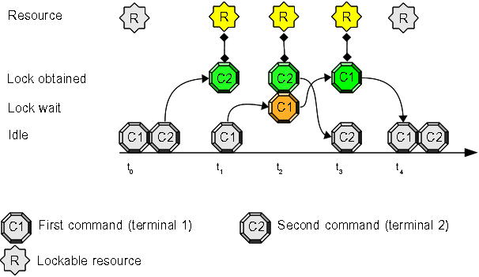

# Use Case #1: user command/script synchronization

The first use case is very simple: you don't want some commands or some scripts submitted by a user can run at the same time. The typical usage is related to *crontab* and the chance some command runs late due to an undesired condition.

## Open two terminals and try this experiment:
1. inside the first terminal write this command at prompt, but do **not** press "enter": "**flom \-\- ls**"
2. inside the second terminal write this command at prompt: "**flom \-\- sleep 10**"
3. now press "enter" key at the second terminal (where you have written "*flom \-\- sleep 10*")
4. switch to first terminal and press "enter" key

## Expected result:
1. the second terminal pauses for 10 seconds
2. the first terminal pauses and displays the output of command "**ls**" after the second terminal *sleeping* terminates

### Terminal 1 output:
    tiian@mojan:/usr$ flom -- ls
    bin  games  include  lib  lib64  local	sbin  share  src
    tiian@mojan:/usr$ 

### Terminal 2 output:
    tiian@mojan:~$ flom -- sleep 10
    tiian@mojan:~$ 

## Explanation:
command "**sleep 10**" and command "**ls**" synchronized: "**ls**" executed after "**sleep 10**" completion.
*flom* command protects (synchronizes) the execution of the command (or script) specified after the *\-\-* separator on the command line.

## Summary
The simplest usage form of command *flom* allows you to synchronize commands/scripts on a per user basis (synchronization does not happen between commands/scripts executed by different users).
