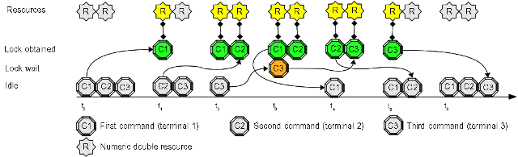

# Use Case #10: executes a maximum of N parallel processes

Sometimes you face a problem like this: "I have to run a maximum of 3 jobs at the same time, no more".   
A typical usage is workload balancing: you want to limit the maximum number of some type of processes, but you don't want only one because you can run a few of them.

## Open three terminals and try this experiment:

1. inside the first terminal write this command at prompt, but do **not** press "enter": "**flom -r ping\[2\] -q 1 \-\- ping -c 5 localhost**"
2. inside the second terminal write this command at prompt, but do **not** press "enter": "**flom -r ping\[2\] -q 1 \-\- ping -c 10 localhost**"
3. inside the third terminal write this command at prompt, but do **not** press "enter": "**flom -r ping\[2\] -q 1 \-\- ping -c 10 localhost**"
4. now press "enter" key at the first terminal
5. switch to second terminal and press "enter" key
6. switch to third terminal and press "enter" key

### Expected result:

1. the first terminal starts to display *ping* output immediately
2. the second terminal starts to display *ping* output immediately
3. the third terminal waits some seconds (until first terminal activity ends) and then starts to display *ping* output

#### Terminal 1 output:

    tiian@mojan:/usr$ flom -r ping[2] -q 1 -- ping -c 5 localhost
    PING localhost (127.0.0.1) 56(84) bytes of data.
    64 bytes from localhost (127.0.0.1): icmp_seq=1 ttl=64 time=0.048 ms
    64 bytes from localhost (127.0.0.1): icmp_seq=2 ttl=64 time=0.045 ms
    64 bytes from localhost (127.0.0.1): icmp_seq=3 ttl=64 time=0.043 ms
    64 bytes from localhost (127.0.0.1): icmp_seq=4 ttl=64 time=0.052 ms
    64 bytes from localhost (127.0.0.1): icmp_seq=5 ttl=64 time=0.049 ms
    
    --- localhost ping statistics ---
    5 packets transmitted, 5 received, 0% packet loss, time 3999ms
    rtt min/avg/max/mdev = 0.043/0.047/0.052/0.006 ms
    tiian@mojan:/usr$ echo $?
    0
    tiian@mojan:/usr$

#### Terminal 2 output:

    tiian@mojan:/usr$ flom -r ping[2] -q 1 -- ping -c 10 localhost
    PING localhost (127.0.0.1) 56(84) bytes of data.
    64 bytes from localhost (127.0.0.1): icmp_seq=1 ttl=64 time=0.050 ms
    64 bytes from localhost (127.0.0.1): icmp_seq=2 ttl=64 time=0.047 ms
    64 bytes from localhost (127.0.0.1): icmp_seq=3 ttl=64 time=0.036 ms
    64 bytes from localhost (127.0.0.1): icmp_seq=4 ttl=64 time=0.039 ms
    64 bytes from localhost (127.0.0.1): icmp_seq=5 ttl=64 time=0.042 ms
    64 bytes from localhost (127.0.0.1): icmp_seq=6 ttl=64 time=0.048 ms
    64 bytes from localhost (127.0.0.1): icmp_seq=7 ttl=64 time=0.051 ms
    64 bytes from localhost (127.0.0.1): icmp_seq=8 ttl=64 time=0.048 ms
    64 bytes from localhost (127.0.0.1): icmp_seq=9 ttl=64 time=0.048 ms
    64 bytes from localhost (127.0.0.1): icmp_seq=10 ttl=64 time=0.047 ms
    
    --- localhost ping statistics ---
    10 packets transmitted, 10 received, 0% packet loss, time 8997ms
    rtt min/avg/max/mdev = 0.036/0.045/0.051/0.008 ms
    tiian@mojan:/usr$ echo $?
    0
    tiian@mojan:/usr$

#### Terminal 3 output:

    tiian@mojan:/usr$ flom -r ping[2] -q 1 -- ping -c 10 localhost
    PING localhost (127.0.0.1) 56(84) bytes of data.
    64 bytes from localhost (127.0.0.1): icmp_seq=1 ttl=64 time=0.046 ms
    64 bytes from localhost (127.0.0.1): icmp_seq=2 ttl=64 time=0.050 ms
    64 bytes from localhost (127.0.0.1): icmp_seq=3 ttl=64 time=0.045 ms
    64 bytes from localhost (127.0.0.1): icmp_seq=4 ttl=64 time=0.038 ms
    64 bytes from localhost (127.0.0.1): icmp_seq=5 ttl=64 time=0.044 ms
    64 bytes from localhost (127.0.0.1): icmp_seq=6 ttl=64 time=0.042 ms
    64 bytes from localhost (127.0.0.1): icmp_seq=7 ttl=64 time=0.048 ms
    64 bytes from localhost (127.0.0.1): icmp_seq=8 ttl=64 time=0.047 ms
    64 bytes from localhost (127.0.0.1): icmp_seq=9 ttl=64 time=0.048 ms
    64 bytes from localhost (127.0.0.1): icmp_seq=10 ttl=64 time=0.042 ms
    
    --- localhost ping statistics ---
    10 packets transmitted, 10 received, 0% packet loss, time 8997ms
    rtt min/avg/max/mdev = 0.038/0.045/0.050/0.003 ms
    tiian@mojan:/usr$ echo $?
    0
    tiian@mojan:/usr$

### Explanation:
the first command "**ping -c 5**" locks resource "ping\[2\]" and pick-up 1 resource unity; the second command "**ping -c 10**" locks resource "ping\[2\]" and pick-up the remaining 1 resource unity; the third command "**ping -c 10**" can not lock resource "ping\[2\]" because there are no more available unities. When the first command completes it frees 1 resource unity and the third command can be executed.

## Some numeric resource details

### Naming convention
The name of a numeric resource is composed by 3 elements:

* an alphanumeric prefix, like "ping", "foo", "bar", ...
* left square bracket, "["
* an integer value (*decimal base* only), like "2", "12", "231", ...
* right square bracket, "]"

#### Your attention please!
Resources "foo\[3\]" and "foo\[2\]" are distinct resources: the first contains 3 locakable unities, the second contains 2 lockable units.

### Supported options
Numeric resources support these options:

* *-o, \-\-resource-timeout*
* *-q, \-\-resource-quantity*

Numeric resources don't support this option:

* *-l, \-\-lock-mode* because only **exclusive** lock ("EX") can be specified

### Requested quantity
Different *flom* invocation can specify different quantities, but the specified quantity can **not** exceed a resource total quantity.

## Summary
This use case explains you how to implement a basic workload manager that allows the execution of a maximum of 2 tasks and put the exceeding submitted job in a wait queue.

### See also
FLoM available arguments are documented in man page: use **man flom**.   
FLoM [configuration](../Configuration.md) explains how you can specify flom behavior without using command line arguments.
