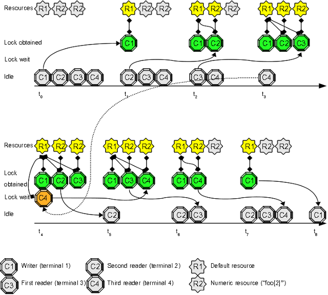

# Use Case 11: one writer, at max N readers

This use case extends [Use Case 5](Use_Case_5.md) in this way: "I can run only one writer and a limited number of readers".   
The "one writer many readers" pattern can be implemented using lock modes *Protected Write* and *Concurrent Read* as explained here http://en.wikipedia.org/wiki/Distributed_lock_manager#Lock_modes   
If you wanted to limit the number of readers, you could implement the limit using a numeric resource as shown below.

## Open four terminals and try this experiment:

1. inside the first terminal write this command at prompt, but do **not** press "enter": "**flom -l PW \-\- ping -c 30 localhost**"; this is our *writer* task (30 seconds ping)
2. inside the second terminal write this command at prompt, but do **not** press "enter": "**flom -l CR \-\- flom -r foo\[2\] \-\- ping -c 10 localhost**"; this is our first *reader* task (10 seconds ping)
3. inside the third terminal write this command at prompt, but do **not** press "enter": "**flom -l CR \-\- flom -r foo\[2\] \-\- ping -c 20 localhost**"; this is our second *reader* task (20 seconds ping)
4. inside the fourth terminal write this command at prompt, but do **not** press "enter": "**flom -l CR \-\- flom -r foo\[2\] \-\- ping -c 10 localhost**"; this is our third *reader* task (10 seconds ping)
5. now press "enter" key at the first terminal
6. switch to second terminal and press "enter" key
7. switch to third terminal and press "enter" key
8. switch to third terminal and press "enter" key

### Expected result:

1. the first terminal starts to display *ping* output immediately
2. the second terminal starts to display *ping* output immediately
3. the third terminal starts to display *ping* output immediately
3. the fourth terminal waits some seconds (until second terminal activity ends) and then starts to display *ping* output

### Explanation:
Two resources are used: the default simple resource to implement *one writer, many readers* pattern and a numeric resource of name *foo\[2\]* to implement the *readers limitation* (a maximum of 2 readers are allowed to executed at the same time).   
The hack is implemented with *flom command nidification*:

    flom -l CR -- flom -r foo[2] -- ping -c 10 localhost

that can be decomposed in this way:

* lock default resource using mode *Concurrent Read* and execute the command **flom -r foo\[2\] \-\- ping -c 10 localhost** protected by the obtained lock
* lock numeric "foo\[2\]" resource, pick-up one of the available slots, and execute the command **ping -c 10 localhost** protected by the obtained lock

#### Your attention please!
*FLOM* does not limit the number of nidified levels and *FLOM* does **not** implement a **deadlock detection algorithm**:  you **must** carefully think about lock concatenation order to avoid [resource starvation](http://en.wikipedia.org/wiki/Resource_starvation)

## Summary
This use case explains you how to implement a non trivial synchronization among N+1 tasks.

### See also
FLoM available arguments are documented in man page: use **man flom**.
FLoM [configuration](../Configuration.md) explains how you can specify flom behavior without using command line arguments.
