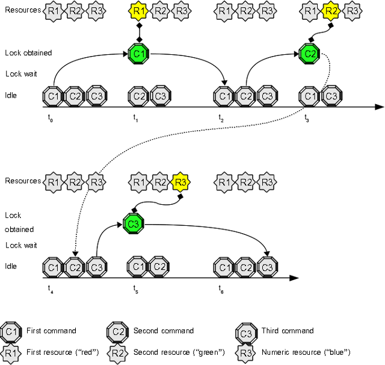

# Use Case 12: a set of resources distributed among N parallel processes

Sometimes you face a problem like this: "A *worker* process can process different tasks, no more than one worker can access one resource, the number of resources is finite, the resources are not omogeneous".

## Open three terminals and try this experiment:

1. inside **every** terminal write this command at prompt, but do **not** press "enter": "**flom -r 'red.green.blue' \-\- echo**"
2. now press "enter" key at the first terminal
3. switch to second terminal and press "enter" key
4. switch to third terminal and press "enter" key

### Expected result:

1. first terminal prints the string *"red"* (the first resource in the set)
2. the second terminal prints the string *"green"* (the second resource in the set)
3. the third terminal prints the string *"blue"* (the third and last resource in the set)

#### Terminal 1 output:

    tiian@mojan:/tmp$ flom -r 'red.green.blue' -- echo
    red
    tiian@mojan:/tmp$

#### Terminal 2 output:

    tiian@mojan:/tmp$ flom -r 'red.green.blue' -- echo
    green
    tiian@mojan:/tmp$

#### Terminal 3 output:

    tiian@mojan:/tmp$ flom -r 'red.green.blue' -- echo
    blue
    tiian@mojan:/tmp$

### Explanation:
the first command "**flom -r 'red.green.blue' \-\- echo**" locks the first resource in the set, the second command **flom -r 'red.green.blue' \-\- echo** locks the second resource int the set and so on.   
FLoM manages resource sets in a different way if compared to simple resources and numeric resources:

* the resources are assigned to the asking clients using a [round-robin scheduling](http://en.wikipedia.org/wiki/Round-robin_scheduling) policy: the second resource in the set is assigned even if the first resource is not locked
* the name of the assigned resource is passed to the protected command (*echo* in the example above) because it must know the name of the assigned resource. In the above example, *flom* executes **echo red**, **echo green** and **echo blue** commands.

## The same example, reloaded

The previous example can be slightly reworked to better understand what you can do with resource sets. Let's imagine you have 3 distinct files in */tmp* directory (use your preferred editor and create three files named *"one", "two", "three"* with different content as shown below:

    tiian@mojan:/tmp$ cat one
    This is file ONE (there's only one row in this file)
    tiian@mojan:/tmp$ cat two
    This is file TWO
    (there are two rows in this file)
    tiian@mojan:/tmp$ cat three 
    This is file THREE
    
    (there are three rows in this file)
    tiian@mojan:/tmp$

1. inside **every** terminal write this command at prompt, but do **not** press "enter": "**flom -r 'one.two.three' \-\- cat**"
2. now press "enter" key at the first terminal
3. switch to second terminal and press "enter" key
4. switch to third terminal and press "enter" key

### Expected result:

1. first terminal prints the content of file *one* (the first resource in the set)
2. second terminal prints the content of file *two* (the second resource in the set)
3. third terminal prints the content of file *three* (the third and last resource in the set)

#### Terminal 1 output:

    tiian@mojan:/tmp$ flom -r 'one.two.three' -- cat
    This is file ONE (there's only one row in this file)
    tiian@mojan:/tmp$

#### Terminal 2 output:

    tiian@mojan:/tmp$ flom -r 'one.two.three' -- cat
    This is file TWO
    (there are two rows in this file)
    tiian@mojan:/tmp$

#### Terminal 3 output:

    tiian@mojan:/tmp$ flom -r 'one.two.three' -- cat
    This is file THREE
    
    (there are three rows in this file)
    tiian@mojan:/tmp$

### Warnings

The above example uses a resource set to map three distinct files, but you should pay attention this is only an example: some file names are not valid *flom* resource names and you need some scripting to map file names to valid resource names.

In the above example the first command (in first terminal) starts a background *flom daemon* that will serve the first, the second and the third request: the *flom daemon* keeps the current state and gives any command a different resource (round-robin policy).   
*flom daemon* default lifetime is quite short (5000 milliseconds) and requests interleaved by a pause longer than 5000 milliseconds will start a fresh *flom daemon* copy; below you can see what happens waiting 5 seconds before first and second command:

#### Terminal 1 output:

    tiian@mojan:/tmp$ flom -r 'one.two.three' -- cat
    This is file ONE (there's only one row in this file)
    tiian@mojan:/tmp$

#### Terminal 2 output:

    tiian@mojan:/tmp$ flom -r 'one.two.three' -- cat
    This is file ONE (there's only one row in this file)
    tiian@mojan:/tmp$

This issue can not be solved using *flom* option '-d, \-\-daemon-lifespan' because the internal *flom* garbage collector automatically destroys unused resources indipendently by daemon restart.    
Option '-i, \-\-resource-idle-lifespan' allow to keep a resource for a longer time, but pay attention *FLoM* is designed to manage resource concurrency, not to manage long term state persistence.   
If you want to manage long term state, a state file and some shell scripting is a better solution.

## Some resource set details

### Naming convention
A resource set name is composed by 2 or more simple resource names concatenated using '.' character:

* a simple resource name, like "red", "foo1", "b1a2r3", ...
* a '.' character
* a simple resource name, like "red", "foo1", "b1a2r3", ...
* a '.' character
* ...
* a simple resource name, like "red", "foo1", "b1a2r3", ...

Examples:

* "red.foo1.b1a2r3" is a valid resource set name
* "red" is not a valid resource set name (it's a valid simple resource name)
* "red." is not a valid resource set name ('.' character can not be the last in the name)
* "red..foo1" is not a valid resource set name (two consecutive '.' characters are not allowed)
* "red.foo1" is a valid resource set name
* "red.green.green.blue" is a valid resource set name (repetitions are allowed)

#### Your attention please!
Resources "red.green.blue" and "red.blue.green" are distinct resource sets.

### Supported options
Resource sets support this option:

* *-o, \-\-resource-timeout*

Resource sets don't support this option:

* *-l, \-\-lock-mode* because only **exclusive** lock ("EX") can be specified
* *-q, \-\-resource-quantity* because only **one** resource can be locked by a client

## Summary
This use case explains you how to manage concurrent access to a finite resource set using a round-robin policy and avoiding the simultaneous access to a resource by more than one locker.

### See also
FLoM available arguments are documented in man page: use **man flom**.
FLoM [configuration](../Configuration.md) explains how you can specify flom behavior without using command line arguments.
