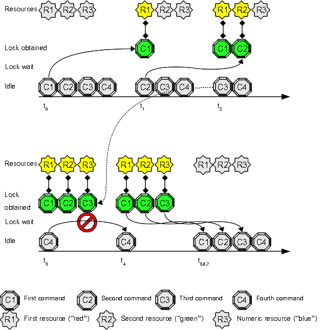

# Use Case 13: passing options with resource sets

This use case extends [Use Case 12](Use_Case_12.md): it is suggested to try it before this one.

## Prepare a sample shell script

Create a simple shell script inside your */tmp* directory (or whereever you prefer): it's a sample script that accept two options:

    tiian@mojan:/tmp$ cat print_and_wait.sh 
    #!/bin/sh
    echo "First arg is $1 (sleep time), second arg is $2 (assigned resource)"
    echo "Sleeping $1 seconds"
    sleep $1
    echo "Releasing resource $2"
    tiian@mojan:/tmp$

Use your preferred editor to prepare the above script and name it *"print_and_wait.sh"*

**Don't forget to attribute exec bits to the shell command**

    tiian@mojan:/tmp$ chmod 755 print_and_wait.sh 
    tiian@mojan:/tmp$ ls -la print_and_wait.sh 
    -rwxr-xr-x 1 tiian tiian 150 2014-05-05 22:30 print_and_wait.sh
    tiian@mojan:/tmp$

execute it directly to test it's working as expected:

    tiian@mojan:/tmp$ ./print_and_wait.sh 2 foo
    First arg is 2 (sleep time), second arg is foo (assigned resource)
    Sleeping 2 seconds
    Releasing resource foo
    tiian@mojan:/tmp$

if all above is OK, we are ready to use it with *flom*.

## Open four terminals and try this experiment:

1. switch **every** terminal to */tmp* directory with command "**cd /tmp**"
2. inside **every** terminal write this command at prompt, but do **not** press "enter": "**flom -o 0 -r red.green.blue \-\- ./print_and_wait.sh 3**"
3. now press "enter" key at the first terminal
4. switch to second terminal and press "enter" key
5. switch to third terminal and press "enter" key
6. switch to fourth terminal and press "enter" key

### Expected result:

1. the script execution inside the first terminal acquires the resource *"red"* (the first resource in the set)
2. the script execution inside the second terminal acquires the resource *"green"* (the second resource in the set)
3. the script execution inside the third terminal acquires the resource *"blue"* (the third resource in the set)
4. the script execution inside the fourth terminal does not start because there is no an available resource and *flom* command specifies *'-o 0'* (*no wait*) option.

#### Terminal 1 output:

    tiian@mojan:/tmp$ flom -o 0 -r red.green.blue -- ./print_and_wait.sh 3
    First arg is 3 (sleep time), second arg is red (assigned resource)
    Sleeping 3 seconds
    Releasing resource red
    tiian@mojan:/tmp$

#### Terminal 2 output:

    tiian@mojan:/tmp$ flom -o 0 -r red.green.blue -- ./print_and_wait.sh 3
    First arg is 3 (sleep time), second arg is green (assigned resource)
    Sleeping 3 seconds
    Releasing resource green
    tiian@mojan:/tmp$

#### Terminal 3 output:

    tiian@mojan:/tmp$ flom -o 0 -r red.green.blue -- ./print_and_wait.sh 3
    First arg is 3 (sleep time), second arg is blue (assigned resource)
    Sleeping 3 seconds
    Releasing resource blue
    tiian@mojan:/tmp$

#### Terminal 4 output:

    tiian@mojan:/tmp$ flom -o 0 -r red.green.blue -- ./print_and_wait.sh 3
    Resource already locked, the lock cannot be obtained
    tiian@mojan:/tmp$

### Explanation:
the first command "**flom -o 0 -r red.green.blue \-\- ./print_and_wait.sh 3**" locks the first resource in the set, the second command **flom -o 0 -r red.green.blue \-\- echo** locks the second resource in the set, the third command **flom -o 0 -r red.green.blue \-\- echo** locks the third resource in the set, but the fourth command can not lock a resource: it should wait but it can't due to "-o 0" option (*no wait* behavior).   
From terminal (1-3) outputs you can understand the resource name is passed as the last command line option to the *flom managed command* ("print_and_wait.sh" script in the above example).

## Summary
This use case explains you how the assigned resource name is passed to the command managed by *flom*.

### See also
FLoM available arguments are documented in man page: use **man flom**.
FLoM [configuration](../Configuration.md) explains how you can specify flom behavior without using command line arguments.
