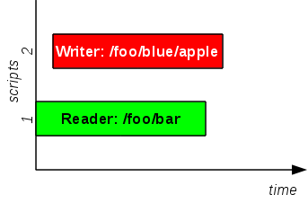
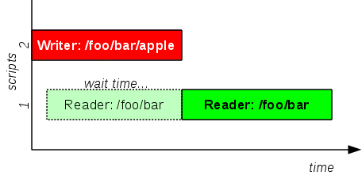
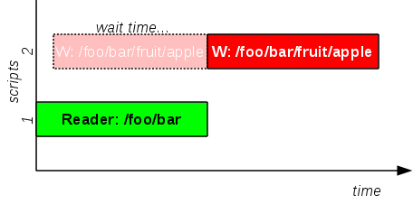
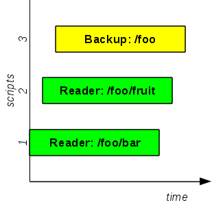
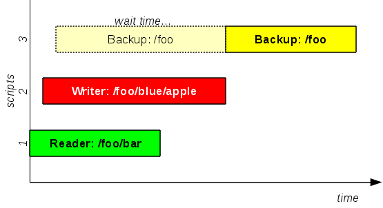
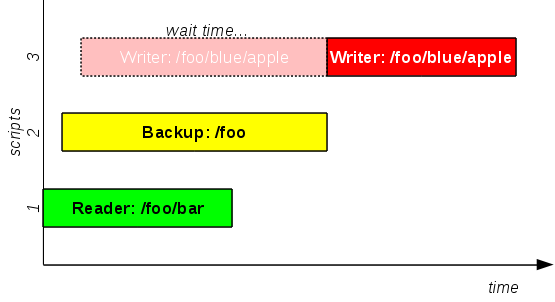

# Use Case 15: hierarchical locks

## This is the problem you have to solve:

* there is a file/directory tree starting at some point, for example *"/foo"*
* *READER* shell scripts access any file inside the file/directory tree (for example *"/foo/bar/white"*) but do **not** change them
* *WRITER* shell scripts access any file inside the file/directory tree (for example *"/foo/apple"*) and **change** (update, create, delete) them
* *BACKUP* shell script accesses all the files inside the file/directory tree and creates a backup of them

The problem can be explained as:

* a *READER* and a *WRITER* script can not work on the same file at the same time
* a *WRITER* can not work on a dir if at least one *READER* (or one *WRITER*) is using a file or a dir at a deeper level
* *BACKUP* can work only if there are **no** *WRITER*s working inside the file/directory tree.

The problem can be solved using two features of FLoM: *lock modes* and *hierarchical resources*.

### Lock modes
FLoM implements the same lock modes proposed by [OpenVMS Distributed Lock Manager](http://en.wikipedia.org/wiki/Distributed_lock_manager#Lock_modes); a possible choiche to solve our problem is:

* using *Protected Read (PR)* for *BACKUP* script: it allows others to read, but **not** to change the locked resource
* using *Protected Read (PR)* for *READER* scripts: it does **not** allow others to change the locked resource
* using *Exclusive (EX)* for *WRITER* scripts: it stops others activities

### Solution test
Just for the **sake of simplicity**, we will not develop real scripts but we simulate them using *ping* command with a step by step approach.

#### one *READER* and one *WRITER* running in parallel
The *READER* script needs to read */foo/bar* directory content, while the *WRITER* script needs to create file *apple* inside directory */foo/blue*.

Open two terminals and try it:

1. inside the first terminal (*READER* script) write this command at prompt, but do **not** press "enter": 
    **flom -r /foo/bar -l PR \-\- ping -c 5 localhost**
2. inside the second terminal (*WRITER* script) write this command at prompt, but do **not** press "enter": 
    **flom -r /foo/blue/apple -l EX \-\- ping -c 5 localhost**
3. now press "enter" key at the first terminal
4. switch to second terminal and press "enter" key

##### Expected result:
All two ping commands run simultaneously because */foo/blue/apple* can be created and modified even if someone else is reading */foo/bar*

#### one *READER* and one *WRITER* with synchronization
The *READER* scripts needs to read */foo/bar* directory content, while the *WRITER* script needs to create file *apple* inside it.

Open two terminals and try it:

1. inside the first terminal (*READER* script) write this command at prompt, but do **not** press "enter": 
    **flom -r /foo/bar -l PR \-\- ping -c 5 localhost**
2. inside the second terminal (*WRITER* script) write this command at prompt, but do **not** press "enter": 
    **flom -r /foo/bar/apple -l EX \-\- ping -c 5 localhost**
3. now press "enter" key at the first terminal
4. switch to second terminal and press "enter" key

##### Expected result:
First ping command runs, second ping command waits first command termination and then starts. The behavior does not change if you switch command execution order.   
If *READER* starts to read */foo/bar*, *WRITER* shall *not* start because it could change */foo/bar* content.   
If *WRITER* starts to create */foo/bar/appple*, *READER* shall *not* start because */foo/bar* content could change in the meantime.

#### one *READER* and one *WRITER* with synchronization (again)
The *READER* scripts needs to read */foo/bar* directory content, while the *WRITER* script needs to create file *apple* inside */foo/bar/fruit* directory.

Open two terminals and try it:

1. inside the first terminal (*READER* script) write this command at prompt, but do **not** press "enter": 
    **flom -r /foo/bar -l PR \-\- ping -c 5 localhost**
2. inside the second terminal (*WRITER* script) write this command at prompt, but do **not** press "enter": 
    **flom -r /foo/bar/fruit/apple -l EX \-\- ping -c 5 localhost**
3. now press "enter" key at the first terminal
4. switch to second terminal and press "enter" key

##### Expected result:
First ping command runs, second ping command waits first command termination and then starts. The behavior does not change if you switch command execution order.

**Note:** from this example we can understand that locking */foo/bar* means *"lock everything that starts with /foo/bar"* and not *"lock only /foo/bar directory"*

#### *READER*s and *BACKUP*
A *READER* script needs to read */foo/bar* directory content, another *READER* script needs to read */foo/fruit* directory and *BACKUP* script needs to collect a consistent backup of */foo" file tree.

Open three terminals and try it:

1. inside the first terminal (first *READER* script) write this command at prompt, but do **not** press "enter": 
    **flom -r /foo/bar -l PR \-\- ping -c 5 localhost**
2. inside the second terminal (second *READER* script) write this command at prompt, but do **not** press "enter": 
    **flom -r /foo/fruit -l PR \-\- ping -c 5 localhost**
3. inside the third terminal (*BACKUP* script) write this command at prompt, but do **not** press "enter": 
    **flom -r /foo -l PR \-\- ping -c 5 localhost**
4. now press "enter" key at the first terminal
5. switch to second terminal and press "enter" key
6. switch to third terminal and press "enter" key

##### Expected result:
Al three commands run simultaneously because *READER*s do not disturb each other and *BACKUP* can produce a consistent backup even if *READER* scripts are working.

#### one *READER*, one *WRITER* and *BACKUP*
Coming back to the first example, we add the *BACKUP* script: the *READER* script needs to read */foo/bar* directory content, the *WRITER* script needs to create file *apple* inside directory */foo/blue* and *BACKUP* script needs to collect a consistent backup of */foo* file tree.

Open three terminals and try it:

1. inside the first terminal (*READER* script) write this command at prompt, but do **not** press "enter": 
    **flom -r /foo/bar -l PR \-\- ping -c 5 localhost**
2. inside the second terminal (*WRITER* script) write this command at prompt, but do **not** press "enter": 
    **flom -r /foo/blue/apple -l EX \-\- ping -c 7 localhost**
3. inside the third terminal (*BACKUP* script) write this command at prompt, but do **not** press "enter": 
    **flom -r /foo -l PR \-\- ping -c 5 localhost**
4. now press "enter" key at the first terminal
5. switch to second terminal and press "enter" key
6. switch to third terminal and press "enter" key

##### Expected result:
The *READER* starts to run, the *WRITER* starts to run because it does not disturb *READER*'s activity, the *BACKUP* task waits *WRITER* end before starting: it can not collect a consistent backup while *WRITER* task is updating */foo/blue/apple*.

#### one *READER*, *BACKUP* and one *WRITER*
Modifying the previous example, we change the script order execution: the *READER* script needs to read */foo/bar* directory content, the *BACKUP* script needs to collect a consistent backup of */foo* file tree and the *WRITER* script needs to create file *apple* inside directory */foo/blue*.

Open three terminals and try it:

1. inside the first terminal (*READER* script) write this command at prompt, but do **not** press "enter": 
    **flom -r /foo/bar -l PR \-\- ping -c 5 localhost**
2. inside the second terminal (*BACKUP* script) write this command at prompt, but do **not** press "enter": 
    **flom -r /foo -l PR \-\- ping -c 7 localhost**
3. inside the third terminal (*WRITER* script) write this command at prompt, but do **not** press "enter": 
    **flom -r /foo/blue/apple -l EX \-\- ping -c 5 localhost**
4. now press "enter" key at the first terminal
5. switch to second terminal and press "enter" key
6. switch to third terminal and press "enter" key

##### Expected result:
The *READER* starts to run, the *BACKUP* starts because it can collect a consisten backup, while the *WRITER* task must wait *BACKUP* end before starting: it can not update */foo/blue/apple* because until the backup finished.

## Summary
This use case shows a complex synchronization scenario with different tasks that access a different levels of a resource tree.   
**It must be noted** that FLoM resources do **not** need to map to real files: FLoM resources are virtual and can be used to model a synchronization scenario that has not a file counterpart.
You might model:

* *invoices*, *receipts*, *customers*, *goods*, ...
* *furniture*, *chest of drawers*, *drawers*, *socks*, *shoes*, ...
* and so on...

### See also
FLoM available arguments are documented in man page: use **man flom**.   
FLoM [configuration](../Configuration.md) explains how you can specify flom behavior without using command line arguments.
