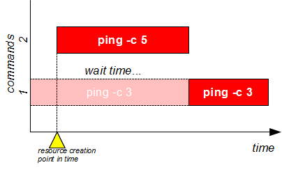
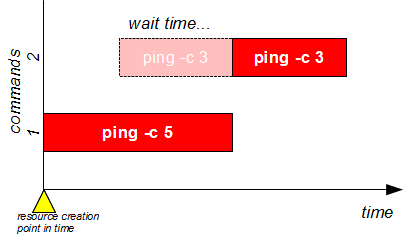
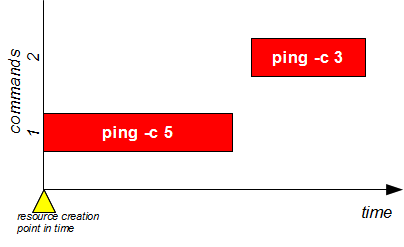
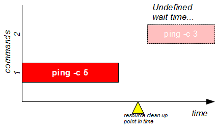

# Use Case 16: waiting completion of a task that has not yet started

Sometimes you need to run a command after another command ended even if the second one has not yet started; example: task A produces a deliverable needed by task B, task B must be executed after task A but task B is fired independently from task A. This type of issues can be solved using a job scheduler and **flom** does **not** try to emulate it, but it can help you if you can't use a real batch scheduler for any reason.

## Open two terminals and try this experiment:

1. inside the first terminal write this command at prompt, and press "enter": "**flom \-\-resource-create=no \-\- ping -c 3 localhost**"
2. inside the second terminal write this command at prompt, and press "enter": "**flom \-\- ping -c 5 localhost**"

### Expected result:

1. the first terminal *"sleeps"*
2. the second terminal pings 5 times *localhost* (command "ping -c 5 localhost")
3. after second terminal completed the task, the first terminal pings 3 times *localhost* (command "ping -c 3 localhost")

#### Terminal 1 output:

    tiian@ubuntu:~$ flom --resource-create=no -- ping -c 3 localhost
    PING localhost (127.0.0.1) 56(84) bytes of data.
    64 bytes from localhost (127.0.0.1): icmp_seq=1 ttl=64 time=0.048 ms
    64 bytes from localhost (127.0.0.1): icmp_seq=2 ttl=64 time=0.068 ms
    64 bytes from localhost (127.0.0.1): icmp_seq=3 ttl=64 time=0.067 ms
    
    --- localhost ping statistics ---
    3 packets transmitted, 3 received, 0% packet loss, time 2000ms
    rtt min/avg/max/mdev = 0.048/0.061/0.068/0.009 ms

#### Terminal 2 output:

    tiian@ubuntu:~$ flom -- ping -c 5 localhost
    PING localhost (127.0.0.1) 56(84) bytes of data.
    64 bytes from localhost (127.0.0.1): icmp_seq=1 ttl=64 time=0.055 ms
    64 bytes from localhost (127.0.0.1): icmp_seq=2 ttl=64 time=0.121 ms
    64 bytes from localhost (127.0.0.1): icmp_seq=3 ttl=64 time=0.059 ms
    64 bytes from localhost (127.0.0.1): icmp_seq=4 ttl=64 time=0.083 ms
    64 bytes from localhost (127.0.0.1): icmp_seq=5 ttl=64 time=0.072 ms
    
    --- localhost ping statistics ---
    5 packets transmitted, 5 received, 0% packet loss, time 4001ms
    rtt min/avg/max/mdev = 0.055/0.078/0.121/0.023 ms

### Explanation:
command "**ping -c 3 localhost**" wants to lock the default resource, but it can not create it and waits someone else will create it; command "**ping -c 5 localhost**" locks the default resource because it can create it (default behavior); the first command can then enqueues itself on default resource because it exists after the second command created it.

## Rewind it...

What happens if the command are started in the reverse order? Try it:

1. inside the first terminal write this command at prompt, and press "enter": "**flom \-\- ping -c 5 localhost**"
2. inside the second terminal write this command at prompt, and press "enter": "**flom \-\-resource-create=no \-\- ping -c 3 localhost**"

### Expected result:

The result depends from timing, there are basically three cases:

1. the second command is fired when the first command is executing
2. the second command is fired immediately after the first command terminated
3. the second command is fired some time after the first command terminated

In case 1 and 2 the first command creates the resource and the second command uses it after first command released the lock; 

in case 3 the resource created by the first command disappears (automatically cleaned by **flom** *daemon*) and the second command waits indefinitely. Take a look to [Use Case 17](Use_Case_17.md) for an advanced use case.

## Summary
This use case allows you to synchronize commands/scripts avoiding a command is executed **before** another one.   
The *don't create resource* behavior can be obtained using "*-e n*", "*\-\-resource-create=no*" command option or "*Resource/Create*" property inside configuration files.

### See also
FLoM available arguments are documented in man page: use **man flom**.   
FLoM [configuration](../Configuration.md) explains how you can specify flom behavior without using command line arguments.
