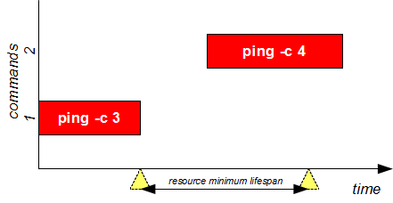
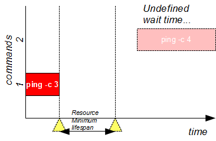

# Use Case 17: long term resources

As shown in [Use Case 16](Use_Case_16.md), the "don't create resource" behavior can generate a race condition: the resource will never created because the producer task finished before the consumer task starts.   
The following picture illustrates the race condition:

**flom** supports *long term resources* to deal with this type of situations.

## Open two terminals and try this experiment:

1. inside the first terminal write this command at prompt, and press "enter": "**flom \-\-resource-idle-lifespan=5000 \-\- ping -c 3 localhost**"
2. wait the command terminates to ping and wait approximately 2-3 more seconds
3. inside the second terminal write this command at prompt, and press "enter": "**flom \-\-resource-create=no \-\- ping -c 4 localhost**"

### Expected result:

1. the first terminal executes "ping -c 3 localhost" command
2. the second terminal executes "ping -c 4 localhost" command

#### Terminal 1 output:

    tiian@ubuntu:~$ flom --resource-idle-lifespan=5000 -- ping -c 3 localhost
    PING localhost (127.0.0.1) 56(84) bytes of data.
    64 bytes from localhost (127.0.0.1): icmp_seq=1 ttl=64 time=0.081 ms
    64 bytes from localhost (127.0.0.1): icmp_seq=2 ttl=64 time=0.069 ms
    64 bytes from localhost (127.0.0.1): icmp_seq=3 ttl=64 time=0.055 ms
    
    --- localhost ping statistics ---
    3 packets transmitted, 3 received, 0% packet loss, time 1998ms
    rtt min/avg/max/mdev = 0.055/0.068/0.081/0.012 ms

#### Terminal 2 output:

    tiian@ubuntu:~$ flom --resource-create=no -- ping -c 4 localhost
    PING localhost (127.0.0.1) 56(84) bytes of data.
    64 bytes from localhost (127.0.0.1): icmp_seq=1 ttl=64 time=0.057 ms
    64 bytes from localhost (127.0.0.1): icmp_seq=2 ttl=64 time=0.118 ms
    64 bytes from localhost (127.0.0.1): icmp_seq=3 ttl=64 time=0.053 ms
    64 bytes from localhost (127.0.0.1): icmp_seq=4 ttl=64 time=0.062 ms
    
    --- localhost ping statistics ---
    4 packets transmitted, 4 received, 0% packet loss, time 2997ms
    rtt min/avg/max/mdev = 0.053/0.072/0.118/0.027 ms

### Explanation:
command "**ping -c 3 localhost**" creates and locks the default resource; the resource will last at least 5000 milliseconds after command completion; command "**ping -c 4 localhost**" locks the default resource.

## Rewind it...

What happens if you wait more than 5000 milliseconds between first command completion and second command execution? Try it:

1. inside the first terminal write this command at prompt, and press "enter": "**flom \-\-resource-idle-lifespan=5000 -- ping -c 3 localhost**"
2. wait the command terminates to ping and wait approximately 7-8 more seconds
3. inside the second terminal write this command at prompt, and press "enter": "**flom \-\-resource-create=no -- ping -c 4 localhost**"

### Expected result:

The resource created by the first command disappears (automatically cleaned by **flom** *daemon*) and the second command waits indefinitely.

## Summary
This use case allows you to implement the *producer/consumer* pattern even if the commands are fired at different times.    
The *long term resource* behavior can be obtained using "*-i milliseconds*", "*\-\-resource-idle-lifespan=milliseconds*" command option or "*Resource/IdleLifespan*" property inside configuration files.

### See also
FLoM available arguments are documented in man page: use **man flom**.   
FLoM [configuration](../Configuration.md) explains how you can specify flom behavior without using command line arguments.
