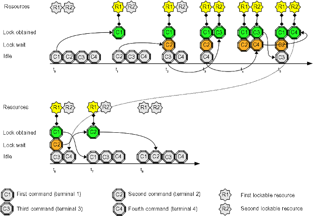

# Use Case 2: user multiple command/script synchronization

This use case extends [Use Case 1](Use_Case_1.md): you don't want some commands or some scripts submitted by a user can run at the same time, but you want parallel execution for some different commands/scripts. The typical usage is related to *crontab* and the chance some command runs late due to an undesired condition.

## Open four terminals and try this experiment:
1. inside the first terminal write this command at prompt, but do **not** press "enter": "**flom -r R1 \-\- sleep 10**"
2. inside the second terminal write this command at prompt, but do **not** press "enter": "**flom -r R1 \-\- ls**"
3. inside the third terminal write this command at prompt, but do **not** press "enter": "**flom -r R2 \-\- sleep 5**"
4. inside the fourth terminal write this command at prompt, but do **not** press "enter": "**flom -r R2 \-\- echo Hello World**"
5. now press "enter" key in every terminal following the same order used to prepare the commands (first, second, third, fourth)

## Expected result:
1. the first terminal pauses for 10 seconds
2. the second terminal pauses (10 seconds) and displays the output of command "**ls**" after the first terminal *sleeping* terminates
3. the third terminal pauses for 5 seconds
4. the fourth terminal pauses (5 seconds) and displays the output of command "**echo Hello Worlds**" after the third terminal *sleeping* terminates

### Terminal 1 output:
    tiian@mojan:/usr$ flom -r R1 -- sleep 10
    tiian@mojan:/usr$ 

### Terminal 2 output:
    tiian@mojan:/usr$ flom -r R1 -- ls
    bin  games  include  lib  lib64  local	sbin  share  src
    tiian@mojan:/usr$ 

### Terminal 3 output:
    tiian@mojan:~$ flom -r R2 -- sleep 5
    tiian@mojan:~$ 

### Terminal 4 output:
    tiian@mojan:~$ flom -r R2 -- echo Hello World
    Hello World
    tiian@mojan:~$ 

## Explanation:
The commands executed inside terminals 1 and 2 synchronize on resource "*R1*"; the commands executed inside terminals 3 and 4 synchronize on resource "*R2*".
"*Hello World*" is displayed before directory content ("*ls*" command) because the two synchronize on different resources.

## Summary
Independent commands can be grouped and synchronized using distinct resources.   
Argument "*-r*" (long form is "*\-\-resource-name*") can be used to specify the resource you want to synchronize on; you may use "*Resource/Name*" property inside configuration files as an alternative way to specify a non default resource.

### See also
FLoM available arguments are documented in man page: use **man flom**.   
FLoM [configuration](../Configuration.md) explains how you can specify flom behavior without using command line arguments.
