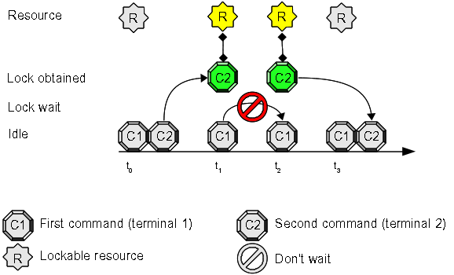

# Use Case 3: don't wait if the resource is busy

Sometimes you need to run a command exclusively as shown in [Use Case 1](Use_Case_1.md), but you don't want to wait (enqueue) if the lock is currently keep by a different command.

## Open two terminals and try this experiment:

1. inside the first terminal write this command at prompt, but do **not** press "enter": "**flom \-\-resource-timeout=0 \-\- ls**"
2. inside the second terminal write this command at prompt: "**flom \-\- sleep 10**"
3. now press "enter" key at the second terminal (where you have written "**flom \-\- sleep 10**")
4. switch to first terminal and press "enter" key

### Expected result:

1. the second terminal pauses for 10 seconds
2. the first terminal displays a warning message: "Resource already locked, the lock cannot be obtained"

#### Terminal 1 output:

    tiian@mojan:~$ flom --resource-timeout=0 -- ls
    Resource already locked, the lock cannot be obtained
    tiian@mojan:~$ echo $?
    98
    tiian@mojan:~$ 

#### Terminal 2 output:

    tiian@mojan:~$ flom -- sleep 10
    tiian@mojan:~$ 

### Explanation:
command "**sleep 10**" locks the default resource, command "**ls**" tries to lock the same resource, but it can **not** wait ("**\-\-resource-timeout=0**" command option) and returns immediately.   
Using "**echo $?**" inside the first terminal you can discover the special exit status *flom* uses to inform you the lock can not be obtained (useful for scripting).

## Come back to first terminal...

Execute the command "**flom \-\-resource-timeout=0 \-\- ls**" inside the terminal, **without** locking the resource from the second terminal (you must not execute "**flom \-\- sleep 10**" in the second terminal!).

### Expected result:

You see the execution of "**ls**" command: the resource is free and the lock is immediately acquired by this session.

### Terminal output:

    tiian@mojan:/usr$ flom --resource-timeout=0 -- ls
    bin  games  include  lib  lib64  local	sbin  share  src
    tiian@mojan:/usr$ 

## Summary
This use case allows you to synchronize commands/scripts avoiding enqueing: your command will be executed "lock protected" if the resource is not busy or you will catch a special exit status if the resource is busy and the command can not be performed immediately.   
The *non blocking* behavior can be obtained using "*-o 0*", "*\-\-resource-timeout=0*" command option or "*Resource/Wait*" property inside configuration files.

### See also
FLoM available arguments are documented in man page: use **man flom**.   
FLoM [configuration](../Configuration.md) explains how you can specify flom behavior without using command line arguments.
