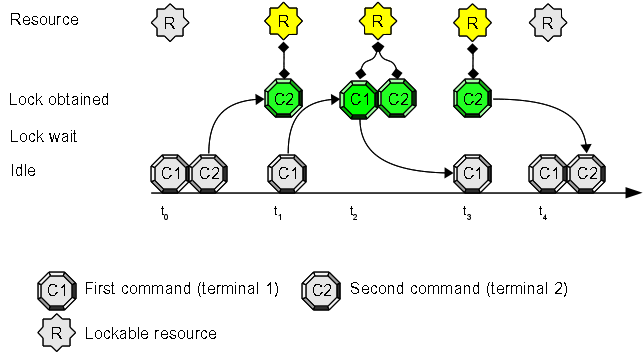

# Use Case #5: non exclusive locking

Sometimes you need to manage shared locks instead of exclusive locks.   
A typical scenario is the ["multiple readers / single-writer lock"](http://en.wikipedia.org/wiki/Readers%E2%80%93writer_lock): many processes can access a resource at the same time (because they does **not** modify the resource state) and only one process can access a resource **to update** it.   
Much more interesting use cases can be implemented using the lock mode semantic proposed by [VMS Distributed Lock Manager](http://en.wikipedia.org/wiki/Distributed_lock_manager).

## Open two terminals and try this experiment:

1. inside the first terminal write this command at prompt, but do **not** press "enter": "**flom \-\-lock-mode=PR -- ls**"
2. inside the second terminal write this command at prompt: "**flom \-\-lock-mode=PR -- sleep 10**"
3. now press "enter" key at the second terminal (where you have written "**flom \-\-lock-mode=PR \-\- sleep 10**")
4. switch to first terminal and press "enter" key

### Expected result:

1. the second terminal pauses for 10 seconds
2. the first terminal displays the output of directory content (*ls* command) immediately: it does **not** enqueue and wait second terminal command termination.

#### Terminal 1 output:

    tiian@mojan:/usr$ flom --lock-mode=PR -- ls
    bin  games  include  lib  lib64  local	sbin  share  src
    tiian@mojan:/usr$ echo $?
    0
    tiian@mojan:/usr$ 

#### Terminal 2 output:

    tiian@mojan:~$ flom -- sleep 10
    tiian@mojan:~/src/flom$ echo $?
    0
    tiian@mojan:~$ 

### Explanation:
command "**sleep 10**" locks the default resource, but it specifies **Protected Read** (PR) as lock mode, command "**ls**" tries to lock the same resource using **Protected Read** lock mode and as explained in [VMS DLM truth table](http://en.wikipedia.org/wiki/Distributed_lock_manager#Lock_modes), *Protected Read lock mode* allows resource sharing.

## Come back to first terminal...

1. prepare command "**flom \-\- ls**" inside the terminal first using default lock mode (*Exclusive*) 
2. prepare command "**flom \-\-lock-mode=PR \-\- sleep 10**" inside the second terminal using **Protected Read** lock mode
3. press "enter" key at the second terminal (where you have written "**flom \-\-lock-mode=PR \-\- sleep 10**")
4. switch to first terminal and press "enter" key

### Expected result:

"**ls**" command is executed after terminal two terminated

### Explanation:

The second terminal command uses *Protected Read lock mode* and can share the resource with someone else, but first terminal command uses (default) *Exclusive lock mode* and **must** wait the resource becomes free to lock it exclusively.

## Summary
This use case explains you how to implement the ["multiple readers / single-writer lock"](http://en.wikipedia.org/wiki/Readers%E2%80%93writer_lock) pattern and gives you the tool to implement more complex patterns using the powerful semantic offered by **flom** lock manager because it implements the full lock mode semantic proposed by [VMS DLM](http://en.wikipedia.org/wiki/Distributed_lock_manager): *"Null Lock", "Concurrent Read", "Concurrent Write", "Protected Read", "Protected Write", "Exclusive"*.

### See also
FLoM available arguments are documented in man page: use **man flom**.   
FLoM [configuration](../Configuration.md) explains how you can specify flom behavior without using command line arguments.    
[VMS Distributed Lock Manager](http://en.wikipedia.org/wiki/Distributed_lock_manager) is a good start point for understanding lock modes.
