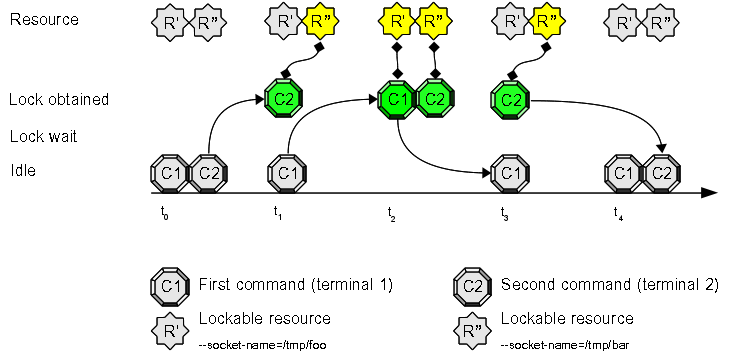

# Use Case 6: multi-user command/script synchronization

Sometimes you need to share/protect a resource among many users: the commands/scripts you have to synchronize/enqueue are not executed by the same user.

## Open two terminals and try this experiment:

1. prepare two different terminals with different logged users (**note**: two different users logged to the **same** system)
2. inside the first terminal (user=*tiian*) write this command at prompt, but do **not** press "enter": "**flom \-\-socket-name=/tmp/foo \-\- ls**"
3. inside the second terminal (user=*kamauz*) write this command at prompt: "**flom \-\-socket-name=/tmp/bar \-\- sleep 10**"
4. now press "enter" key at the second terminal (where you have written "**flom \-\-socket-name=/tmp/bar \-\- sleep 10**")
5. switch to first terminal and press "enter" key

### Expected result:

1. the second terminal pauses for 10 seconds
2. the first terminal shows the directory content **immediately**

#### Terminal 1 (user=*tiian*) output:

    tiian@mojan:/usr$ flom --socket-name=/tmp/foo -- ls
    bin  games  include  lib  lib64  local	sbin  share  src
    tiian@mojan:/usr$ echo $?
    0
    tiian@mojan:/usr$ 

#### Terminal 2 (user=*kamauz*) output:

    kamauz@mojan:~$ flom --socket-name=/tmp/bar -- sleep 10
    kamauz@mojan:~$ echo $?
    0
    kamauz@mojan:~$ 

### Explanation:
command "**sleep 10**" (user=*kamauz*) connects to UNIX socket */tmp/bar* and locks the default resource associated to */tmp/bar*, command "**ls**" (user=*tiian*) connects to UNIX socket */tmp/foo* and locks the default resource associated to */tmp/foo*: users *kamauz* and *tiian* do not use the same UNIX socket and connect to two different instances of *flom background process (daemon)*.

## Come back to the terminals...

1. inside the first terminal (user=*tiian*) write this command at prompt, but do **not** press "enter": "**flom \-\-socket-name=/tmp/foo \-\- ls**"
2. inside the second terminal (user=*kamauz*) write this command at prompt: "**flom \-\-socket-name=/tmp/foo \-\- sleep 10**"
3. now press "enter" key at the second terminal (where you have written "**flom \-\-socket-name=/tmp/foo \-\- sleep 10**")
4. switch to first terminal and press "enter" key

### Expected result:

1. the second terminal pauses for 10 seconds
2. the first terminal **waits 10 seconds** and then shows the directory content

### Explanation:
command "**sleep 10**" (user=*kamauz*) connects to UNIX socket */tmp/foo* and locks the default resource, command "**ls**" (user=*tiian*) connects to UNIX socket */tmp/foo* and tries to lock the same resource, but it's not free and must wait *kamauz*'s command termination.
** Specifying the same UNIX socket is exactly how you can enqueue commands/scripts executed by distinct users. **

## Try it again...

1. inside the first terminal (user=*tiian*) write this command at prompt, but do **not** press "enter": "**flom \-\- ls**"
2. inside the second terminal (user=*kamauz*) write this command at prompt: "**flom \-\- sleep 10**"
3. now press "enter" key at the second terminal (where you have written "**flom \-\- sleep 10**")
4. switch to first terminal and press "enter" key

### Expected result:

1. the second terminal pauses for 10 seconds
2. the first terminal shows the directory content **immediately**

### Explanation:
command "**sleep 10**" connects to *kamauz*'s flom default UNIX socket and locks its own default resource, command "**ls**" connects to *tiian*'s flom default UNIX socket and locks its own default resource: users *kamauz* and *tiian* do not use the same UNIX socket and connect to two different instances of *flom background process (daemon)*.

## Summary
This use case allows you to synchronize commands/scripts among two or more different users; the above examples show you why default behavior does not produce enqueing between commands executed by different users.
The *multiple users enqueing* feature can be obtained using "*-s filename*", "*\-\-socket-name=filename*" command option or "*Communication/SocketName*" property inside configuration files.

### See also
FLoM available arguments are documented in man page: use **man flom**.   
FLoM [configuration](../Configuration.md) explains how you can specify flom behavior without using command line arguments.
