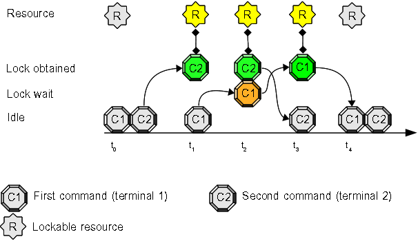

# Use Case 8: distributed command/script synchronization, auto-discovery feature

This use case shows extends [Use Case 7](Use_Case_7.md) and shows as auto-discovery feature works.

## Before you can start:
Download and install **flom** on two different systems: they must be able to contact each other using IP network; it is suggested to play with [Use Case 7](Use_Case_7.md) before trying this one.

### UDP/IP multicast and firewalls
Please pay attention some Linux distros configure a default firewall that silently drop multicast datagrams: disable your firewall or configure it to **not** drop multicast datagrams.    
**openSUSE** 12.2 is such a distribution.

## Activate a flom network daemon and check it's up & running:
System *mojan* (IP address 192.168.1.2) will be our *flom network daemon* (server) system, so we have to activate it with the following commands:

    tiian@mojan:/usr$ pgrep flom
    tiian@mojan:/usr$ flom -a 192.168.1.2 -A 239.255.0.1 -d -1 -- true
    tiian@mojan:/usr$ pgrep flom
    2634
    tiian@mojan:/usr$ ps -ef | grep flom | grep -v grep
    tiian     2634     1  0 21:39 ?        00:00:00 flom -a 192.168.1.2 -A 239.255.0.1 -d -1 -- true
    tiian@mojan:/usr$

There was no a running daemon before we started it, now there's exactly one *flom* running process with *process id 2634*.

Check the daemon is serving local requests:

    tiian@mojan:/usr$ flom -a 192.168.1.2 -d 0 -- ls
    bin  games  include  lib  lib64  local	sbin  share  src
    tiian@mojan:/usr$

Switch to the second terminal (second system, IP address 192.168.1.4) and try the same command using the IP address or the network name of *flom daemon*:

    tiian@presanella:/usr$ flom -a 192.168.1.2 -d 0 -- ls
    bin  games  include  lib  local  sbin  share  src
    tiian@presanella:/usr$ flom -a mojan -d 0 -- ls
    bin  games  include  lib  local  sbin  share  src
    tiian@presanella:/usr$

From the second terminal try the autodiscovery feature based on UDP/IP multicast:

    tiian@presanella:/usr$ flom -A 239.255.0.1 -d 0 -- ls
    bin  games  include  lib  local  sbin  share  src
    tiian@presanella:/usr$

## Experiment this synchronization:
1. inside the first terminal write this command at prompt, but do **not** press "enter": "**flom -A 239.255.0.1 -d 0 \-\- ls**"
2. inside the second terminal write this command at prompt: "**flom -A 239.255.0.1 -d 0 \-\- sleep 10**"
3. now press "enter" key at the second terminal (where you have written "*flom -A 239.255.0.1 -d 0 \-\- sleep 10*")
4. switch to first terminal and press "enter" key

## Expected result:
1. the second terminal (system *presanella* in the above example) pauses for 10 seconds
2. the first terminal (system *mojan* in the above example) pauses and displays the output of command "**ls**" after the second terminal *sleeping* terminates

### Terminal 1 output:
    tiian@mojan:/usr$ flom -A 239.255.0.1 -d 0 -- ls
    bin  games  include  lib  lib64  local	sbin  share  src
    tiian@mojan:/usr$

### Terminal 2 output:
    tiian@presanella:/usr$ flom -A 239.255.0.1 -d 0 -- sleep 10
    tiian@presanella:/usr$

## Explanation:
command "**sleep 10**" and command "**ls**" synchronized: "**ls**" executed after "**sleep 10**" completion.    
*flom* command protects (synchronizes) the execution of the command (or script) specified after the *--* separator on the command line.

### Auto-discovery explanation:
IP address 239.255.0.1 is not an address associated to *mojan* system but a reserved special multicast address. When *flom* uses the *"client"* mode specifying *"-d 0"* it will perform a multicast UDP/IP query, using address 239.255.0.1, to discover if a *flom daemon* is active and where it is located.
The following example shows what happens if the *flom daemon* is not available:

### Terminal 1 output (flom daemon shutdown):
    tiian@mojan:/usr$ pgrep flom
    2634
    tiian@mojan:/usr$ pkill flom
    tiian@mojan:/usr$ pgrep flom
    tiian@mojan:/usr$

### Terminal 2 output (unsuccessful auto-discovery):
    tiian@presanella:/usr$ flom -A 239.255.0.1 -d 0 -- sleep 10
    flom_client_connect: ret_cod=-104 (ERROR: 'connect' function returned an error condition)
    tiian@presanella:/usr$

more details can be retrieved activating tracing:

### Terminal 2 output (unsuccessful auto-discovery/tracing):
    tiian@presanella:/usr$ export FLOM_TRACE_MASK=0x8
    tiian@presanella:/usr$ flom -A 239.255.0.1 -d 0 -- sleep 10
    2014-03-09 21:55:39.892322 [7148/0x15c2e00] flom_client_connect
    2014-03-09 21:55:39.892512 [7148/0x15c2e00] flom_client_discover_udp
    2014-03-09 21:55:39.892549 [7148/0x15c2e00] flom_client_discover_udp: using address '239.255.0.1' and port 28015
    2014-03-09 21:55:39.892612 [7148/0x15c2e00] flom_client_discover_udp/getaddrinfo(): [ai_flags=2,ai_family=2,ai_socktype=2,ai_protocol=17,ai_addrlen=16,ai_canonname='239.255.0.1'] 
    2014-03-09 21:55:39.892705 [7148/0x15c2e00] flom_client_discover_udp: ai_addr 02 00 6d 6f ef ff 00 01 00 00 00 00 00 00 00 00 
    2014-03-09 21:55:39.893078 [7148/0x15c2e00] flom_client_discover_udp: sending discover message...
    2014-03-09 21:55:40.891936 [7148/0x15c2e00] flom_client_discover_udp: no answer from UDP/IP multicast discovery
    2014-03-09 21:55:40.892077 [7148/0x15c2e00] flom_client_discover_udp/excp=5/ret_cod=4/errno=11 ('Resource temporarily unavailable')
    2014-03-09 21:55:40.892111 [7148/0x15c2e00] flom_client_connect: connection failed, a new daemon can not be started because daemon lifespan is 0
    2014-03-09 21:55:40.892127 [7148/0x15c2e00] flom_client_connect/excp=4/ret_cod=-104/errno=11
    flom_client_connect: ret_cod=-104 (ERROR: 'connect' function returned an error condition)
    tiian@presanella:/usr$

## Extra considerations related to -d option:
*-d* (*\-\-daemon-lifespan*) is the parameter used to specify how long a *flom daemon* must run.   
-d -1 is used in the above example with the meaning "start a daemon and don't stop it"    
-d 0 is used in the above example with the meaning "don't start a daemon"   
First usage is typically *server oriented*, while the second usage is typically *client oriented*.    
If you are not happy to specify "-d 0" for every *client* command, you can set *Lifespan* option in a [configuration](../Configuration.md) file.

To terminate a running *flom daemon*, simply use *kill* or *pkill* command:

    tiian@mojan:/usr$ pgrep flom
    2198
    tiian@mojan:/usr$ pkill flom
    tiian@mojan:/usr$ pgrep flom
    tiian@mojan:/usr$

## Summary
This example of command *flom* allows you to synchronize commands/scripts running on different systems and you don't have to start *flom daemon* on a specific system: it may be started on any system that can answer to UDP/IP multicast queries.    
With auto-discovery feature all the information needed to reach the *flom daemon* is the UDP/IP multicast address and port (*multicast group*): this can save you a lot of configuration pains.
