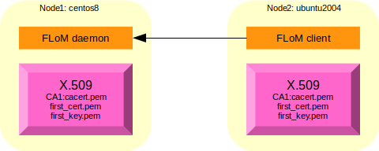
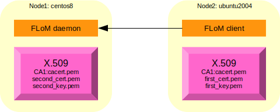

# Configuration example for "Channel Encryption" security level #
The example uses two different nodes; these are the names used during all the example:

* node1, name: *centos8.brenta.org*, operating system: CentOS 8.2 (64 bit)
* node2, name: *ubuntu2004.brenta.org*, operating system: Ubuntu Linux 20.04 (64 bit)

The page [Channel Encryption Debug](../Deep_Diving/Channel_Encryption_Debug.md) explains how to debug this type of configuration in case of issues.

## Setting up the certification authority and the required certificates ##
The instructions that are shown below are sufficient for a basic TLS set-up, for more advanced configurations please refer to specific documentaion like for exampe [OpenSSL Certificate Authority](https://jamielinux.com/docs/openssl-certificate-authority/index.html).

### Creating a CA (Certification Authority) of name *CA1* ###
Connect to node2 (could be even node1, it doesn't matter what node you use to create the Certification Authority and the Certificates) and execute these commands to create the directory structure:

~~~
tiian@ubuntu2004:~$ mkdir -p flom_ssl/CA1
tiian@ubuntu2004:~$ cd flom_ssl/CA1/
tiian@ubuntu2004:~/flom_ssl/CA1$ mkdir certs crl newcerts private
tiian@ubuntu2004:~/flom_ssl/CA1$ echo "01" > serial
tiian@ubuntu2004:~/flom_ssl/CA1$ cp /dev/null index.txt
tiian@ubuntu2004:~/flom_ssl/CA1$ ls -la
total 28
drwxrwxr-x 6 tiian tiian 4096 Nov 15 09:47 .
drwxrwxr-x 3 tiian tiian 4096 Nov 15 09:46 ..
drwxrwxr-x 2 tiian tiian 4096 Nov 15 09:47 certs
drwxrwxr-x 2 tiian tiian 4096 Nov 15 09:47 crl
-rw-rw-r-- 1 tiian tiian    0 Nov 15 09:47 index.txt
drwxrwxr-x 2 tiian tiian 4096 Nov 15 09:47 newcerts
drwxrwxr-x 2 tiian tiian 4096 Nov 15 09:47 private
-rw-rw-r-- 1 tiian tiian    3 Nov 15 09:47 serial
~~~

Pick-up a *openssl.cnf* example file; FLoM provide a pre-configured file in directory */usr/local/share/doc/flom/*:

~~~
tiian@ubuntu2004:~/flom_ssl/CA1$ ls -la /usr/local/share/doc/flom/flom_openssl.conf
-rw-r--r-- 1 root root 9409 Nov 15 09:46 /usr/local/share/doc/flom/flom_openssl.conf
~~~

copy it locally:

~~~
tiian@ubuntu2004:~/flom_ssl/CA1$ cp /usr/local/share/doc/flom/flom_openssl.conf .
~~~

Generate the certificate for the CA, use a secret password and pass something like "CA for FLoM Channel Encryption" as Common Name (CN):

~~~
tiian@ubuntu2004:~/flom_ssl/CA1$ openssl req -new -x509 -keyout private/cakey.pem -out cacert.pem -days 3650 -config flom_openssl.conf
Generating a RSA private key
..+++++
.....................+++++
writing new private key to 'private/cakey.pem'
Enter PEM pass phrase:
Verifying - Enter PEM pass phrase:
-----
You are about to be asked to enter information that will be incorporated
into your certificate request.
What you are about to enter is what is called a Distinguished Name or a DN.
There are quite a few fields but you can leave some blank
For some fields there will be a default value,
If you enter '.', the field will be left blank.
-----
Country Name (2 letter code) [IT]:
State or Province Name (full name) [Treviso]:
Locality Name (eg, city) [Mogliano Veneto]:
Organization Name (eg, company) [www.tiian.org]:
Organizational Unit Name (eg, section) [FLoM Project]:
Common Name (eg, YOUR name) []:CA for FLoM Channel Encryption
Email Address []:
~~~

File *cacert.pem* contains the **X.509 certificate** of the certification authority you have just created and file *private/cakey.pem* contains the **private key** associated to the certification authority.

~~~
tiian@ubuntu2004:~/flom_ssl/CA1$ ls -la cacert.pem private/cakey.pem
-rw-rw-r-- 1 tiian tiian 1700 Nov 15 09:50 cacert.pem
-rw------- 1 tiian tiian 1854 Nov 15 09:49 private/cakey.pem
~~~

### Creating a first X.509 certificate ###
To implement a *channel encryption* configuration just one certificate is enough.

Now you have to execute 4 commands; the system asks for a password: the same secret password used for the certification authority (see above). Use something like "Generic FLoM node" for the Common Name (CN) field.

~~~
tiian@ubuntu1004:~/flom_ssl/CA1$ openssl req -nodes -new -x509 -keyout first_key.pem -out first_req.pem -days 3650 -config flom_openssl.conf
tiian@ubuntu1004:~/flom_ssl/CA1$ openssl x509 -x509toreq -in first_req.pem -signkey first_key.pem -out tmp.pem
tiian@ubuntu1004:~/flom_ssl/CA1$ openssl ca -config flom_openssl.conf -policy policy_anything -out first_cert.pem -infiles tmp.pem
tiian@ubuntu1004:~/flom_ssl/CA1$ rm tmp.pem
~~~

The output should be something like this:

~~~
tiian@ubuntu2004:~/flom_ssl/CA1$ openssl req -nodes -new -x509 -keyout first_key.pem -out first_req.pem -days 3650 -config flom_openssl.conf
Generating a RSA private key
..............................+++++
....................+++++
writing new private key to 'first_key.pem'
-----
You are about to be asked to enter information that will be incorporated
into your certificate request.
What you are about to enter is what is called a Distinguished Name or a DN.
There are quite a few fields but you can leave some blank
For some fields there will be a default value,
If you enter '.', the field will be left blank.
-----
Country Name (2 letter code) [IT]:
State or Province Name (full name) [Treviso]:
Locality Name (eg, city) [Mogliano Veneto]:
Organization Name (eg, company) [www.tiian.org]:
Organizational Unit Name (eg, section) [FLoM Project]:
Common Name (eg, YOUR name) []:Generic FLoM node
Email Address []:

tiian@ubuntu2004:~/flom_ssl/CA1$ openssl x509 -x509toreq -in first_req.pem -signkey first_key.pem -out tmp.pem
Getting request Private Key
Generating certificate request

tiian@ubuntu2004:~/flom_ssl/CA1$ openssl ca -config flom_openssl.conf -policy policy_anything -out first_cert.pem -infiles tmp.pem
Using configuration from flom_openssl.conf
Enter pass phrase for ./private/cakey.pem:
Check that the request matches the signature
Signature ok
Certificate Details:
        Serial Number: 1 (0x1)
        Validity
            Not Before: Nov 15 08:53:55 2020 GMT
            Not After : Nov 15 08:53:55 2021 GMT
        Subject:
            countryName               = IT
            stateOrProvinceName       = Treviso
            localityName              = Mogliano Veneto
            organizationName          = www.tiian.org
            organizationalUnitName    = FLoM Project
            commonName                = Generic FLoM node
        X509v3 extensions:
            X509v3 Basic Constraints: 
                CA:FALSE
            Netscape Comment: 
                OpenSSL Generated Certificate
            X509v3 Subject Key Identifier: 
                11:6E:BD:75:E4:15:B7:23:8F:C1:C6:C3:87:61:77:21:4F:BF:20:61
            X509v3 Authority Key Identifier: 
                keyid:FE:A0:93:46:39:2E:BE:C9:A4:23:C1:46:7D:C6:01:F0:1E:0B:97:2A

Certificate is to be certified until Nov 15 08:53:55 2021 GMT (365 days)
Sign the certificate? [y/n]:y

1 out of 1 certificate requests certified, commit? [y/n]y
Write out database with 1 new entries
Data Base Updated

tiian@ubuntu2004:~/flom_ssl/CA1$ rm tmp.pem
~~~

Don't forget the last *rm* command.
If everything is fine, you must have two files: *first_cert.pem* contains the **X.509 certificate** for your FLoM node(s) and *first_key.pem* contains the **private key** associated to the certicate:

~~~
tiian@ubuntu2004:~/flom_ssl/CA1$ ls -la first_cert.pem first_key.pem
-rw-rw-r-- 1 tiian tiian 4663 Nov 15 09:53 first_cert.pem
-rw------- 1 tiian tiian 1704 Nov 15 09:52 first_key.pem
~~~

### Certificate *"installation"* ###
Only 3 files are needed to FLoM process (*flom*):

* *first_cert.pem*
* *first_key.pem*
* *cacert.pem*

copy them in a *easy to use place* on both systems.
Local copy:

~~~
tiian@ubuntu2004:~/flom_ssl/CA1$ mkdir /tmp/flom_ssl
tiian@ubuntu2004:~/flom_ssl/CA1$ cp cacert.pem first_cert.pem first_key.pem /tmp/flom_ssl/
tiian@ubuntu2004:~/flom_ssl/CA1$ ls -la /tmp/flom_ssl/
total 24
drwxrwxr-x  2 tiian tiian 4096 Nov 15 18:59 .
drwxrwxrwt 12 root  root  4096 Nov 15 18:59 ..
-rw-rw-r--  1 tiian tiian 1700 Nov 15 18:59 cacert.pem
-rw-rw-r--  1 tiian tiian 4663 Nov 15 18:59 first_cert.pem
-rw-------  1 tiian tiian 1704 Nov 15 18:59 first_key.pem
~~~

Remote copy:

~~~
tiian@ubuntu2004:~/flom_ssl/CA1$ scp -r /tmp/flom_ssl/ tiian@centos8.brenta.org:/tmp
tiian@centos8.brenta.org's password: 
first_key.pem                                 100% 1704     1.7MB/s   00:00    
first_cert.pem                                100% 4663     5.1MB/s   00:00    
cacert.pem                                    100% 1700   388.5KB/s   00:00    
~~~

Check the content in node1:

~~~
[tiian@centos8 ~]$ ls -la /tmp/flom_ssl/
total 20
drwxr-xr-x.  2 tiian tiian   67 Nov 15 19:02 .
drwxrwxrwt. 12 root  root  4096 Nov 15 19:01 ..
-rw-rw-r--.  1 tiian tiian 1700 Nov 15 19:01 cacert.pem
-rw-rw-r--.  1 tiian tiian 4663 Nov 15 19:01 first_cert.pem
-rw-------.  1 tiian tiian 1704 Nov 15 19:01 first_key.pem
~~~

### Using TLS (channel encryption security level) with FLoM ###

The picture shows the use case:

Setting a *trace mask* to trace the messaged produced by *flom_tls* and *flom_tcp* modules can help in troubleshooting a possible issue.

These are the commands to activate tracing and to start a FLoM daemon (server) using TLS inside node1:

~~~
[tiian@centos8 ~]$ export FLOM_TRACE_MASK=0x600000
[tiian@centos8 ~]$ echo $FLOM_TRACE_MASK
0x600000
[tiian@centos8 ~]$ flom -a centos8.brenta.org --daemon-trace-file=/tmp/flom-daemon.trc --tls-certificate=/tmp/flom_ssl/first_cert.pem --tls-private-key=/tmp/flom_ssl/first_key.pem --tls-ca-certificate=/tmp/flom_ssl/cacert.pem --tls-check-peer-id=no -d -1 -- true
2020-11-15 19:23:43.211283 [1669/0x107aa00] flom_tcp_init
2020-11-15 19:23:43.211348 [1669/0x107aa00] flom_tcp_init
2020-11-15 19:23:43.211351 [1669/0x107aa00] flom_tcp_connect
2020-11-15 19:23:43.211353 [1669/0x107aa00] flom_tcp_connect: connecting to address 'centos8.brenta.org' and port 28015
2020-11-15 19:23:43.213123 [1669/0x107aa00] flom_tcp_connect/getaddrinfo(): [ai_flags=2,ai_family=2,ai_socktype=1,ai_protocol=6,ai_addrlen=16,ai_canonname='centos8.brenta.org'] [ai_flags=2,ai_family=10,ai_socktype=1,ai_protocol=6,ai_addrlen=28,ai_canonname='{null}'] 
2020-11-15 19:23:43.213138 [1669/0x107aa00] flom_tcp_try_connect: sa addrlen=16; IPv4 address, sin_port=28015, sin_addr='192.168.123.227'
2020-11-15 19:23:43.213490 [1669/0x107aa00] flom_tcp_try_connect: sa addrlen=16; IPv4 address, sin_port=28015, sin_addr='192.168.123.227'
2020-11-15 19:23:43.213663 [1669/0x107aa00] flom_tcp_try_connect/connect(): errno=111 'Connection refused', skipping...
2020-11-15 19:23:43.213678 [1669/0x107aa00] flom_tcp_try_connect: sa addrlen=28; IPv6 address, sin6_port=28015, sin6_flowinfo=0x0, sin6_addr='fe80::1bb8:338f:2bcc:81e2', sin6_scope_id=0
2020-11-15 19:23:43.213709 [1669/0x107aa00] flom_tcp_try_connect: sa addrlen=28; IPv6 address, sin6_port=28015, sin6_flowinfo=0x0, sin6_addr='fe80::1bb8:338f:2bcc:81e2', sin6_scope_id=0
2020-11-15 19:23:43.213723 [1669/0x107aa00] flom_tcp_try_connect/connect(): errno=22 'Invalid argument', skipping...
2020-11-15 19:23:43.213731 [1669/0x107aa00] flom_tcp_connect/excp=1/ret_cod=7/errno=22
2020-11-15 19:23:43.217433 [1669/0x107aa00] flom_tcp_init
2020-11-15 19:23:43.217453 [1669/0x107aa00] flom_tcp_connect
2020-11-15 19:23:43.217456 [1669/0x107aa00] flom_tcp_connect: connecting to address 'centos8.brenta.org' and port 28015
2020-11-15 19:23:43.217847 [1669/0x107aa00] flom_tcp_connect/getaddrinfo(): [ai_flags=2,ai_family=2,ai_socktype=1,ai_protocol=6,ai_addrlen=16,ai_canonname='centos8.brenta.org'] [ai_flags=2,ai_family=10,ai_socktype=1,ai_protocol=6,ai_addrlen=28,ai_canonname='{null}'] 
2020-11-15 19:23:43.217864 [1669/0x107aa00] flom_tcp_try_connect: sa addrlen=16; IPv4 address, sin_port=28015, sin_addr='192.168.123.227'
2020-11-15 19:23:43.217881 [1669/0x107aa00] flom_tcp_try_connect: sa addrlen=16; IPv4 address, sin_port=28015, sin_addr='192.168.123.227'
2020-11-15 19:23:43.217951 [1669/0x107aa00] flom_tcp_connect: domain=2, sockfd=3, socket_type=1, addrlen=16
2020-11-15 19:23:43.217961 [1669/0x107aa00] flom_tcp_connect: addrlen=16; IPv4 address, sin_port=28015, sin_addr='192.168.123.227'
2020-11-15 19:23:43.217969 [1669/0x107aa00] flom_tcp_connect/excp=2/ret_cod=0/errno=22
2020-11-15 19:23:43.217983 [1669/0x107aa00] flom_tls_init: calling OPENSSL_init_ssl()...
2020-11-15 19:23:43.219182 [1669/0x107aa00] flom_tls_init: calling SSL_load_error_strings()...
2020-11-15 19:23:43.219278 [1669/0x107aa00] flom_tls_init: calling OpenSSL_add_all_algorithms()...
2020-11-15 19:23:43.219284 [1669/0x107aa00] flom_tls_context
2020-11-15 19:23:43.219287 [1669/0x107aa00] flom_tls_context: setting TLS/SSL method to TLS_client_method()
2020-11-15 19:23:43.228282 [1669/0x107aa00] flom_tls_context: SSL_CTX_set_verify(0x1083d50, 1, flom_tls_callback)
2020-11-15 19:23:43.228313 [1669/0x107aa00] flom_tls_context/excp=2/ret_cod=0/errno=22
2020-11-15 19:23:43.228318 [1669/0x107aa00] flom_tls_set_cert
2020-11-15 19:23:43.228320 [1669/0x107aa00] flom_tls_set_cert: SSL_CTX_use_certificate_file(obj->ctx, '/tmp/flom_ssl/first_cert.pem', SSL_FILETYPE_PEM)
2020-11-15 19:23:43.228524 [1669/0x107aa00] flom_tls_set_cert: SSL_CTX_use_PrivateKey_file(obj->ctx, '/tmp/flom_ssl/first_key.pem', SSL_FILETYPE_PEM)
2020-11-15 19:23:43.228566 [1669/0x107aa00] flom_tls_set_cert: SSL_CTX_check_private_key(obj->ctx)
2020-11-15 19:23:43.228572 [1669/0x107aa00] flom_tls_set_cert: SSL_CTX_load_verify_locations(obj->ctx, '/tmp/flom_ssl/cacert.pem', NULL)
2020-11-15 19:23:43.228643 [1669/0x107aa00] flom_tls_set_cert/excp=4/ret_cod=0/errno=22
2020-11-15 19:23:43.228648 [1669/0x107aa00] flom_tls_connect
2020-11-15 19:23:43.228651 [1669/0x107aa00] flom_tls_prepare
2020-11-15 19:23:43.228669 [1669/0x107aa00] flom_tls_prepare/excp=3/ret_cod=0/errno=22
2020-11-15 19:23:43.231021 [1669/0x107aa00] flom_tls_callback: preverify_ok=1
2020-11-15 19:23:43.231033 [1669/0x107aa00] flom_tls_callback: ret_cod=1
2020-11-15 19:23:43.231105 [1669/0x107aa00] flom_tls_callback: preverify_ok=1
2020-11-15 19:23:43.231123 [1669/0x107aa00] flom_tls_callback: ret_cod=1
2020-11-15 19:23:43.232505 [1669/0x107aa00] flom_tls_connect: connection established with TLS_AES_256_GCM_SHA384 encryption
2020-11-15 19:23:43.232515 [1669/0x107aa00] flom_tls_cert_parse
2020-11-15 19:23:43.232524 [1669/0x107aa00] flom_tls_cert_struct_fill
2020-11-15 19:23:43.232527 [1669/0x107aa00] flom_tls_cert_struct_fill/excp=7/ret_cod=0/errno=0
2020-11-15 19:23:43.232530 [1669/0x107aa00] flom_tls_cert_struct_fill
2020-11-15 19:23:43.232532 [1669/0x107aa00] flom_tls_cert_struct_fill/excp=7/ret_cod=0/errno=0
2020-11-15 19:23:43.232534 [1669/0x107aa00] flom_tls_cert_struct_fill
2020-11-15 19:23:43.232536 [1669/0x107aa00] flom_tls_cert_struct_fill/excp=7/ret_cod=0/errno=0
2020-11-15 19:23:43.232538 [1669/0x107aa00] flom_tls_cert_struct_fill
2020-11-15 19:23:43.232540 [1669/0x107aa00] flom_tls_cert_struct_fill/excp=7/ret_cod=0/errno=0
2020-11-15 19:23:43.232542 [1669/0x107aa00] flom_tls_cert_struct_fill
2020-11-15 19:23:43.232544 [1669/0x107aa00] flom_tls_cert_struct_fill/excp=7/ret_cod=0/errno=0
2020-11-15 19:23:43.232546 [1669/0x107aa00] flom_tls_cert_struct_fill
2020-11-15 19:23:43.232548 [1669/0x107aa00] flom_tls_cert_struct_fill/excp=7/ret_cod=0/errno=0
2020-11-15 19:23:43.232551 [1669/0x107aa00] flom_tls_cert_parse: issuer fields are C=IT/ST=Treviso/L=Mogliano Veneto/O=www.tiian.org/OU=FLoM Project/emailAddress={null}/CN=CA for FLoM Channel Encryption
2020-11-15 19:23:43.232623 [1669/0x107aa00] flom_tls_cert_struct_fill
2020-11-15 19:23:43.232627 [1669/0x107aa00] flom_tls_cert_struct_fill/excp=7/ret_cod=0/errno=0
2020-11-15 19:23:43.232629 [1669/0x107aa00] flom_tls_cert_struct_fill
2020-11-15 19:23:43.232631 [1669/0x107aa00] flom_tls_cert_struct_fill/excp=7/ret_cod=0/errno=0
2020-11-15 19:23:43.232633 [1669/0x107aa00] flom_tls_cert_struct_fill
2020-11-15 19:23:43.232635 [1669/0x107aa00] flom_tls_cert_struct_fill/excp=7/ret_cod=0/errno=0
2020-11-15 19:23:43.232637 [1669/0x107aa00] flom_tls_cert_struct_fill
2020-11-15 19:23:43.232640 [1669/0x107aa00] flom_tls_cert_struct_fill/excp=7/ret_cod=0/errno=0
2020-11-15 19:23:43.232642 [1669/0x107aa00] flom_tls_cert_struct_fill
2020-11-15 19:23:43.232644 [1669/0x107aa00] flom_tls_cert_struct_fill/excp=7/ret_cod=0/errno=0
2020-11-15 19:23:43.232646 [1669/0x107aa00] flom_tls_cert_struct_fill
2020-11-15 19:23:43.232648 [1669/0x107aa00] flom_tls_cert_struct_fill/excp=7/ret_cod=0/errno=0
2020-11-15 19:23:43.232650 [1669/0x107aa00] flom_tls_cert_parse: subject fields are C=IT/ST=Treviso/L=Mogliano Veneto/O=www.tiian.org/OU=FLoM Project/emailAddress={null}/CN=Generic FLoM node
2020-11-15 19:23:43.232659 [1669/0x107aa00] flom_tls_cert_parse/excp=4/ret_cod=0/errno=0
2020-11-15 19:23:43.232661 [1669/0x107aa00] flom_tls_connect/excp=3/ret_cod=0/errno=0
2020-11-15 19:23:43.232938 [1669/0x107aa00] flom_tls_send
2020-11-15 19:23:43.232956 [1669/0x107aa00] flom_tls_send/excp=2/ret_cod=0/errno=0
2020-11-15 19:23:43.232962 [1669/0x107aa00] flom_tls_recv_msg
2020-11-15 19:23:43.232964 [1669/0x107aa00] flom_tls_recv_msg: closing_tag='</msg>', closing_tag_len=6, closing_tag_last='>'
2020-11-15 19:23:43.233590 [1669/0x107aa00] flom_tls_recv_msg: read_bytes=6 '<?xml '
2020-11-15 19:23:43.233602 [1669/0x107aa00] flom_tls_recv_msg: read_bytes=6 'versio'
2020-11-15 19:23:43.233605 [1669/0x107aa00] flom_tls_recv_msg: read_bytes=6 'n="1.0'
2020-11-15 19:23:43.233607 [1669/0x107aa00] flom_tls_recv_msg: read_bytes=6 '" enco'
2020-11-15 19:23:43.233609 [1669/0x107aa00] flom_tls_recv_msg: read_bytes=6 'ding="'
2020-11-15 19:23:43.233611 [1669/0x107aa00] flom_tls_recv_msg: read_bytes=6 'UTF-8"'
2020-11-15 19:23:43.233613 [1669/0x107aa00] flom_tls_recv_msg: read_bytes=6 ' ?><ms'
2020-11-15 19:23:43.233615 [1669/0x107aa00] flom_tls_recv_msg: read_bytes=6 'g leve'
2020-11-15 19:23:43.233617 [1669/0x107aa00] flom_tls_recv_msg: read_bytes=6 'l="3" '
2020-11-15 19:23:43.233619 [1669/0x107aa00] flom_tls_recv_msg: read_bytes=6 'verb="'
2020-11-15 19:23:43.233623 [1669/0x107aa00] flom_tls_recv_msg: read_bytes=6 '1" ste'
2020-11-15 19:23:43.233628 [1669/0x107aa00] flom_tls_recv_msg: read_bytes=6 'p="16"'
2020-11-15 19:23:43.233630 [1669/0x107aa00] flom_tls_recv_msg: read_bytes=6 '><sess'
2020-11-15 19:23:43.233632 [1669/0x107aa00] flom_tls_recv_msg: read_bytes=6 'ion pe'
2020-11-15 19:23:43.233634 [1669/0x107aa00] flom_tls_recv_msg: read_bytes=6 'erid="'
2020-11-15 19:23:43.233636 [1669/0x107aa00] flom_tls_recv_msg: read_bytes=6 'b4eae1'
2020-11-15 19:23:43.233638 [1669/0x107aa00] flom_tls_recv_msg: read_bytes=6 '48592d'
2020-11-15 19:23:43.233640 [1669/0x107aa00] flom_tls_recv_msg: read_bytes=6 '4d128d'
2020-11-15 19:23:43.233642 [1669/0x107aa00] flom_tls_recv_msg: read_bytes=6 'f8f769'
2020-11-15 19:23:43.233644 [1669/0x107aa00] flom_tls_recv_msg: read_bytes=6 '87b9ac'
2020-11-15 19:23:43.233646 [1669/0x107aa00] flom_tls_recv_msg: read_bytes=6 '08"/><'
2020-11-15 19:23:43.233648 [1669/0x107aa00] flom_tls_recv_msg: read_bytes=5 'answe'
2020-11-15 19:23:43.233652 [1669/0x107aa00] flom_tls_recv_msg: read_bytes=6 'r rc="'
2020-11-15 19:23:43.233654 [1669/0x107aa00] flom_tls_recv_msg: read_bytes=6 '0"/></'
2020-11-15 19:23:43.233656 [1669/0x107aa00] flom_tls_recv_msg: read_bytes=4 'msg>'
2020-11-15 19:23:43.233658 [1669/0x107aa00] flom_tls_recv_msg: received message is '<?xml version="1.0" encoding="UTF-8" ?><msg level="3" verb="1" step="16"><session peerid="b4eae148592d4d128df8f76987b9ac08"/><answer rc="0"/></msg>' of 147 chars
2020-11-15 19:23:43.233661 [1669/0x107aa00] flom_tls_recv_msg/excp=3/ret_cod=0/errno=0
2020-11-15 19:23:43.234667 [1669/0x107aa00] flom_tls_send
2020-11-15 19:23:43.234711 [1669/0x107aa00] flom_tls_send/excp=2/ret_cod=0/errno=0
2020-11-15 19:23:43.235047 [1669/0x107aa00] flom_tcp_close
2020-11-15 19:23:43.235063 [1669/0x107aa00] flom_tcp_close/excp=1/ret_cod=0/errno=107
[tiian@centos8 ~]$ pgrep flom
1672
~~~

This is the trace produced by FLoM daemon that runs in node1:

~~~
[tiian@centos8 ~]$ cat /tmp/flom-daemon.trc
2020-11-15 19:23:43.215424 [1672/0x107aa00] flom_tcp_init
2020-11-15 19:23:43.215457 [1672/0x107aa00] flom_tcp_listen
2020-11-15 19:23:43.215460 [1672/0x107aa00] flom_tcp_listen: binding address 'centos8.brenta.org' and port 28015
2020-11-15 19:23:43.215890 [1672/0x107aa00] flom_tcp_listen/getaddrinfo(): [ai_flags=1,ai_family=2,ai_socktype=1,ai_protocol=6,ai_addrlen=16,ai_canonname='{null}'] [ai_flags=1,ai_family=10,ai_socktype=1,ai_protocol=6,ai_addrlen=28,ai_canonname='{null}'] 
2020-11-15 19:23:43.215894 [1672/0x107aa00] flom_tcp_listen: ai_addr addrlen=16; IPv4 address, sin_port=28015, sin_addr='192.168.123.227'
2020-11-15 19:23:43.215952 [1672/0x107aa00] flom_tcp_listen: bound!
2020-11-15 19:23:43.215964 [1672/0x107aa00] flom_tcp_listen/excp=3/ret_cod=0/errno=22
2020-11-15 19:23:43.215970 [1672/0x107aa00] flom_tcp_init
2020-11-15 19:23:43.215973 [1672/0x107aa00] flom_tcp_init
2020-11-15 19:23:43.218459 [1672/0x107aa00] flom_tcp_init
2020-11-15 19:23:43.218472 [1672/0x107aa00] flom_tcp_init
2020-11-15 19:23:43.218479 [1672/0x107aa00] flom_tls_init: calling OPENSSL_init_ssl()...
2020-11-15 19:23:43.219396 [1672/0x107aa00] flom_tls_init: calling SSL_load_error_strings()...
2020-11-15 19:23:43.219490 [1672/0x107aa00] flom_tls_init: calling OpenSSL_add_all_algorithms()...
2020-11-15 19:23:43.219501 [1672/0x107aa00] flom_tls_context
2020-11-15 19:23:43.219504 [1672/0x107aa00] flom_tls_context: setting TLS/SSL method to TLS_server_method()
2020-11-15 19:23:43.228290 [1672/0x107aa00] flom_tls_context: SSL_CTX_set_verify(0x10852a0, 3, flom_tls_callback)
2020-11-15 19:23:43.228314 [1672/0x107aa00] flom_tls_context/excp=2/ret_cod=0/errno=22
2020-11-15 19:23:43.228318 [1672/0x107aa00] flom_tls_set_cert
2020-11-15 19:23:43.228320 [1672/0x107aa00] flom_tls_set_cert: SSL_CTX_use_certificate_file(obj->ctx, '/tmp/flom_ssl/first_cert.pem', SSL_FILETYPE_PEM)
2020-11-15 19:23:43.228524 [1672/0x107aa00] flom_tls_set_cert: SSL_CTX_use_PrivateKey_file(obj->ctx, '/tmp/flom_ssl/first_key.pem', SSL_FILETYPE_PEM)
2020-11-15 19:23:43.228567 [1672/0x107aa00] flom_tls_set_cert: SSL_CTX_check_private_key(obj->ctx)
2020-11-15 19:23:43.228572 [1672/0x107aa00] flom_tls_set_cert: SSL_CTX_load_verify_locations(obj->ctx, '/tmp/flom_ssl/cacert.pem', NULL)
2020-11-15 19:23:43.228641 [1672/0x107aa00] flom_tls_set_cert/excp=4/ret_cod=0/errno=22
2020-11-15 19:23:43.228646 [1672/0x107aa00] flom_tls_accept
2020-11-15 19:23:43.228649 [1672/0x107aa00] flom_tls_prepare
2020-11-15 19:23:43.228669 [1672/0x107aa00] flom_tls_prepare/excp=3/ret_cod=0/errno=22
2020-11-15 19:23:43.232609 [1672/0x107aa00] flom_tls_callback: preverify_ok=1
2020-11-15 19:23:43.232619 [1672/0x107aa00] flom_tls_callback: ret_cod=1
2020-11-15 19:23:43.232655 [1672/0x107aa00] flom_tls_callback: preverify_ok=1
2020-11-15 19:23:43.232658 [1672/0x107aa00] flom_tls_callback: ret_cod=1
2020-11-15 19:23:43.232888 [1672/0x107aa00] flom_tls_accepted: connection accepted with TLS_AES_256_GCM_SHA384 encryption
2020-11-15 19:23:43.232896 [1672/0x107aa00] flom_tls_cert_parse
2020-11-15 19:23:43.232904 [1672/0x107aa00] flom_tls_cert_struct_fill
2020-11-15 19:23:43.232907 [1672/0x107aa00] flom_tls_cert_struct_fill/excp=7/ret_cod=0/errno=0
2020-11-15 19:23:43.232909 [1672/0x107aa00] flom_tls_cert_struct_fill
2020-11-15 19:23:43.232911 [1672/0x107aa00] flom_tls_cert_struct_fill/excp=7/ret_cod=0/errno=0
2020-11-15 19:23:43.232913 [1672/0x107aa00] flom_tls_cert_struct_fill
2020-11-15 19:23:43.232915 [1672/0x107aa00] flom_tls_cert_struct_fill/excp=7/ret_cod=0/errno=0
2020-11-15 19:23:43.232917 [1672/0x107aa00] flom_tls_cert_struct_fill
2020-11-15 19:23:43.232919 [1672/0x107aa00] flom_tls_cert_struct_fill/excp=7/ret_cod=0/errno=0
2020-11-15 19:23:43.232921 [1672/0x107aa00] flom_tls_cert_struct_fill
2020-11-15 19:23:43.232922 [1672/0x107aa00] flom_tls_cert_struct_fill/excp=7/ret_cod=0/errno=0
2020-11-15 19:23:43.232924 [1672/0x107aa00] flom_tls_cert_struct_fill
2020-11-15 19:23:43.232926 [1672/0x107aa00] flom_tls_cert_struct_fill/excp=7/ret_cod=0/errno=0
2020-11-15 19:23:43.232928 [1672/0x107aa00] flom_tls_cert_parse: issuer fields are C=IT/ST=Treviso/L=Mogliano Veneto/O=www.tiian.org/OU=FLoM Project/emailAddress={null}/CN=CA for FLoM Channel Encryption
2020-11-15 19:23:43.232946 [1672/0x107aa00] flom_tls_cert_struct_fill
2020-11-15 19:23:43.232949 [1672/0x107aa00] flom_tls_cert_struct_fill/excp=7/ret_cod=0/errno=0
2020-11-15 19:23:43.232951 [1672/0x107aa00] flom_tls_cert_struct_fill
2020-11-15 19:23:43.232953 [1672/0x107aa00] flom_tls_cert_struct_fill/excp=7/ret_cod=0/errno=0
2020-11-15 19:23:43.232954 [1672/0x107aa00] flom_tls_cert_struct_fill
2020-11-15 19:23:43.232956 [1672/0x107aa00] flom_tls_cert_struct_fill/excp=7/ret_cod=0/errno=0
2020-11-15 19:23:43.232958 [1672/0x107aa00] flom_tls_cert_struct_fill
2020-11-15 19:23:43.232960 [1672/0x107aa00] flom_tls_cert_struct_fill/excp=7/ret_cod=0/errno=0
2020-11-15 19:23:43.232962 [1672/0x107aa00] flom_tls_cert_struct_fill
2020-11-15 19:23:43.232964 [1672/0x107aa00] flom_tls_cert_struct_fill/excp=7/ret_cod=0/errno=0
2020-11-15 19:23:43.232966 [1672/0x107aa00] flom_tls_cert_struct_fill
2020-11-15 19:23:43.232967 [1672/0x107aa00] flom_tls_cert_struct_fill/excp=7/ret_cod=0/errno=0
2020-11-15 19:23:43.232969 [1672/0x107aa00] flom_tls_cert_parse: subject fields are C=IT/ST=Treviso/L=Mogliano Veneto/O=www.tiian.org/OU=FLoM Project/emailAddress={null}/CN=Generic FLoM node
2020-11-15 19:23:43.232976 [1672/0x107aa00] flom_tls_cert_parse/excp=4/ret_cod=0/errno=0
2020-11-15 19:23:43.232979 [1672/0x107aa00] flom_tls_accept/excp=3/ret_cod=0/errno=0
2020-11-15 19:23:43.232986 [1672/0x107aa00] flom_tls_recv_msg
2020-11-15 19:23:43.232988 [1672/0x107aa00] flom_tls_recv_msg: closing_tag='</msg>', closing_tag_len=6, closing_tag_last='>'
2020-11-15 19:23:43.232995 [1672/0x107aa00] flom_tls_recv_msg: read_bytes=6 '<?xml '
2020-11-15 19:23:43.232998 [1672/0x107aa00] flom_tls_recv_msg: read_bytes=6 'versio'
2020-11-15 19:23:43.233000 [1672/0x107aa00] flom_tls_recv_msg: read_bytes=6 'n="1.0'
2020-11-15 19:23:43.233002 [1672/0x107aa00] flom_tls_recv_msg: read_bytes=6 '" enco'
2020-11-15 19:23:43.233004 [1672/0x107aa00] flom_tls_recv_msg: read_bytes=6 'ding="'
2020-11-15 19:23:43.233006 [1672/0x107aa00] flom_tls_recv_msg: read_bytes=6 'UTF-8"'
2020-11-15 19:23:43.233008 [1672/0x107aa00] flom_tls_recv_msg: read_bytes=6 ' ?><ms'
2020-11-15 19:23:43.233010 [1672/0x107aa00] flom_tls_recv_msg: read_bytes=6 'g leve'
2020-11-15 19:23:43.233012 [1672/0x107aa00] flom_tls_recv_msg: read_bytes=6 'l="3" '
2020-11-15 19:23:43.233014 [1672/0x107aa00] flom_tls_recv_msg: read_bytes=6 'verb="'
2020-11-15 19:23:43.233016 [1672/0x107aa00] flom_tls_recv_msg: read_bytes=6 '1" ste'
2020-11-15 19:23:43.233018 [1672/0x107aa00] flom_tls_recv_msg: read_bytes=6 'p="8">'
2020-11-15 19:23:43.233019 [1672/0x107aa00] flom_tls_recv_msg: read_bytes=6 '<sessi'
2020-11-15 19:23:43.233021 [1672/0x107aa00] flom_tls_recv_msg: read_bytes=6 'on pee'
2020-11-15 19:23:43.233023 [1672/0x107aa00] flom_tls_recv_msg: read_bytes=6 'rid="b'
2020-11-15 19:23:43.233025 [1672/0x107aa00] flom_tls_recv_msg: read_bytes=6 '4eae14'
2020-11-15 19:23:43.233027 [1672/0x107aa00] flom_tls_recv_msg: read_bytes=6 '8592d4'
2020-11-15 19:23:43.233029 [1672/0x107aa00] flom_tls_recv_msg: read_bytes=6 'd128df'
2020-11-15 19:23:43.233031 [1672/0x107aa00] flom_tls_recv_msg: read_bytes=6 '8f7698'
2020-11-15 19:23:43.233033 [1672/0x107aa00] flom_tls_recv_msg: read_bytes=6 '7b9ac0'
2020-11-15 19:23:43.233035 [1672/0x107aa00] flom_tls_recv_msg: read_bytes=6 '8"/><r'
2020-11-15 19:23:43.233037 [1672/0x107aa00] flom_tls_recv_msg: read_bytes=6 'esourc'
2020-11-15 19:23:43.233039 [1672/0x107aa00] flom_tls_recv_msg: read_bytes=6 'e name'
2020-11-15 19:23:43.233041 [1672/0x107aa00] flom_tls_recv_msg: read_bytes=6 '="X1JF'
2020-11-15 19:23:43.233042 [1672/0x107aa00] flom_tls_recv_msg: read_bytes=6 'U09VUk'
2020-11-15 19:23:43.233044 [1672/0x107aa00] flom_tls_recv_msg: read_bytes=6 'NF" mo'
2020-11-15 19:23:43.233046 [1672/0x107aa00] flom_tls_recv_msg: read_bytes=6 'de="5"'
2020-11-15 19:23:43.233048 [1672/0x107aa00] flom_tls_recv_msg: read_bytes=6 ' wait='
2020-11-15 19:23:43.233050 [1672/0x107aa00] flom_tls_recv_msg: read_bytes=6 '"1" cr'
2020-11-15 19:23:43.233054 [1672/0x107aa00] flom_tls_recv_msg: read_bytes=6 'eate="'
2020-11-15 19:23:43.233056 [1672/0x107aa00] flom_tls_recv_msg: read_bytes=6 '1" lif'
2020-11-15 19:23:43.233058 [1672/0x107aa00] flom_tls_recv_msg: read_bytes=6 'espan='
2020-11-15 19:23:43.233060 [1672/0x107aa00] flom_tls_recv_msg: read_bytes=6 '"0"/><'
2020-11-15 19:23:43.233062 [1672/0x107aa00] flom_tls_recv_msg: read_bytes=5 '/msg>'
2020-11-15 19:23:43.233064 [1672/0x107aa00] flom_tls_recv_msg: received message is '<?xml version="1.0" encoding="UTF-8" ?><msg level="3" verb="1" step="8"><session peerid="b4eae148592d4d128df8f76987b9ac08"/><resource name="X1JFU09VUkNF" mode="5" wait="1" create="1" lifespan="0"/></msg>' of 203 chars
2020-11-15 19:23:43.233066 [1672/0x107aa00] flom_tls_recv_msg/excp=3/ret_cod=0/errno=0
2020-11-15 19:23:43.233491 [1672/0x10be800] flom_tcp_init
2020-11-15 19:23:43.233501 [1672/0x10be800] flom_tcp_init
2020-11-15 19:23:43.233548 [1672/0x10be800] flom_tls_send
2020-11-15 19:23:43.233569 [1672/0x10be800] flom_tls_send/excp=2/ret_cod=0/errno=0
2020-11-15 19:23:43.234831 [1672/0x10be800] flom_tls_recv_msg
2020-11-15 19:23:43.234908 [1672/0x10be800] flom_tls_recv_msg: closing_tag='</msg>', closing_tag_len=6, closing_tag_last='>'
2020-11-15 19:23:43.234920 [1672/0x10be800] flom_tls_recv_msg: read_bytes=6 '<?xml '
2020-11-15 19:23:43.234923 [1672/0x10be800] flom_tls_recv_msg: read_bytes=6 'versio'
2020-11-15 19:23:43.234925 [1672/0x10be800] flom_tls_recv_msg: read_bytes=6 'n="1.0'
2020-11-15 19:23:43.234927 [1672/0x10be800] flom_tls_recv_msg: read_bytes=6 '" enco'
2020-11-15 19:23:43.234929 [1672/0x10be800] flom_tls_recv_msg: read_bytes=6 'ding="'
2020-11-15 19:23:43.234931 [1672/0x10be800] flom_tls_recv_msg: read_bytes=6 'UTF-8"'
2020-11-15 19:23:43.234934 [1672/0x10be800] flom_tls_recv_msg: read_bytes=6 ' ?><ms'
2020-11-15 19:23:43.234936 [1672/0x10be800] flom_tls_recv_msg: read_bytes=6 'g leve'
2020-11-15 19:23:43.234938 [1672/0x10be800] flom_tls_recv_msg: read_bytes=6 'l="3" '
2020-11-15 19:23:43.234940 [1672/0x10be800] flom_tls_recv_msg: read_bytes=6 'verb="'
2020-11-15 19:23:43.234942 [1672/0x10be800] flom_tls_recv_msg: read_bytes=6 '2" ste'
2020-11-15 19:23:43.234944 [1672/0x10be800] flom_tls_recv_msg: read_bytes=6 'p="8">'
2020-11-15 19:23:43.234946 [1672/0x10be800] flom_tls_recv_msg: read_bytes=6 '<resou'
2020-11-15 19:23:43.234948 [1672/0x10be800] flom_tls_recv_msg: read_bytes=6 'rce na'
2020-11-15 19:23:43.234950 [1672/0x10be800] flom_tls_recv_msg: read_bytes=6 'me="X1'
2020-11-15 19:23:43.234952 [1672/0x10be800] flom_tls_recv_msg: read_bytes=6 'JFU09V'
2020-11-15 19:23:43.234954 [1672/0x10be800] flom_tls_recv_msg: read_bytes=6 'UkNF" '
2020-11-15 19:23:43.234956 [1672/0x10be800] flom_tls_recv_msg: read_bytes=6 'rollba'
2020-11-15 19:23:43.234959 [1672/0x10be800] flom_tls_recv_msg: read_bytes=6 'ck="0"'
2020-11-15 19:23:43.234961 [1672/0x10be800] flom_tls_recv_msg: read_bytes=6 ' /></m'
2020-11-15 19:23:43.234963 [1672/0x10be800] flom_tls_recv_msg: read_bytes=3 'sg>'
2020-11-15 19:23:43.234965 [1672/0x10be800] flom_tls_recv_msg: received message is '<?xml version="1.0" encoding="UTF-8" ?><msg level="3" verb="2" step="8"><resource name="X1JFU09VUkNF" rollback="0" /></msg>' of 123 chars
2020-11-15 19:23:43.234967 [1672/0x10be800] flom_tls_recv_msg/excp=3/ret_cod=0/errno=0
2020-11-15 19:23:43.234988 [1672/0x10be800] flom_tls_recv_msg
2020-11-15 19:23:43.234991 [1672/0x10be800] flom_tls_recv_msg: closing_tag='</msg>', closing_tag_len=6, closing_tag_last='>'
2020-11-15 19:23:43.234995 [1672/0x10be800] flom_tls_recv_msg: read_bytes=0 ''
2020-11-15 19:23:43.234999 [1672/0x10be800] flom_tls_recv_msg/SSL_read: SSL error=5 (SSL_ERROR_SYSCALL)
2020-11-15 19:23:43.235002 [1672/0x10be800] flom_tls_recv_msg/excp=1/ret_cod=-409/errno=0
2020-11-15 19:23:43.235006 [1672/0x10be800] flom_tcp_close
2020-11-15 19:23:43.235037 [1672/0x10be800] flom_tcp_close/excp=1/ret_cod=0/errno=0
~~~

These are the commands to activate tracing and to start a FLoM client using TLS inside node2:

~~~
tiian@ubuntu2004:~$ export FLOM_TRACE_MASK=0x600000
tiian@ubuntu2004:~$ echo $FLOM_TRACE_MASK
0x600000
tiian@ubuntu2004:~$ flom -a centos8.brenta.org --tls-certificate=/tmp/flom_ssl/first_cert.pem --tls-private-key=/tmp/flom_ssl/first_key.pem --tls-ca-certificate=/tmp/flom_ssl/cacert.pem --tls-check-peer-id=no -- echo 'Hello world!'
2020-11-15 19:28:00.795666 [1244/0x555a246fe200] flom_tcp_init
2020-11-15 19:28:00.795711 [1244/0x555a246fe200] flom_tcp_init
2020-11-15 19:28:00.795724 [1244/0x555a246fe200] flom_tcp_connect
2020-11-15 19:28:00.795726 [1244/0x555a246fe200] flom_tcp_connect: connecting to address 'centos8.brenta.org' and port 28015
2020-11-15 19:28:00.796580 [1244/0x555a246fe200] flom_tcp_connect/getaddrinfo(): [ai_flags=2,ai_family=2,ai_socktype=1,ai_protocol=6,ai_addrlen=16,ai_canonname='centos8.brenta.org'] [ai_flags=2,ai_family=10,ai_socktype=1,ai_protocol=6,ai_addrlen=28,ai_canonname='{null}'] 
2020-11-15 19:28:00.796597 [1244/0x555a246fe200] flom_tcp_try_connect: sa addrlen=16; IPv4 address, sin_port=28015, sin_addr='192.168.123.227'
2020-11-15 19:28:00.796612 [1244/0x555a246fe200] flom_tcp_try_connect: sa addrlen=16; IPv4 address, sin_port=28015, sin_addr='192.168.123.227'
2020-11-15 19:28:00.797122 [1244/0x555a246fe200] flom_tcp_connect: domain=2, sockfd=3, socket_type=1, addrlen=16
2020-11-15 19:28:00.797135 [1244/0x555a246fe200] flom_tcp_connect: addrlen=16; IPv4 address, sin_port=28015, sin_addr='192.168.123.227'
2020-11-15 19:28:00.797154 [1244/0x555a246fe200] flom_tcp_connect/excp=2/ret_cod=0/errno=22
2020-11-15 19:28:00.797160 [1244/0x555a246fe200] flom_tls_init: calling OPENSSL_init_ssl()...
2020-11-15 19:28:00.798213 [1244/0x555a246fe200] flom_tls_init: calling SSL_load_error_strings()...
2020-11-15 19:28:00.798342 [1244/0x555a246fe200] flom_tls_init: calling OpenSSL_add_all_algorithms()...
2020-11-15 19:28:00.798351 [1244/0x555a246fe200] flom_tls_context
2020-11-15 19:28:00.798354 [1244/0x555a246fe200] flom_tls_context: setting TLS/SSL method to TLS_client_method()
2020-11-15 19:28:00.798495 [1244/0x555a246fe200] flom_tls_context: SSL_CTX_set_verify(0x555a24707230, 1, flom_tls_callback)
2020-11-15 19:28:00.798503 [1244/0x555a246fe200] flom_tls_context/excp=2/ret_cod=0/errno=22
2020-11-15 19:28:00.798506 [1244/0x555a246fe200] flom_tls_set_cert
2020-11-15 19:28:00.798508 [1244/0x555a246fe200] flom_tls_set_cert: SSL_CTX_use_certificate_file(obj->ctx, '/tmp/flom_ssl/first_cert.pem', SSL_FILETYPE_PEM)
2020-11-15 19:28:00.798676 [1244/0x555a246fe200] flom_tls_set_cert: SSL_CTX_use_PrivateKey_file(obj->ctx, '/tmp/flom_ssl/first_key.pem', SSL_FILETYPE_PEM)
2020-11-15 19:28:00.798734 [1244/0x555a246fe200] flom_tls_set_cert: SSL_CTX_check_private_key(obj->ctx)
2020-11-15 19:28:00.798743 [1244/0x555a246fe200] flom_tls_set_cert: SSL_CTX_load_verify_locations(obj->ctx, '/tmp/flom_ssl/cacert.pem', NULL)
2020-11-15 19:28:00.798811 [1244/0x555a246fe200] flom_tls_set_cert/excp=4/ret_cod=0/errno=22
2020-11-15 19:28:00.798819 [1244/0x555a246fe200] flom_tls_connect
2020-11-15 19:28:00.798822 [1244/0x555a246fe200] flom_tls_prepare
2020-11-15 19:28:00.798860 [1244/0x555a246fe200] flom_tls_prepare/excp=3/ret_cod=0/errno=22
2020-11-15 19:28:00.801113 [1244/0x555a246fe200] flom_tls_callback: preverify_ok=1
2020-11-15 19:28:00.801125 [1244/0x555a246fe200] flom_tls_callback: ret_cod=1
2020-11-15 19:28:00.801212 [1244/0x555a246fe200] flom_tls_callback: preverify_ok=1
2020-11-15 19:28:00.801219 [1244/0x555a246fe200] flom_tls_callback: ret_cod=1
2020-11-15 19:28:00.802531 [1244/0x555a246fe200] flom_tls_connect: connection established with TLS_AES_256_GCM_SHA384 encryption
2020-11-15 19:28:00.802544 [1244/0x555a246fe200] flom_tls_cert_parse
2020-11-15 19:28:00.802554 [1244/0x555a246fe200] flom_tls_cert_struct_fill
2020-11-15 19:28:00.802560 [1244/0x555a246fe200] flom_tls_cert_struct_fill/excp=7/ret_cod=0/errno=0
2020-11-15 19:28:00.802563 [1244/0x555a246fe200] flom_tls_cert_struct_fill
2020-11-15 19:28:00.802565 [1244/0x555a246fe200] flom_tls_cert_struct_fill/excp=7/ret_cod=0/errno=0
2020-11-15 19:28:00.802567 [1244/0x555a246fe200] flom_tls_cert_struct_fill
2020-11-15 19:28:00.802569 [1244/0x555a246fe200] flom_tls_cert_struct_fill/excp=7/ret_cod=0/errno=0
2020-11-15 19:28:00.802572 [1244/0x555a246fe200] flom_tls_cert_struct_fill
2020-11-15 19:28:00.802576 [1244/0x555a246fe200] flom_tls_cert_struct_fill/excp=7/ret_cod=0/errno=0
2020-11-15 19:28:00.802580 [1244/0x555a246fe200] flom_tls_cert_struct_fill
2020-11-15 19:28:00.802583 [1244/0x555a246fe200] flom_tls_cert_struct_fill/excp=7/ret_cod=0/errno=0
2020-11-15 19:28:00.802587 [1244/0x555a246fe200] flom_tls_cert_struct_fill
2020-11-15 19:28:00.802591 [1244/0x555a246fe200] flom_tls_cert_struct_fill/excp=7/ret_cod=0/errno=0
2020-11-15 19:28:00.802595 [1244/0x555a246fe200] flom_tls_cert_parse: issuer fields are C=IT/ST=Treviso/L=Mogliano Veneto/O=www.tiian.org/OU=FLoM Project/emailAddress={null}/CN=CA for FLoM Channel Encryption
2020-11-15 19:28:00.802639 [1244/0x555a246fe200] flom_tls_cert_struct_fill
2020-11-15 19:28:00.802643 [1244/0x555a246fe200] flom_tls_cert_struct_fill/excp=7/ret_cod=0/errno=0
2020-11-15 19:28:00.802646 [1244/0x555a246fe200] flom_tls_cert_struct_fill
2020-11-15 19:28:00.802648 [1244/0x555a246fe200] flom_tls_cert_struct_fill/excp=7/ret_cod=0/errno=0
2020-11-15 19:28:00.802650 [1244/0x555a246fe200] flom_tls_cert_struct_fill
2020-11-15 19:28:00.802652 [1244/0x555a246fe200] flom_tls_cert_struct_fill/excp=7/ret_cod=0/errno=0
2020-11-15 19:28:00.802654 [1244/0x555a246fe200] flom_tls_cert_struct_fill
2020-11-15 19:28:00.802656 [1244/0x555a246fe200] flom_tls_cert_struct_fill/excp=7/ret_cod=0/errno=0
2020-11-15 19:28:00.802658 [1244/0x555a246fe200] flom_tls_cert_struct_fill
2020-11-15 19:28:00.802660 [1244/0x555a246fe200] flom_tls_cert_struct_fill/excp=7/ret_cod=0/errno=0
2020-11-15 19:28:00.802662 [1244/0x555a246fe200] flom_tls_cert_struct_fill
2020-11-15 19:28:00.802664 [1244/0x555a246fe200] flom_tls_cert_struct_fill/excp=7/ret_cod=0/errno=0
2020-11-15 19:28:00.802667 [1244/0x555a246fe200] flom_tls_cert_parse: subject fields are C=IT/ST=Treviso/L=Mogliano Veneto/O=www.tiian.org/OU=FLoM Project/emailAddress={null}/CN=Generic FLoM node
2020-11-15 19:28:00.802675 [1244/0x555a246fe200] flom_tls_cert_parse/excp=4/ret_cod=0/errno=0
2020-11-15 19:28:00.802677 [1244/0x555a246fe200] flom_tls_connect/excp=3/ret_cod=0/errno=0
2020-11-15 19:28:00.802731 [1244/0x555a246fe200] flom_tls_send
2020-11-15 19:28:00.802745 [1244/0x555a246fe200] flom_tls_send/excp=2/ret_cod=0/errno=0
2020-11-15 19:28:00.802750 [1244/0x555a246fe200] flom_tls_recv_msg
2020-11-15 19:28:00.802752 [1244/0x555a246fe200] flom_tls_recv_msg: closing_tag='</msg>', closing_tag_len=6, closing_tag_last='>'
2020-11-15 19:28:00.804852 [1244/0x555a246fe200] flom_tls_recv_msg: read_bytes=6 '<?xml '
2020-11-15 19:28:00.804883 [1244/0x555a246fe200] flom_tls_recv_msg: read_bytes=6 'versio'
2020-11-15 19:28:00.804889 [1244/0x555a246fe200] flom_tls_recv_msg: read_bytes=6 'n="1.0'
2020-11-15 19:28:00.804895 [1244/0x555a246fe200] flom_tls_recv_msg: read_bytes=6 '" enco'
2020-11-15 19:28:00.804910 [1244/0x555a246fe200] flom_tls_recv_msg: read_bytes=6 'ding="'
2020-11-15 19:28:00.804915 [1244/0x555a246fe200] flom_tls_recv_msg: read_bytes=6 'UTF-8"'
2020-11-15 19:28:00.804920 [1244/0x555a246fe200] flom_tls_recv_msg: read_bytes=6 ' ?><ms'
2020-11-15 19:28:00.804924 [1244/0x555a246fe200] flom_tls_recv_msg: read_bytes=6 'g leve'
2020-11-15 19:28:00.804929 [1244/0x555a246fe200] flom_tls_recv_msg: read_bytes=6 'l="3" '
2020-11-15 19:28:00.804934 [1244/0x555a246fe200] flom_tls_recv_msg: read_bytes=6 'verb="'
2020-11-15 19:28:00.804938 [1244/0x555a246fe200] flom_tls_recv_msg: read_bytes=6 '1" ste'
2020-11-15 19:28:00.804943 [1244/0x555a246fe200] flom_tls_recv_msg: read_bytes=6 'p="16"'
2020-11-15 19:28:00.804947 [1244/0x555a246fe200] flom_tls_recv_msg: read_bytes=6 '><sess'
2020-11-15 19:28:00.804952 [1244/0x555a246fe200] flom_tls_recv_msg: read_bytes=6 'ion pe'
2020-11-15 19:28:00.804957 [1244/0x555a246fe200] flom_tls_recv_msg: read_bytes=6 'erid="'
2020-11-15 19:28:00.804961 [1244/0x555a246fe200] flom_tls_recv_msg: read_bytes=6 'b4eae1'
2020-11-15 19:28:00.804976 [1244/0x555a246fe200] flom_tls_recv_msg: read_bytes=6 '48592d'
2020-11-15 19:28:00.804981 [1244/0x555a246fe200] flom_tls_recv_msg: read_bytes=6 '4d128d'
2020-11-15 19:28:00.804986 [1244/0x555a246fe200] flom_tls_recv_msg: read_bytes=6 'f8f769'
2020-11-15 19:28:00.804991 [1244/0x555a246fe200] flom_tls_recv_msg: read_bytes=6 '87b9ac'
2020-11-15 19:28:00.804995 [1244/0x555a246fe200] flom_tls_recv_msg: read_bytes=6 '08"/><'
2020-11-15 19:28:00.805000 [1244/0x555a246fe200] flom_tls_recv_msg: read_bytes=5 'answe'
2020-11-15 19:28:00.805005 [1244/0x555a246fe200] flom_tls_recv_msg: read_bytes=6 'r rc="'
2020-11-15 19:28:00.805010 [1244/0x555a246fe200] flom_tls_recv_msg: read_bytes=6 '0"/></'
2020-11-15 19:28:00.805024 [1244/0x555a246fe200] flom_tls_recv_msg: read_bytes=4 'msg>'
2020-11-15 19:28:00.805029 [1244/0x555a246fe200] flom_tls_recv_msg: received message is '<?xml version="1.0" encoding="UTF-8" ?><msg level="3" verb="1" step="16"><session peerid="b4eae148592d4d128df8f76987b9ac08"/><answer rc="0"/></msg>' of 147 chars
2020-11-15 19:28:00.805034 [1244/0x555a246fe200] flom_tls_recv_msg/excp=3/ret_cod=0/errno=0
Hello world!
2020-11-15 19:28:00.851574 [1244/0x555a246fe200] flom_tls_send
2020-11-15 19:28:00.851626 [1244/0x555a246fe200] flom_tls_send/excp=2/ret_cod=0/errno=0
2020-11-15 19:28:00.852402 [1244/0x555a246fe200] flom_tcp_close
2020-11-15 19:28:00.852442 [1244/0x555a246fe200] flom_tcp_close/excp=1/ret_cod=0/errno=107
~~~

Remove *trace mask* and the old *daemon*, then restart the daemon on node1:

~~~
[tiian@centos8 ~]$ pkill flom
[tiian@centos8 ~]$ pgrep flom
[tiian@centos8 ~]$ unset FLOM_TRACE_MASK
[tiian@centos8 ~]$ flom -a centos8.brenta.org --daemon-trace-file=/tmp/flom-daemon.trc --tls-certificate=/tmp/flom_ssl/first_cert.pem --tls-private-key=/tmp/flom_ssl/first_key.pem --tls-ca-certificate=/tmp/flom_ssl/cacert.pem --tls-check-peer-id=no -d -1 -- true
[tiian@centos8 ~]$ pgrep flom
1706
~~~

Remove *trace mask*, then restart the client on node2:

~~~
tiian@ubuntu2004:~$ unset FLOM_TRACE_MASK
tiian@ubuntu2004:~$ flom -a centos8.brenta.org --tls-certificate=/tmp/flom_ssl/first_cert.pem --tls-private-key=/tmp/flom_ssl/first_key.pem --tls-ca-certificate=/tmp/flom_ssl/cacert.pem --tls-check-peer-id=no -- echo 'Hello world!'
Hello world!
~~~

### Configuration hints ###
A more convenient way to setup all the TLS parameters is to use a FLoM [Configuration] file: these are the keys you have to customize:

~~~
[TLS]
# Name of the file that contains the X.509 certificate assigned to this peer
# (Uncomment below row if necessary)
#TlsCertificate=cert.pem
# Name of the file that contains the private key of this peer
# (Uncomment below row if necessary)
#TlsPrivateKey=priv_key.pem
# Name of the file that contains the X.509 certificate of the certification
# authority used to sign the certificate of this peer
# (Uncomment below row if necessary)
#TlsCaCertificate=ca_cert.pem
# Check if the CommonName (CN) of the peer certificate matches the peer unique
# identifier; valid values are "yes" and "no" (case insensitive)
# (Uncomment below row if necessary)
#TlsCheckPeerId=yes
~~~

### System message logging ###

Both client and server writes logging messages on the system log.

On the server side (node 1):

~~~
Nov 15 19:28:00 centos8 flom[1672]: FLM015I a connecting peer sent id 'aa0025217
cc24efb983dff5bfb361129' for verb 1 and step 8
Nov 15 19:29:23 centos8 flom[1706]: FLM001I this process is activating a network
 FLoM daemon listening TCP/IP socket centos8.brenta.org/28015
Nov 15 19:29:23 centos8 flom[1706]: FLM003N FLoM daemon is ready to serve incomi
ng requests
Nov 15 19:29:23 centos8 flom[1703]: FLM011I X.509 CA certificate fields are C=IT
/ST=Treviso/L=Mogliano Veneto/O=www.tiian.org/OU=FLoM Project/emailAddress={null
}/CN=CA for FLoM Channel Encryption
Nov 15 19:29:23 centos8 flom[1703]: FLM012I X.509 peer certificate fields are C=
IT/ST=Treviso/L=Mogliano Veneto/O=www.tiian.org/OU=FLoM Project/emailAddress={nu
ll}/CN=Generic FLoM node
Nov 15 19:29:23 centos8 flom[1706]: FLM011I X.509 CA certificate fields are C=IT
/ST=Treviso/L=Mogliano Veneto/O=www.tiian.org/OU=FLoM Project/emailAddress={null
}/CN=CA for FLoM Channel Encryption
Nov 15 19:29:23 centos8 flom[1706]: FLM012I X.509 peer certificate fields are C=
IT/ST=Treviso/L=Mogliano Veneto/O=www.tiian.org/OU=FLoM Project/emailAddress={null}/CN=Generic FLoM node
Nov 15 19:29:23 centos8 flom[1706]: FLM015I a connecting peer sent id 'b4eae148592d4d128df8f76987b9ac08' for verb 1 and step 8
Nov 15 19:29:23 centos8 flom[1703]: FLM016I the serving peer sent id 'b4eae148592d4d128df8f76987b9ac08' for verb 1 and step 16
Nov 15 19:29:59 centos8 flom[1706]: FLM011I X.509 CA certificate fields are C=IT/ST=Treviso/L=Mogliano Veneto/O=www.tiian.org/OU=FLoM Project/emailAddress={null}/CN=CA for FLoM Channel Encryption
Nov 15 19:29:59 centos8 flom[1706]: FLM012I X.509 peer certificate fields are C=IT/ST=Treviso/L=Mogliano Veneto/O=www.tiian.org/OU=FLoM Project/emailAddress={null}/CN=Generic FLoM node
Nov 15 19:29:59 centos8 flom[1706]: FLM015I a connecting peer sent id 'aa0025217cc24efb983dff5bfb361129' for verb 1 and step 8
~~~

These messages are related to the connection incoming from *node2*:

~~~
Nov 15 19:29:59 centos8 flom[1706]: FLM011I X.509 CA certificate fields are C=IT/ST=Treviso/L=Mogliano Veneto/O=www.tiian.org/OU=FLoM Project/emailAddress={null}/CN=CA for FLoM Channel Encryption
Nov 15 19:29:59 centos8 flom[1706]: FLM012I X.509 peer certificate fields are C=IT/ST=Treviso/L=Mogliano Veneto/O=www.tiian.org/OU=FLoM Project/emailAddress={null}/CN=Generic FLoM node
Nov 15 19:29:59 centos8 flom[1706]: FLM015I a connecting peer sent id 'aa0025217cc24efb983dff5bfb361129' for verb 1 and step 8
~~~

On the client side (*node2*), these are the corresponding messages:

~~~
Nov 15 19:29:58 ubuntu2004 flom: FLM011I X.509 CA certificate fields are C=IT/ST=Treviso/L=Mogliano Veneto/O=www.tiian.org/OU=FLoM Project/emailAddress={null}/CN=CA for FLoM Channel Encryption
Nov 15 19:29:58 ubuntu2004 flom: FLM012I X.509 peer certificate fields are C=IT/ST=Treviso/L=Mogliano Veneto/O=www.tiian.org/OU=FLoM Project/emailAddress={null}/CN=Generic FLoM node
Nov 15 19:29:58 ubuntu2004 flom: FLM016I the serving peer sent id 'b4eae148592d4d128df8f76987b9ac08' for verb 1 and step 16
~~~

#### FLoM peer unique ID ####

From the above logs:

* node2 (client) sends ID *aa0025217cc24efb983dff5bfb361129* to node 1 (server)
* node1 (server) sends back ID *b4eae148592d4d128df8f76987b9ac08* to node 2 (client)

both nodes sent their own identity, but identity is not verified due to command line option *--tls-check-peer-id=no*. 
In [Mutual Authentication](Mutual_Authentication.md) the IDs are checked against the CN (Common Name) field inside the X.509 certificate.

### Role exchange ###

Client and server roles can be switched because the configuration is symmetric:

Start a daemon inside node2:
~~~
tiian@ubuntu2004:~$ pkill flom
tiian@ubuntu2004:~$ pgrep flom
tiian@ubuntu2004:~$ flom -a ubuntu2004.brenta.org --daemon-trace-file=/tmp/flom-daemon.trc --tls-certificate=/tmp/flom_ssl/first_cert.pem --tls-private-key=/tmp/flom_ssl/first_key.pem --tls-ca-certificate=/tmp/flom_ssl/cacert.pem --tls-check-peer-id=no -d -1 -- true
tiian@ubuntu2004:~$ pgrep flom
1099
~~~

Start a client inside node1:

~~~
[tiian@centos8 ~]$ pkill flom
[tiian@centos8 ~]$ pgrep flom
[tiian@centos8 ~]$ flom -a ubuntu2004.brenta.org --tls-certificate=/tmp/flom_ssl/first_cert.pem --tls-private-key=/tmp/flom_ssl/first_key.pem --tls-ca-certificate=/tmp/flom_ssl/cacert.pem --tls-check-peer-id=no -- echo 'Hello world!'
Hello world!
~~~

### Using different X.509 certificates ###

You can create a second certificate using the same certification authority, pass something like "Another FLoM node" as the Common Name; use the same procedure used for the first certificate (see above):

~~~
tiian@ubuntu2004:~/flom_ssl/CA1$ openssl req -nodes -new -x509 -keyout second_key.pem -out second_req.pem -days 3650 -config flom_openssl.conf
Generating a RSA private key
.+++++
................+++++
writing new private key to 'second_key.pem'
-----
You are about to be asked to enter information that will be incorporated
into your certificate request.
What you are about to enter is what is called a Distinguished Name or a DN.
There are quite a few fields but you can leave some blank
For some fields there will be a default value,
If you enter '.', the field will be left blank.
-----
Country Name (2 letter code) [IT]:
State or Province Name (full name) [Treviso]:
Locality Name (eg, city) [Mogliano Veneto]:
Organization Name (eg, company) [www.tiian.org]:
Organizational Unit Name (eg, section) [FLoM Project]:
Common Name (eg, YOUR name) []:Another FLoM node
Email Address []:

tiian@ubuntu2004:~/flom_ssl/CA1$ openssl x509 -x509toreq -in second_req.pem -signkey second_key.pem -out tmp.pem
Getting request Private Key
Generating certificate request

tiian@ubuntu2004:~/flom_ssl/CA1$ openssl ca -config flom_openssl.conf -policy policy_anything -out second_cert.pem -infiles tmp.pem
Using configuration from flom_openssl.conf
Enter pass phrase for ./private/cakey.pem:
Check that the request matches the signature
Signature ok
Certificate Details:
        Serial Number: 2 (0x2)
        Validity
            Not Before: Nov 15 20:14:25 2020 GMT
            Not After : Nov 15 20:14:25 2021 GMT
        Subject:
            countryName               = IT
            stateOrProvinceName       = Treviso
            localityName              = Mogliano Veneto
            organizationName          = www.tiian.org
            organizationalUnitName    = FLoM Project
            commonName                = Another FLoM node
        X509v3 extensions:
            X509v3 Basic Constraints: 
                CA:FALSE
            Netscape Comment: 
                OpenSSL Generated Certificate
            X509v3 Subject Key Identifier: 
                AA:E2:42:1A:73:9F:97:FE:72:AC:D7:26:9C:5B:88:39:0B:E7:3D:91
            X509v3 Authority Key Identifier: 
                keyid:FE:A0:93:46:39:2E:BE:C9:A4:23:C1:46:7D:C6:01:F0:1E:0B:97:2A

Certificate is to be certified until Nov 15 20:14:25 2021 GMT (365 days)
Sign the certificate? [y/n]:y

1 out of 1 certificate requests certified, commit? [y/n]y
Write out database with 1 new entries
Data Base Updated

tiian@ubuntu2004:~/flom_ssl/CA1$ rm tmp.pem

tiian@ubuntu2004:~/flom_ssl/CA1$ ls -la second_cert.pem second_key.pem
-rw-rw-r-- 1 tiian tiian 4663 Nov 15 21:14 second_cert.pem
-rw------- 1 tiian tiian 1708 Nov 15 21:11 second_key.pem

itiian@ubuntu2004:~/flom_ssl/CA1$ scp second_cert.pem second_key.pem tiian@centos8.brenta.org:/tmp/flom_ssl
tiian@centos8.brenta.org's password: 
second_cert.pem                               100% 4663     4.0MB/s   00:00    
second_key.pem                                100% 1708     1.8MB/s   00:00    

~~~
The certificate must be copied to node1, as above; the image shows the use case:

~~~
[tiian@centos8 ~]$ pkill flom
[tiian@centos8 ~]$ pgrep flom
[tiian@centos8 ~]$ flom -a centos8.brenta.org --daemon-trace-file=/tmp/flom-daemon.trc --tls-certificate=/tmp/flom_ssl/second_cert.pem --tls-private-key=/tmp/flom_ssl/second_key.pem --tls-ca-certificate=/tmp/flom_ssl/cacert.pem --tls-check-peer-id=no -d -1 -- true
[tiian@centos8 ~]$ pgrep flom
1594
~~~

Use the *old* certificate for the client on node2:

~~~
tiian@ubuntu2004:~$ flom -a centos8.brenta.org --tls-certificate=/tmp/flom_ssl/first_cert.pem --tls-private-key=/tmp/flom_ssl/first_key.pem --tls-ca-certificate=/tmp/flom_ssl/cacert.pem --tls-check-peer-id=no -- echo 'Hello world!'
Hello world!
~~~

#### System logging ####

These are the messages written by the server on node1:

~~~
Nov 15 21:21:31 centos8 flom[1594]: FLM011I X.509 CA certificate fields are C=IT/ST=Treviso/L=Mogliano Veneto/O=www.tiian.org/OU=FLoM Project/emailAddress={null}/CN=CA for FLoM Channel Encryption
Nov 15 21:21:31 centos8 flom[1594]: FLM012I X.509 peer certificate fields are C=IT/ST=Treviso/L=Mogliano Veneto/O=www.tiian.org/OU=FLoM Project/emailAddress={null}/CN=Generic FLoM node
Nov 15 21:21:31 centos8 flom[1594]: FLM015I a connecting peer sent id 'aa0025217cc24efb983dff5bfb361129' for verb 1 and step 8
~~~

and these are the messages written by the client on node2:

~~~
Nov 15 21:21:31 ubuntu2004 flom: FLM011I X.509 CA certificate fields are C=IT/ST=Treviso/L=Mogliano Veneto/O=www.tiian.org/OU=FLoM Project/emailAddress={null}/CN=CA for FLoM Channel Encryption
Nov 15 21:21:31 ubuntu2004 flom: FLM012I X.509 peer certificate fields are C=IT/ST=Treviso/L=Mogliano Veneto/O=www.tiian.org/OU=FLoM Project/emailAddress={null}/CN=Another FLoM node
Nov 15 21:21:31 ubuntu2004 flom: FLM016I the serving peer sent id 'b4eae148592d4d128df8f76987b9ac08' for verb 1 and step 16
~~~

The *CN* field of the peer certificates are now different:

* the client (node2) presents a certificate with "CN=Generic FLoM node" to the server (node1)
* the server (node1) sends back a certificate with "CN=Another FLoM node" to the client (node2)

The peers use different certificates, but from an authentication point of view this is not relevant: FLoM *Channel Encryption* security level only needs one (or more) valid X.509 certificate(s) signed by the same certification authority.

**Note:** 

* using different certificates is not a must have, just an additional possibility when *Channel Encryption* is required
* in the event of using different certificates, they **must** be signed by the same Certification Authority.
