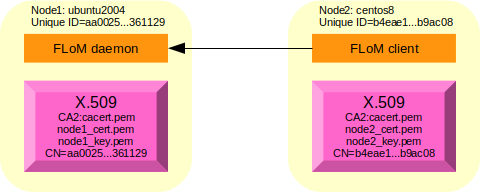
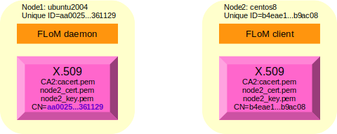
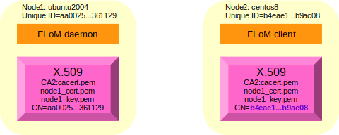

# Configuration example for "Mutual Authentication" security level #
The example uses two different nodes; these are the names used during all the example:

* node1, name: *ubuntu2004.brenta.org*, operating system: Ubuntu Linux 20.04 (64 bit)
* node2, name: *centos8.brenta.org*, operating system: CentOS 8.2 (64 bit)

It is suggested to understand how [Channel Encryption](Channel_Encryption.md) security level configuration works before proceeding with this more complex one.

The page [Mutual Authentication Debug](../Deep_Diving/Mutual_Authentication_Debug.md) explains how to debug this type of configuration in case of issue.

## Setting up the certification authority and the required certificates ##
The instructions that are shown below are sufficient for a basic TLS set-up, for more advanced configurations please refer to specific documentaion like for exampe [OpenSSL Certificate Authority](https://jamielinux.com/docs/openssl-certificate-authority/index.html).

### Creating a CA (Certification Authority) of name *CA2* ###
Connect to node1, and execute these commands to create the directory structure:

~~~
tiian@ubuntu2004:~$ mkdir -p flom_ssl/CA2
tiian@ubuntu2004:~$ cd flom_ssl/CA2/
tiian@ubuntu2004:~/flom_ssl/CA2$ mkdir certs crl newcerts private
tiian@ubuntu2004:~/flom_ssl/CA2$ echo "01" > serial
tiian@ubuntu2004:~/flom_ssl/CA2$ cp /dev/null index.txt
tiian@ubuntu2004:~/flom_ssl/CA2$ ls -la
total 28
drwxrwxr-x 6 tiian tiian 4096 Nov 15 21:56 .
drwxrwxr-x 3 tiian tiian 4096 Nov 15 21:56 ..
drwxrwxr-x 2 tiian tiian 4096 Nov 15 21:56 certs
drwxrwxr-x 2 tiian tiian 4096 Nov 15 21:56 crl
-rw-rw-r-- 1 tiian tiian    0 Nov 15 21:56 index.txt
drwxrwxr-x 2 tiian tiian 4096 Nov 15 21:56 newcerts
drwxrwxr-x 2 tiian tiian 4096 Nov 15 21:56 private
-rw-rw-r-- 1 tiian tiian    3 Nov 15 21:56 serial
~~~

Pick-up a *openssl.cnf* example file; FLoM provide a pre-configured file in directory */usr/local/share/doc/flom/*:

~~~
tiian@ubuntu2004:~/flom_ssl/CA2$ ls -la /usr/local/share/doc/flom/flom_openssl.conf
-rw-r--r-- 1 root root 9409 Nov 15 09:46 /usr/local/share/doc/flom/flom_openssl.conf
~~~

copy it locally:

~~~
tiian@ubuntu2004:~/flom_ssl/CA2$ cp /usr/local/share/doc/flom/flom_openssl.conf .
~~~

Generate the certificate for the CA, use a secret password and pass something like "CA for FLoM Mutual Authentication" for Common Name:

~~~
tiian@ubuntu2004:~/flom_ssl/CA2$ openssl req -new -x509 -keyout private/cakey.pem -out cacert.pem -days 3650 -config flom_openssl.conf
Generating a RSA private key
..........+++++
......+++++
writing new private key to 'private/cakey.pem'
Enter PEM pass phrase:
Verifying - Enter PEM pass phrase:
-----
You are about to be asked to enter information that will be incorporated
into your certificate request.
What you are about to enter is what is called a Distinguished Name or a DN.
There are quite a few fields but you can leave some blank
For some fields there will be a default value,
If you enter '.', the field will be left blank.
-----
Country Name (2 letter code) [IT]:
State or Province Name (full name) [Treviso]:
Locality Name (eg, city) [Mogliano Veneto]:
Organization Name (eg, company) [www.tiian.org]:
Organizational Unit Name (eg, section) [FLoM Project]:
Common Name (eg, YOUR name) []:CA for FLoM Mutual Authentication
Email Address []:
~~~

File *cacert.pem* contains the **X.509 certificate** of the certification authority you have just created and file *private/cakey.pem* contains the **private key** associated to the certification authority.

~~~
tiian@ubuntu2004:~/flom_ssl/CA2$ ls -la cacert.pem private/cakey.pem
-rw-rw-r-- 1 tiian tiian 1712 Nov 15 21:59 cacert.pem
-rw------- 1 tiian tiian 1854 Nov 15 21:59 private/cakey.pem
~~~

### Creating the first X.509 certificate ###
To implement a *mutual authentication* configuration a **distinct certificate for every node** is necessary.

#### Retrieving node/system unique ID ####
FLoM unique ID technology is based on a feature provided by [D-Bus](https://www.freedesktop.org/wiki/Software/dbus/).

FLoM behaves like the command *dbus-uuidgen --get*:

~~~
tiian@ubuntu2004:~/flom_ssl/CA2$ flom --unique-id
aa0025217cc24efb983dff5bfb361129
~~~

From the above text, the **unique ID** of node1 is *aa0025217cc24efb983dff5bfb361129*.
The *unique ID* must be passed to the *openssl* command when the *Common Name* associated to the certificate is asked.

Now you have to execute 4 commands:

* the *unique ID* must be passed to the first command
* the third command asks for a password: the same password used for the certification authority (see above).

~~~
tiian@ubuntu2004:~/flom_ssl/CA2$ openssl req -nodes -new -x509 -keyout node1_key.pem -out node1_req.pem -days 3650 -config flom_openssl.conf
tiian@ubuntu2004:~/flom_ssl/CA2$ openssl x509 -x509toreq -in node1_req.pem -signkey node1_key.pem -out tmp.pem
tiian@ubuntu2004:~/flom_ssl/CA2$ openssl ca -config flom_openssl.conf -policy policy_anything -out node1_cert.pem -infiles tmp.pem
tiian@ubuntu2004:~/flom_ssl/CA2$ rm tmp.pem 
~~~

The output should be something like this:

~~~
tiian@ubuntu2004:~/flom_ssl/CA2$ openssl req -nodes -new -x509 -keyout node1_key.pem -out node1_req.pem -days 3650 -config flom_openssl.conf
Generating a RSA private key
...........................+++++
........................................................................+++++
writing new private key to 'node1_key.pem'
-----
You are about to be asked to enter information that will be incorporated
into your certificate request.
What you are about to enter is what is called a Distinguished Name or a DN.
There are quite a few fields but you can leave some blank
For some fields there will be a default value,
If you enter '.', the field will be left blank.
-----
Country Name (2 letter code) [IT]:
State or Province Name (full name) [Treviso]:
Locality Name (eg, city) [Mogliano Veneto]:
Organization Name (eg, company) [www.tiian.org]:
Organizational Unit Name (eg, section) [FLoM Project]:
Common Name (eg, YOUR name) []:aa0025217cc24efb983dff5bfb361129
Email Address []:

tiian@ubuntu2004:~/flom_ssl/CA2$ openssl x509 -x509toreq -in node1_req.pem -signkey node1_key.pem -out tmp.pem
Getting request Private Key
Generating certificate request

tiian@ubuntu2004:~/flom_ssl/CA2$ openssl ca -config flom_openssl.conf -policy policy_anything -out node1_cert.pem -infiles tmp.pem
Using configuration from flom_openssl.conf
Enter pass phrase for ./private/cakey.pem:
Check that the request matches the signature
Signature ok
Certificate Details:
        Serial Number: 1 (0x1)
        Validity
            Not Before: Nov 15 21:05:08 2020 GMT
            Not After : Nov 15 21:05:08 2021 GMT
        Subject:
            countryName               = IT
            stateOrProvinceName       = Treviso
            localityName              = Mogliano Veneto
            organizationName          = www.tiian.org
            organizationalUnitName    = FLoM Project
            commonName                = aa0025217cc24efb983dff5bfb361129
        X509v3 extensions:
            X509v3 Basic Constraints: 
                CA:FALSE
            Netscape Comment: 
                OpenSSL Generated Certificate
            X509v3 Subject Key Identifier: 
                9A:94:05:12:97:D5:15:9B:F9:79:29:F9:83:D4:31:C7:B8:2D:7C:5D
            X509v3 Authority Key Identifier: 
                keyid:18:4F:34:EC:90:1F:54:42:B9:2D:02:C3:86:89:00:A5:AA:32:FE:94

Certificate is to be certified until Nov 15 21:05:08 2021 GMT (365 days)
Sign the certificate? [y/n]:y

1 out of 1 certificate requests certified, commit? [y/n]y
Write out database with 1 new entries
Data Base Updated

tiian@ubuntu2004:~/flom_ssl/CA2$ rm tmp.pem 
~~~

If everything is fine, you must have two files: *node1_cert.pem* contains the **X.509 certificate** for *node1* (*ubuntu2004*) and *node1_key.pem* contains the **private key** associated to the certicate:

~~~
tiian@ubuntu1004:~/flom_ssl/CA2$ ls -la node1_cert.pem node1_key.pem
-rw-r--r-- 1 tiian tiian 3433 2016-03-30 22:12 node1_cert.pem
-rw-r--r-- 1 tiian tiian  887 2016-03-30 22:11 node1_key.pem
~~~

### Creating the second X.509 certificate ###
To implement a *mutual authentication* configuration a distinct certificate for every node is necessary.

Connect to *node2* and retrieve the *unique ID*:

~~~
[tiian@centos8 ~]$ flom --unique-id
b4eae148592d4d128df8f76987b9ac08
~~~

From the above text, the **unique ID** of node2 is *b4eae148592d4d128df8f76987b9ac08*.
The *unique ID* must be passed to the *openssl* command when the *Common Name* associated to the certificate is asked.

Connect to *node1* and execute the 4 commands you need to generate the certificate for *node2*:

* the *unique ID* must be passed to the first command
* the third command asks for a password: the same password used for the certification authority (see above).

~~~
tiian@ubuntu2004:~/flom_ssl/CA2$ openssl req -nodes -new -x509 -keyout node2_key.pem -out node2_req.pem -days 3650 -config flom_openssl.conf
tiian@ubuntu2004:~/flom_ssl/CA2$ openssl x509 -x509toreq -in node2_req.pem -signkey node2_key.pem -out tmp.pem
tiian@ubuntu2004:~/flom_ssl/CA2$ openssl ca -config flom_openssl.conf -policy policy_anything -out node2_cert.pem -infiles tmp.pem
tiian@ubuntu2004:~/flom_ssl/CA2$ rm tmp.pem 
~~~

The output should be something like this:

~~~
tiian@ubuntu2004:~/flom_ssl/CA2$ openssl req -nodes -new -x509 -keyout node2_key.pem -out node2_req.pem -days 3650 -config flom_openssl.conf
Generating a RSA private key
..+++++
......................+++++
writing new private key to 'node2_key.pem'
-----
You are about to be asked to enter information that will be incorporated
into your certificate request.
What you are about to enter is what is called a Distinguished Name or a DN.
There are quite a few fields but you can leave some blank
For some fields there will be a default value,
If you enter '.', the field will be left blank.
-----
Country Name (2 letter code) [IT]:
State or Province Name (full name) [Treviso]:
Locality Name (eg, city) [Mogliano Veneto]:
Organization Name (eg, company) [www.tiian.org]:
Organizational Unit Name (eg, section) [FLoM Project]:
Common Name (eg, YOUR name) []:b4eae148592d4d128df8f76987b9ac08
Email Address []:

tiian@ubuntu2004:~/flom_ssl/CA2$ openssl x509 -x509toreq -in node2_req.pem -signkey node2_key.pem -out tmp.pem
Getting request Private Key
Generating certificate request

tiian@ubuntu2004:~/flom_ssl/CA2$ openssl ca -config flom_openssl.conf -policy policy_anything -out node2_cert.pem -infiles tmp.pem
Using configuration from flom_openssl.conf
Enter pass phrase for ./private/cakey.pem:
Check that the request matches the signature
Signature ok
Certificate Details:
        Serial Number: 2 (0x2)
        Validity
            Not Before: Nov 15 21:10:22 2020 GMT
            Not After : Nov 15 21:10:22 2021 GMT
        Subject:
            countryName               = IT
            stateOrProvinceName       = Treviso
            localityName              = Mogliano Veneto
            organizationName          = www.tiian.org
            organizationalUnitName    = FLoM Project
            commonName                = b4eae148592d4d128df8f76987b9ac08
        X509v3 extensions:
            X509v3 Basic Constraints: 
                CA:FALSE
            Netscape Comment: 
                OpenSSL Generated Certificate
            X509v3 Subject Key Identifier: 
                13:EF:C8:13:4A:52:D2:41:DA:17:48:67:73:0E:F7:20:84:F3:7F:1E
            X509v3 Authority Key Identifier: 
                keyid:18:4F:34:EC:90:1F:54:42:B9:2D:02:C3:86:89:00:A5:AA:32:FE:94

Certificate is to be certified until Nov 15 21:10:22 2021 GMT (365 days)
Sign the certificate? [y/n]:y

1 out of 1 certificate requests certified, commit? [y/n]y
Write out database with 1 new entries
Data Base Updated

tiian@ubuntu2004:~/flom_ssl/CA2$ rm tmp.pem 
~~~

If everything is fine, you must have two new files: *node2_cert.pem* contains the **X.509 certificate** for *node2* (*centos8*) and *node2_key.pem* contains the **private key** associated to the certicate:

~~~
tiian@ubuntu2004:~/flom_ssl/CA2$ ls -la node2_cert.pem node2_key.pem
-rw-rw-r-- 1 tiian tiian 4706 Nov 15 22:10 node2_cert.pem
-rw------- 1 tiian tiian 1704 Nov 15 22:08 node2_key.pem
~~~

### Certificate *"installation"* ###
Only 3 files are needed to FLoM process (*flom*):

* *node?_cert.pem*
* *node?_key.pem*
* *cacert.pem*

copy them in a *easy to use place* on both systems.
Pay attention you have to copy different certificate/key pairs to different systems.
Local copy:

~~~
tiian@ubuntu2004:~/flom_ssl/CA2$ mkdir /tmp/flom_ssl
tiian@ubuntu2004:~/flom_ssl/CA2$ cp cacert.pem node1_cert.pem node1_key.pem /tmp/flom_ssl/
tiian@ubuntu2004:~/flom_ssl/CA2$ ls -la /tmp/flom_ssl/
total 24
drwxrwxr-x  2 tiian tiian 4096 Nov 15 22:15 .
drwxrwxrwt 12 root  root  4096 Nov 15 22:15 ..
-rw-rw-r--  1 tiian tiian 1712 Nov 15 22:15 cacert.pem
-rw-rw-r--  1 tiian tiian 4706 Nov 15 22:15 node1_cert.pem
-rw-------  1 tiian tiian 1704 Nov 15 22:15 node1_key.pem
~~~

Remote copy (directory */tmp/flom_ssl/* on node2 must be created in advance):

~~~
tiian@ubuntu2004:~/flom_ssl/CA2$ scp -r cacert.pem node2_cert.pem node2_key.pem tiian@centos8.brenta.org:/tmp/flom_ssl/
tiian@centos8.brenta.org's password: 
cacert.pem                                    100% 1712     1.9MB/s   00:00    
node2_cert.pem                                100% 4706     5.7MB/s   00:00    
node2_key.pem                                 100% 1704     2.6MB/s   00:00    
~~~

Check the content in node2:

~~~
[tiian@centos8 ~]$ ls -la /tmp/flom_ssl/
total 20
drwxr-xr-x.  2 tiian tiian   67 Nov 15 22:17 .
drwxrwxrwt. 12 root  root  4096 Nov 15 22:35 ..
-rw-rw-r--.  1 tiian tiian 1712 Nov 15 22:34 cacert.pem
-rw-rw-r--.  1 tiian tiian 4706 Nov 15 22:34 node2_cert.pem
-rw-------.  1 tiian tiian 1704 Nov 15 22:34 node2_key.pem
~~~

### Using TLS (mutual authentication security level) with FLoM ###
Setting a *trace mask* to trace the messaged produced by *flom_tls* and *flom_tcp* modules can help in troubleshooting possible issues.

This is the command to activate tracing and start a FLoM daemon (server) using TLS inside node1:

~~~
tiian@ubuntu2004:~$ export FLOM_TRACE_MASK=0x600000
tiian@ubuntu2004:~$ echo $FLOM_TRACE_MASK
0x600000
tiian@ubuntu2004:~$ flom -a ubuntu2004.brenta.org --daemon-trace-file=/tmp/flom-daemon.trc --tls-certificate=/tmp/flom_ssl/node1_cert.pem --tls-private-key=/tmp/flom_ssl/node1_key.pem --tls-ca-certificate=/tmp/flom_ssl/cacert.pem --tls-check-peer-id=yes -d -1 -- true
2020-11-15 22:19:16.394238 [1626/0x564d50b03800] flom_tcp_init
2020-11-15 22:19:16.394405 [1626/0x564d50b03800] flom_tcp_init
2020-11-15 22:19:16.394440 [1626/0x564d50b03800] flom_tcp_connect
2020-11-15 22:19:16.394462 [1626/0x564d50b03800] flom_tcp_connect: connecting to address 'ubuntu2004.brenta.org' and port 28015
2020-11-15 22:19:16.396252 [1626/0x564d50b03800] flom_tcp_connect/getaddrinfo(): [ai_flags=2,ai_family=2,ai_socktype=1,ai_protocol=6,ai_addrlen=16,ai_canonname='ubuntu2004.brenta.org'] [ai_flags=2,ai_family=10,ai_socktype=1,ai_protocol=6,ai_addrlen=28,ai_canonname='{null}'] 
2020-11-15 22:19:16.396290 [1626/0x564d50b03800] flom_tcp_try_connect: sa addrlen=16; IPv4 address, sin_port=28015, sin_addr='192.168.123.92'
2020-11-15 22:19:16.396324 [1626/0x564d50b03800] flom_tcp_try_connect: sa addrlen=16; IPv4 address, sin_port=28015, sin_addr='192.168.123.92'
2020-11-15 22:19:16.396383 [1626/0x564d50b03800] flom_tcp_try_connect/connect(): errno=111 'Connection refused', skipping...
2020-11-15 22:19:16.396401 [1626/0x564d50b03800] flom_tcp_try_connect: sa addrlen=28; IPv6 address, sin6_port=28015, sin6_flowinfo=0x0, sin6_addr='fe80::5054:ff:fe5d:a9a', sin6_scope_id=0
2020-11-15 22:19:16.396439 [1626/0x564d50b03800] flom_tcp_try_connect: sa addrlen=28; IPv6 address, sin6_port=28015, sin6_flowinfo=0x0, sin6_addr='fe80::5054:ff:fe5d:a9a', sin6_scope_id=0
2020-11-15 22:19:16.396464 [1626/0x564d50b03800] flom_tcp_try_connect/connect(): errno=22 'Invalid argument', skipping...
2020-11-15 22:19:16.396473 [1626/0x564d50b03800] flom_tcp_connect/excp=1/ret_cod=7/errno=22
2020-11-15 22:19:16.397899 [1626/0x564d50b03800] flom_tcp_init
2020-11-15 22:19:16.397927 [1626/0x564d50b03800] flom_tcp_connect
2020-11-15 22:19:16.397933 [1626/0x564d50b03800] flom_tcp_connect: connecting to address 'ubuntu2004.brenta.org' and port 28015
2020-11-15 22:19:16.399062 [1626/0x564d50b03800] flom_tcp_connect/getaddrinfo(): [ai_flags=2,ai_family=2,ai_socktype=1,ai_protocol=6,ai_addrlen=16,ai_canonname='ubuntu2004.brenta.org'] [ai_flags=2,ai_family=10,ai_socktype=1,ai_protocol=6,ai_addrlen=28,ai_canonname='{null}'] 
2020-11-15 22:19:16.399083 [1626/0x564d50b03800] flom_tcp_try_connect: sa addrlen=16; IPv4 address, sin_port=28015, sin_addr='192.168.123.92'
2020-11-15 22:19:16.399102 [1626/0x564d50b03800] flom_tcp_try_connect: sa addrlen=16; IPv4 address, sin_port=28015, sin_addr='192.168.123.92'
2020-11-15 22:19:16.399448 [1626/0x564d50b03800] flom_tcp_connect: domain=2, sockfd=3, socket_type=1, addrlen=16
2020-11-15 22:19:16.399462 [1626/0x564d50b03800] flom_tcp_connect: addrlen=16; IPv4 address, sin_port=28015, sin_addr='192.168.123.92'
2020-11-15 22:19:16.399474 [1626/0x564d50b03800] flom_tcp_connect/excp=2/ret_cod=0/errno=22
2020-11-15 22:19:16.399491 [1626/0x564d50b03800] flom_tls_init: calling OPENSSL_init_ssl()...
2020-11-15 22:19:16.400754 [1626/0x564d50b03800] flom_tls_init: calling SSL_load_error_strings()...
2020-11-15 22:19:16.400876 [1626/0x564d50b03800] flom_tls_init: calling OpenSSL_add_all_algorithms()...
2020-11-15 22:19:16.400885 [1626/0x564d50b03800] flom_tls_context
2020-11-15 22:19:16.400889 [1626/0x564d50b03800] flom_tls_context: setting TLS/SSL method to TLS_client_method()
2020-11-15 22:19:16.401022 [1626/0x564d50b03800] flom_tls_context: SSL_CTX_set_verify(0x564d50b0c7e0, 1, flom_tls_callback)
2020-11-15 22:19:16.401032 [1626/0x564d50b03800] flom_tls_context/excp=2/ret_cod=0/errno=22
2020-11-15 22:19:16.401037 [1626/0x564d50b03800] flom_tls_set_cert
2020-11-15 22:19:16.401040 [1626/0x564d50b03800] flom_tls_set_cert: SSL_CTX_use_certificate_file(obj->ctx, '/tmp/flom_ssl/node1_cert.pem', SSL_FILETYPE_PEM)
2020-11-15 22:19:16.401235 [1626/0x564d50b03800] flom_tls_set_cert: SSL_CTX_use_PrivateKey_file(obj->ctx, '/tmp/flom_ssl/node1_key.pem', SSL_FILETYPE_PEM)
2020-11-15 22:19:16.401305 [1626/0x564d50b03800] flom_tls_set_cert: SSL_CTX_check_private_key(obj->ctx)
2020-11-15 22:19:16.401313 [1626/0x564d50b03800] flom_tls_set_cert: SSL_CTX_load_verify_locations(obj->ctx, '/tmp/flom_ssl/cacert.pem', NULL)
2020-11-15 22:19:16.401400 [1626/0x564d50b03800] flom_tls_set_cert/excp=4/ret_cod=0/errno=22
2020-11-15 22:19:16.401411 [1626/0x564d50b03800] flom_tls_connect
2020-11-15 22:19:16.401417 [1626/0x564d50b03800] flom_tls_prepare
2020-11-15 22:19:16.401451 [1626/0x564d50b03800] flom_tls_prepare/excp=3/ret_cod=0/errno=22
2020-11-15 22:19:16.403266 [1626/0x564d50b03800] flom_tls_callback: preverify_ok=1
2020-11-15 22:19:16.403278 [1626/0x564d50b03800] flom_tls_callback: ret_cod=1
2020-11-15 22:19:16.403506 [1626/0x564d50b03800] flom_tls_callback: preverify_ok=1
2020-11-15 22:19:16.403516 [1626/0x564d50b03800] flom_tls_callback: ret_cod=1
2020-11-15 22:19:16.404794 [1626/0x564d50b03800] flom_tls_connect: connection established with TLS_AES_256_GCM_SHA384 encryption
2020-11-15 22:19:16.404808 [1626/0x564d50b03800] flom_tls_cert_parse
2020-11-15 22:19:16.404822 [1626/0x564d50b03800] flom_tls_cert_struct_fill
2020-11-15 22:19:16.404829 [1626/0x564d50b03800] flom_tls_cert_struct_fill/excp=7/ret_cod=0/errno=0
2020-11-15 22:19:16.404833 [1626/0x564d50b03800] flom_tls_cert_struct_fill
2020-11-15 22:19:16.404837 [1626/0x564d50b03800] flom_tls_cert_struct_fill/excp=7/ret_cod=0/errno=0
2020-11-15 22:19:16.404840 [1626/0x564d50b03800] flom_tls_cert_struct_fill
2020-11-15 22:19:16.404845 [1626/0x564d50b03800] flom_tls_cert_struct_fill/excp=7/ret_cod=0/errno=0
2020-11-15 22:19:16.404849 [1626/0x564d50b03800] flom_tls_cert_struct_fill
2020-11-15 22:19:16.404855 [1626/0x564d50b03800] flom_tls_cert_struct_fill/excp=7/ret_cod=0/errno=0
2020-11-15 22:19:16.404859 [1626/0x564d50b03800] flom_tls_cert_struct_fill
2020-11-15 22:19:16.404862 [1626/0x564d50b03800] flom_tls_cert_struct_fill/excp=7/ret_cod=0/errno=0
2020-11-15 22:19:16.404865 [1626/0x564d50b03800] flom_tls_cert_struct_fill
2020-11-15 22:19:16.404868 [1626/0x564d50b03800] flom_tls_cert_struct_fill/excp=7/ret_cod=0/errno=0
2020-11-15 22:19:16.404873 [1626/0x564d50b03800] flom_tls_cert_parse: issuer fields are C=IT/ST=Treviso/L=Mogliano Veneto/O=www.tiian.org/OU=FLoM Project/emailAddress={null}/CN=CA for FLoM Mutual Authentication
2020-11-15 22:19:16.405365 [1626/0x564d50b03800] flom_tls_cert_struct_fill
2020-11-15 22:19:16.405376 [1626/0x564d50b03800] flom_tls_cert_struct_fill/excp=7/ret_cod=0/errno=0
2020-11-15 22:19:16.405380 [1626/0x564d50b03800] flom_tls_cert_struct_fill
2020-11-15 22:19:16.405385 [1626/0x564d50b03800] flom_tls_cert_struct_fill/excp=7/ret_cod=0/errno=0
2020-11-15 22:19:16.405390 [1626/0x564d50b03800] flom_tls_cert_struct_fill
2020-11-15 22:19:16.405398 [1626/0x564d50b03800] flom_tls_cert_struct_fill/excp=7/ret_cod=0/errno=0
2020-11-15 22:19:16.405402 [1626/0x564d50b03800] flom_tls_cert_struct_fill
2020-11-15 22:19:16.405405 [1626/0x564d50b03800] flom_tls_cert_struct_fill/excp=7/ret_cod=0/errno=0
2020-11-15 22:19:16.405408 [1626/0x564d50b03800] flom_tls_cert_struct_fill
2020-11-15 22:19:16.405411 [1626/0x564d50b03800] flom_tls_cert_struct_fill/excp=7/ret_cod=0/errno=0
2020-11-15 22:19:16.405414 [1626/0x564d50b03800] flom_tls_cert_struct_fill
2020-11-15 22:19:16.405420 [1626/0x564d50b03800] flom_tls_cert_struct_fill/excp=7/ret_cod=0/errno=0
2020-11-15 22:19:16.405424 [1626/0x564d50b03800] flom_tls_cert_parse: subject fields are C=IT/ST=Treviso/L=Mogliano Veneto/O=www.tiian.org/OU=FLoM Project/emailAddress={null}/CN=aa0025217cc24efb983dff5bfb361129
2020-11-15 22:19:16.405443 [1626/0x564d50b03800] flom_tls_cert_parse/excp=4/ret_cod=0/errno=0
2020-11-15 22:19:16.405447 [1626/0x564d50b03800] flom_tls_connect/excp=3/ret_cod=0/errno=0
2020-11-15 22:19:16.405895 [1626/0x564d50b03800] flom_tls_send
2020-11-15 22:19:16.405926 [1626/0x564d50b03800] flom_tls_send/excp=2/ret_cod=0/errno=0
2020-11-15 22:19:16.405939 [1626/0x564d50b03800] flom_tls_recv_msg
2020-11-15 22:19:16.405943 [1626/0x564d50b03800] flom_tls_recv_msg: closing_tag='</msg>', closing_tag_len=6, closing_tag_last='>'
2020-11-15 22:19:16.406825 [1626/0x564d50b03800] flom_tls_recv_msg: read_bytes=6 '<?xml '
2020-11-15 22:19:16.406839 [1626/0x564d50b03800] flom_tls_recv_msg: read_bytes=6 'versio'
2020-11-15 22:19:16.406844 [1626/0x564d50b03800] flom_tls_recv_msg: read_bytes=6 'n="1.0'
2020-11-15 22:19:16.406847 [1626/0x564d50b03800] flom_tls_recv_msg: read_bytes=6 '" enco'
2020-11-15 22:19:16.406853 [1626/0x564d50b03800] flom_tls_recv_msg: read_bytes=6 'ding="'
2020-11-15 22:19:16.406858 [1626/0x564d50b03800] flom_tls_recv_msg: read_bytes=6 'UTF-8"'
2020-11-15 22:19:16.406865 [1626/0x564d50b03800] flom_tls_recv_msg: read_bytes=6 ' ?><ms'
2020-11-15 22:19:16.406869 [1626/0x564d50b03800] flom_tls_recv_msg: read_bytes=6 'g leve'
2020-11-15 22:19:16.406873 [1626/0x564d50b03800] flom_tls_recv_msg: read_bytes=6 'l="3" '
2020-11-15 22:19:16.406876 [1626/0x564d50b03800] flom_tls_recv_msg: read_bytes=6 'verb="'
2020-11-15 22:19:16.406880 [1626/0x564d50b03800] flom_tls_recv_msg: read_bytes=6 '1" ste'
2020-11-15 22:19:16.406883 [1626/0x564d50b03800] flom_tls_recv_msg: read_bytes=6 'p="16"'
2020-11-15 22:19:16.406887 [1626/0x564d50b03800] flom_tls_recv_msg: read_bytes=6 '><sess'
2020-11-15 22:19:16.406893 [1626/0x564d50b03800] flom_tls_recv_msg: read_bytes=6 'ion pe'
2020-11-15 22:19:16.406898 [1626/0x564d50b03800] flom_tls_recv_msg: read_bytes=6 'erid="'
2020-11-15 22:19:16.406905 [1626/0x564d50b03800] flom_tls_recv_msg: read_bytes=6 'aa0025'
2020-11-15 22:19:16.406909 [1626/0x564d50b03800] flom_tls_recv_msg: read_bytes=6 '217cc2'
2020-11-15 22:19:16.406913 [1626/0x564d50b03800] flom_tls_recv_msg: read_bytes=6 '4efb98'
2020-11-15 22:19:16.406916 [1626/0x564d50b03800] flom_tls_recv_msg: read_bytes=6 '3dff5b'
2020-11-15 22:19:16.406919 [1626/0x564d50b03800] flom_tls_recv_msg: read_bytes=6 'fb3611'
2020-11-15 22:19:16.406923 [1626/0x564d50b03800] flom_tls_recv_msg: read_bytes=6 '29"/><'
2020-11-15 22:19:16.406927 [1626/0x564d50b03800] flom_tls_recv_msg: read_bytes=5 'answe'
2020-11-15 22:19:16.406930 [1626/0x564d50b03800] flom_tls_recv_msg: read_bytes=6 'r rc="'
2020-11-15 22:19:16.406933 [1626/0x564d50b03800] flom_tls_recv_msg: read_bytes=6 '0"/></'
2020-11-15 22:19:16.406937 [1626/0x564d50b03800] flom_tls_recv_msg: read_bytes=4 'msg>'
2020-11-15 22:19:16.406940 [1626/0x564d50b03800] flom_tls_recv_msg: received message is '<?xml version="1.0" encoding="UTF-8" ?><msg level="3" verb="1" step="16"><session peerid="aa0025217cc24efb983dff5bfb361129"/><answer rc="0"/></msg>' of 147 chars
2020-11-15 22:19:16.407225 [1626/0x564d50b03800] flom_tls_recv_msg/excp=3/ret_cod=0/errno=0
2020-11-15 22:19:16.407265 [1626/0x564d50b03800] flom_tls_cert_check
2020-11-15 22:19:16.407274 [1626/0x564d50b03800] flom_tls_cert_check: peer address='192.168.123.92/28015', CN='aa0025217cc24efb983dff5bfb361129', peer unique ID='aa0025217cc24efb983dff5bfb361129'
2020-11-15 22:19:16.407286 [1626/0x564d50b03800] flom_tls_cert_check/excp=2/ret_cod=0/errno=0
2020-11-15 22:19:16.408097 [1626/0x564d50b03800] flom_tls_send
2020-11-15 22:19:16.408156 [1626/0x564d50b03800] flom_tls_send/excp=2/ret_cod=0/errno=0
2020-11-15 22:19:16.408359 [1626/0x564d50b03800] flom_tcp_close
2020-11-15 22:19:16.408379 [1626/0x564d50b03800] flom_tcp_close/excp=1/ret_cod=0/errno=107
~~~

This is the trace produced by FLoM daemon that runs in node 1:

~~~
tiian@ubuntu2004:~$ cat /tmp/flom-daemon.trc 
2020-11-15 22:19:16.397342 [1629/0x564d50b03800] flom_tcp_init
2020-11-15 22:19:16.397388 [1629/0x564d50b03800] flom_tcp_listen
2020-11-15 22:19:16.397392 [1629/0x564d50b03800] flom_tcp_listen: binding address 'ubuntu2004.brenta.org' and port 28015
2020-11-15 22:19:16.397781 [1629/0x564d50b03800] flom_tcp_listen/getaddrinfo(): [ai_flags=1,ai_family=2,ai_socktype=1,ai_protocol=6,ai_addrlen=16,ai_canonname='{null}'] [ai_flags=1,ai_family=10,ai_socktype=1,ai_protocol=6,ai_addrlen=28,ai_canonname='{null}'] 
2020-11-15 22:19:16.397785 [1629/0x564d50b03800] flom_tcp_listen: ai_addr addrlen=16; IPv4 address, sin_port=28015, sin_addr='192.168.123.92'
2020-11-15 22:19:16.397807 [1629/0x564d50b03800] flom_tcp_listen: bound!
2020-11-15 22:19:16.397818 [1629/0x564d50b03800] flom_tcp_listen/excp=3/ret_cod=0/errno=22
2020-11-15 22:19:16.397826 [1629/0x564d50b03800] flom_tcp_init
2020-11-15 22:19:16.397829 [1629/0x564d50b03800] flom_tcp_init
2020-11-15 22:19:16.399484 [1629/0x564d50b03800] flom_tcp_init
2020-11-15 22:19:16.399496 [1629/0x564d50b03800] flom_tcp_init
2020-11-15 22:19:16.399505 [1629/0x564d50b03800] flom_tls_init: calling OPENSSL_init_ssl()...
2020-11-15 22:19:16.400754 [1629/0x564d50b03800] flom_tls_init: calling SSL_load_error_strings()...
2020-11-15 22:19:16.400876 [1629/0x564d50b03800] flom_tls_init: calling OpenSSL_add_all_algorithms()...
2020-11-15 22:19:16.400899 [1629/0x564d50b03800] flom_tls_context
2020-11-15 22:19:16.400905 [1629/0x564d50b03800] flom_tls_context: setting TLS/SSL method to TLS_server_method()
2020-11-15 22:19:16.401022 [1629/0x564d50b03800] flom_tls_context: SSL_CTX_set_verify(0x564d50b0e090, 3, flom_tls_callback)
2020-11-15 22:19:16.401032 [1629/0x564d50b03800] flom_tls_context/excp=2/ret_cod=0/errno=22
2020-11-15 22:19:16.401037 [1629/0x564d50b03800] flom_tls_set_cert
2020-11-15 22:19:16.401041 [1629/0x564d50b03800] flom_tls_set_cert: SSL_CTX_use_certificate_file(obj->ctx, '/tmp/flom_ssl/node1_cert.pem', SSL_FILETYPE_PEM)
2020-11-15 22:19:16.401235 [1629/0x564d50b03800] flom_tls_set_cert: SSL_CTX_use_PrivateKey_file(obj->ctx, '/tmp/flom_ssl/node1_key.pem', SSL_FILETYPE_PEM)
2020-11-15 22:19:16.401297 [1629/0x564d50b03800] flom_tls_set_cert: SSL_CTX_check_private_key(obj->ctx)
2020-11-15 22:19:16.401310 [1629/0x564d50b03800] flom_tls_set_cert: SSL_CTX_load_verify_locations(obj->ctx, '/tmp/flom_ssl/cacert.pem', NULL)
2020-11-15 22:19:16.401400 [1629/0x564d50b03800] flom_tls_set_cert/excp=4/ret_cod=0/errno=22
2020-11-15 22:19:16.401412 [1629/0x564d50b03800] flom_tls_accept
2020-11-15 22:19:16.401417 [1629/0x564d50b03800] flom_tls_prepare
2020-11-15 22:19:16.401451 [1629/0x564d50b03800] flom_tls_prepare/excp=3/ret_cod=0/errno=22
2020-11-15 22:19:16.405247 [1629/0x564d50b03800] flom_tls_callback: preverify_ok=1
2020-11-15 22:19:16.405262 [1629/0x564d50b03800] flom_tls_callback: ret_cod=1
2020-11-15 22:19:16.405344 [1629/0x564d50b03800] flom_tls_callback: preverify_ok=1
2020-11-15 22:19:16.405352 [1629/0x564d50b03800] flom_tls_callback: ret_cod=1
2020-11-15 22:19:16.406307 [1629/0x564d50b03800] flom_tls_accepted: connection accepted with TLS_AES_256_GCM_SHA384 encryption
2020-11-15 22:19:16.406318 [1629/0x564d50b03800] flom_tls_cert_parse
2020-11-15 22:19:16.406331 [1629/0x564d50b03800] flom_tls_cert_struct_fill
2020-11-15 22:19:16.406336 [1629/0x564d50b03800] flom_tls_cert_struct_fill/excp=7/ret_cod=0/errno=0
2020-11-15 22:19:16.406340 [1629/0x564d50b03800] flom_tls_cert_struct_fill
2020-11-15 22:19:16.406344 [1629/0x564d50b03800] flom_tls_cert_struct_fill/excp=7/ret_cod=0/errno=0
2020-11-15 22:19:16.406347 [1629/0x564d50b03800] flom_tls_cert_struct_fill
2020-11-15 22:19:16.406351 [1629/0x564d50b03800] flom_tls_cert_struct_fill/excp=7/ret_cod=0/errno=0
2020-11-15 22:19:16.406354 [1629/0x564d50b03800] flom_tls_cert_struct_fill
2020-11-15 22:19:16.406358 [1629/0x564d50b03800] flom_tls_cert_struct_fill/excp=7/ret_cod=0/errno=0
2020-11-15 22:19:16.406361 [1629/0x564d50b03800] flom_tls_cert_struct_fill
2020-11-15 22:19:16.406365 [1629/0x564d50b03800] flom_tls_cert_struct_fill/excp=7/ret_cod=0/errno=0
2020-11-15 22:19:16.406367 [1629/0x564d50b03800] flom_tls_cert_struct_fill
2020-11-15 22:19:16.406377 [1629/0x564d50b03800] flom_tls_cert_struct_fill/excp=7/ret_cod=0/errno=0
2020-11-15 22:19:16.406380 [1629/0x564d50b03800] flom_tls_cert_parse: issuer fields are C=IT/ST=Treviso/L=Mogliano Veneto/O=www.tiian.org/OU=FLoM Project/emailAddress={null}/CN=CA for FLoM Mutual Authentication
2020-11-15 22:19:16.406393 [1629/0x564d50b03800] flom_tls_cert_struct_fill
2020-11-15 22:19:16.406396 [1629/0x564d50b03800] flom_tls_cert_struct_fill/excp=7/ret_cod=0/errno=0
2020-11-15 22:19:16.406398 [1629/0x564d50b03800] flom_tls_cert_struct_fill
2020-11-15 22:19:16.406400 [1629/0x564d50b03800] flom_tls_cert_struct_fill/excp=7/ret_cod=0/errno=0
2020-11-15 22:19:16.406403 [1629/0x564d50b03800] flom_tls_cert_struct_fill
2020-11-15 22:19:16.406405 [1629/0x564d50b03800] flom_tls_cert_struct_fill/excp=7/ret_cod=0/errno=0
2020-11-15 22:19:16.406407 [1629/0x564d50b03800] flom_tls_cert_struct_fill
2020-11-15 22:19:16.406409 [1629/0x564d50b03800] flom_tls_cert_struct_fill/excp=7/ret_cod=0/errno=0
2020-11-15 22:19:16.406412 [1629/0x564d50b03800] flom_tls_cert_struct_fill
2020-11-15 22:19:16.406414 [1629/0x564d50b03800] flom_tls_cert_struct_fill/excp=7/ret_cod=0/errno=0
2020-11-15 22:19:16.406416 [1629/0x564d50b03800] flom_tls_cert_struct_fill
2020-11-15 22:19:16.406418 [1629/0x564d50b03800] flom_tls_cert_struct_fill/excp=7/ret_cod=0/errno=0
2020-11-15 22:19:16.406421 [1629/0x564d50b03800] flom_tls_cert_parse: subject fields are C=IT/ST=Treviso/L=Mogliano Veneto/O=www.tiian.org/OU=FLoM Project/emailAddress={null}/CN=aa0025217cc24efb983dff5bfb361129
2020-11-15 22:19:16.406428 [1629/0x564d50b03800] flom_tls_cert_parse/excp=4/ret_cod=0/errno=0
2020-11-15 22:19:16.406431 [1629/0x564d50b03800] flom_tls_accept/excp=3/ret_cod=0/errno=0
2020-11-15 22:19:16.406436 [1629/0x564d50b03800] flom_tls_recv_msg
2020-11-15 22:19:16.406439 [1629/0x564d50b03800] flom_tls_recv_msg: closing_tag='</msg>', closing_tag_len=6, closing_tag_last='>'
2020-11-15 22:19:16.406448 [1629/0x564d50b03800] flom_tls_recv_msg: read_bytes=6 '<?xml '
2020-11-15 22:19:16.406451 [1629/0x564d50b03800] flom_tls_recv_msg: read_bytes=6 'versio'
2020-11-15 22:19:16.406453 [1629/0x564d50b03800] flom_tls_recv_msg: read_bytes=6 'n="1.0'
2020-11-15 22:19:16.406455 [1629/0x564d50b03800] flom_tls_recv_msg: read_bytes=6 '" enco'
2020-11-15 22:19:16.406458 [1629/0x564d50b03800] flom_tls_recv_msg: read_bytes=6 'ding="'
2020-11-15 22:19:16.406460 [1629/0x564d50b03800] flom_tls_recv_msg: read_bytes=6 'UTF-8"'
2020-11-15 22:19:16.406462 [1629/0x564d50b03800] flom_tls_recv_msg: read_bytes=6 ' ?><ms'
2020-11-15 22:19:16.406465 [1629/0x564d50b03800] flom_tls_recv_msg: read_bytes=6 'g leve'
2020-11-15 22:19:16.406467 [1629/0x564d50b03800] flom_tls_recv_msg: read_bytes=6 'l="3" '
2020-11-15 22:19:16.406469 [1629/0x564d50b03800] flom_tls_recv_msg: read_bytes=6 'verb="'
2020-11-15 22:19:16.406471 [1629/0x564d50b03800] flom_tls_recv_msg: read_bytes=6 '1" ste'
2020-11-15 22:19:16.406474 [1629/0x564d50b03800] flom_tls_recv_msg: read_bytes=6 'p="8">'
2020-11-15 22:19:16.406476 [1629/0x564d50b03800] flom_tls_recv_msg: read_bytes=6 '<sessi'
2020-11-15 22:19:16.406478 [1629/0x564d50b03800] flom_tls_recv_msg: read_bytes=6 'on pee'
2020-11-15 22:19:16.406481 [1629/0x564d50b03800] flom_tls_recv_msg: read_bytes=6 'rid="a'
2020-11-15 22:19:16.406483 [1629/0x564d50b03800] flom_tls_recv_msg: read_bytes=6 'a00252'
2020-11-15 22:19:16.406485 [1629/0x564d50b03800] flom_tls_recv_msg: read_bytes=6 '17cc24'
2020-11-15 22:19:16.406487 [1629/0x564d50b03800] flom_tls_recv_msg: read_bytes=6 'efb983'
2020-11-15 22:19:16.406490 [1629/0x564d50b03800] flom_tls_recv_msg: read_bytes=6 'dff5bf'
2020-11-15 22:19:16.406492 [1629/0x564d50b03800] flom_tls_recv_msg: read_bytes=6 'b36112'
2020-11-15 22:19:16.406494 [1629/0x564d50b03800] flom_tls_recv_msg: read_bytes=6 '9"/><r'
2020-11-15 22:19:16.406497 [1629/0x564d50b03800] flom_tls_recv_msg: read_bytes=6 'esourc'
2020-11-15 22:19:16.406499 [1629/0x564d50b03800] flom_tls_recv_msg: read_bytes=6 'e name'
2020-11-15 22:19:16.406501 [1629/0x564d50b03800] flom_tls_recv_msg: read_bytes=6 '="X1JF'
2020-11-15 22:19:16.406506 [1629/0x564d50b03800] flom_tls_recv_msg: read_bytes=6 'U09VUk'
2020-11-15 22:19:16.406508 [1629/0x564d50b03800] flom_tls_recv_msg: read_bytes=6 'NF" mo'
2020-11-15 22:19:16.406510 [1629/0x564d50b03800] flom_tls_recv_msg: read_bytes=6 'de="5"'
2020-11-15 22:19:16.406513 [1629/0x564d50b03800] flom_tls_recv_msg: read_bytes=6 ' wait='
2020-11-15 22:19:16.406515 [1629/0x564d50b03800] flom_tls_recv_msg: read_bytes=6 '"1" cr'
2020-11-15 22:19:16.406517 [1629/0x564d50b03800] flom_tls_recv_msg: read_bytes=6 'eate="'
2020-11-15 22:19:16.406520 [1629/0x564d50b03800] flom_tls_recv_msg: read_bytes=6 '1" lif'
2020-11-15 22:19:16.406522 [1629/0x564d50b03800] flom_tls_recv_msg: read_bytes=6 'espan='
2020-11-15 22:19:16.406524 [1629/0x564d50b03800] flom_tls_recv_msg: read_bytes=6 '"0"/><'
2020-11-15 22:19:16.406526 [1629/0x564d50b03800] flom_tls_recv_msg: read_bytes=5 '/msg>'
2020-11-15 22:19:16.406529 [1629/0x564d50b03800] flom_tls_recv_msg: received message is '<?xml version="1.0" encoding="UTF-8" ?><msg level="3" verb="1" step="8"><session peerid="aa0025217cc24efb983dff5bfb361129"/><resource name="X1JFU09VUkNF" mode="5" wait="1" create="1" lifespan="0"/></msg>' of 203 chars
2020-11-15 22:19:16.406531 [1629/0x564d50b03800] flom_tls_recv_msg/excp=3/ret_cod=0/errno=0
2020-11-15 22:19:16.406570 [1629/0x564d50b03800] flom_tls_cert_check
2020-11-15 22:19:16.406573 [1629/0x564d50b03800] flom_tls_cert_check: peer address='192.168.123.92/52934', CN='aa0025217cc24efb983dff5bfb361129', peer unique ID='aa0025217cc24efb983dff5bfb361129'
2020-11-15 22:19:16.406579 [1629/0x564d50b03800] flom_tls_cert_check/excp=2/ret_cod=0/errno=0
2020-11-15 22:19:16.406720 [1629/0x564d50ae8240] flom_tcp_init
2020-11-15 22:19:16.406734 [1629/0x564d50ae8240] flom_tcp_init
2020-11-15 22:19:16.406780 [1629/0x564d50ae8240] flom_tls_send
2020-11-15 22:19:16.406813 [1629/0x564d50ae8240] flom_tls_send/excp=2/ret_cod=0/errno=0
2020-11-15 22:19:16.408173 [1629/0x564d50ae8240] flom_tls_recv_msg
2020-11-15 22:19:16.408185 [1629/0x564d50ae8240] flom_tls_recv_msg: closing_tag='</msg>', closing_tag_len=6, closing_tag_last='>'
2020-11-15 22:19:16.408201 [1629/0x564d50ae8240] flom_tls_recv_msg: read_bytes=6 '<?xml '
2020-11-15 22:19:16.408208 [1629/0x564d50ae8240] flom_tls_recv_msg: read_bytes=6 'versio'
2020-11-15 22:19:16.408212 [1629/0x564d50ae8240] flom_tls_recv_msg: read_bytes=6 'n="1.0'
2020-11-15 22:19:16.408217 [1629/0x564d50ae8240] flom_tls_recv_msg: read_bytes=6 '" enco'
2020-11-15 22:19:16.408221 [1629/0x564d50ae8240] flom_tls_recv_msg: read_bytes=6 'ding="'
2020-11-15 22:19:16.408225 [1629/0x564d50ae8240] flom_tls_recv_msg: read_bytes=6 'UTF-8"'
2020-11-15 22:19:16.408229 [1629/0x564d50ae8240] flom_tls_recv_msg: read_bytes=6 ' ?><ms'
2020-11-15 22:19:16.408231 [1629/0x564d50ae8240] flom_tls_recv_msg: read_bytes=6 'g leve'
2020-11-15 22:19:16.408234 [1629/0x564d50ae8240] flom_tls_recv_msg: read_bytes=6 'l="3" '
2020-11-15 22:19:16.408236 [1629/0x564d50ae8240] flom_tls_recv_msg: read_bytes=6 'verb="'
2020-11-15 22:19:16.408239 [1629/0x564d50ae8240] flom_tls_recv_msg: read_bytes=6 '2" ste'
2020-11-15 22:19:16.408242 [1629/0x564d50ae8240] flom_tls_recv_msg: read_bytes=6 'p="8">'
2020-11-15 22:19:16.408244 [1629/0x564d50ae8240] flom_tls_recv_msg: read_bytes=6 '<resou'
2020-11-15 22:19:16.408247 [1629/0x564d50ae8240] flom_tls_recv_msg: read_bytes=6 'rce na'
2020-11-15 22:19:16.408249 [1629/0x564d50ae8240] flom_tls_recv_msg: read_bytes=6 'me="X1'
2020-11-15 22:19:16.408252 [1629/0x564d50ae8240] flom_tls_recv_msg: read_bytes=6 'JFU09V'
2020-11-15 22:19:16.408255 [1629/0x564d50ae8240] flom_tls_recv_msg: read_bytes=6 'UkNF" '
2020-11-15 22:19:16.408257 [1629/0x564d50ae8240] flom_tls_recv_msg: read_bytes=6 'rollba'
2020-11-15 22:19:16.408260 [1629/0x564d50ae8240] flom_tls_recv_msg: read_bytes=6 'ck="0"'
2020-11-15 22:19:16.408262 [1629/0x564d50ae8240] flom_tls_recv_msg: read_bytes=6 ' /></m'
2020-11-15 22:19:16.408265 [1629/0x564d50ae8240] flom_tls_recv_msg: read_bytes=3 'sg>'
2020-11-15 22:19:16.408273 [1629/0x564d50ae8240] flom_tls_recv_msg: received message is '<?xml version="1.0" encoding="UTF-8" ?><msg level="3" verb="2" step="8"><resource name="X1JFU09VUkNF" rollback="0" /></msg>' of 123 chars
2020-11-15 22:19:16.408276 [1629/0x564d50ae8240] flom_tls_recv_msg/excp=3/ret_cod=0/errno=0
2020-11-15 22:19:16.408301 [1629/0x564d50ae8240] flom_tls_recv_msg
2020-11-15 22:19:16.408308 [1629/0x564d50ae8240] flom_tls_recv_msg: closing_tag='</msg>', closing_tag_len=6, closing_tag_last='>'
2020-11-15 22:19:16.408313 [1629/0x564d50ae8240] flom_tls_recv_msg: read_bytes=0 ''
2020-11-15 22:19:16.408318 [1629/0x564d50ae8240] flom_tls_recv_msg/SSL_read: SSL error=5 (SSL_ERROR_SYSCALL)
2020-11-15 22:19:16.408323 [1629/0x564d50ae8240] flom_tls_recv_msg/excp=1/ret_cod=-409/errno=0
2020-11-15 22:19:16.408327 [1629/0x564d50ae8240] flom_tcp_close
2020-11-15 22:19:16.408357 [1629/0x564d50ae8240] flom_tcp_close/excp=1/ret_cod=0/errno=0
~~~

This is the command to start a FLoM client using TLS inside node2:

~~~
[tiian@centos8 ~]$ export FLOM_TRACE_MASK=0x600000
[tiian@centos8 ~]$ echo $FLOM_TRACE_MASK
0x600000
[tiian@centos8 ~]$ flom -a ubuntu2004.brenta.org --tls-certificate=/tmp/flom_ssl/node2_cert.pem --tls-private-key=/tmp/flom_ssl/node2_key.pem --tls-ca-certificate=/tmp/flom_ssl/cacert.pem --tls-check-peer-id=yes -- echo 'Hello world!'
2020-11-15 22:22:24.847416 [1842/0x1caec00] flom_tcp_init
2020-11-15 22:22:24.847529 [1842/0x1caec00] flom_tcp_init
2020-11-15 22:22:24.847535 [1842/0x1caec00] flom_tcp_connect
2020-11-15 22:22:24.847539 [1842/0x1caec00] flom_tcp_connect: connecting to address 'ubuntu2004.brenta.org' and port 28015
2020-11-15 22:22:24.849770 [1842/0x1caec00] flom_tcp_connect/getaddrinfo(): [ai_flags=2,ai_family=2,ai_socktype=1,ai_protocol=6,ai_addrlen=16,ai_canonname='ubuntu2004.brenta.org'] [ai_flags=2,ai_family=10,ai_socktype=1,ai_protocol=6,ai_addrlen=28,ai_canonname='{null}'] 
2020-11-15 22:22:24.849801 [1842/0x1caec00] flom_tcp_try_connect: sa addrlen=16; IPv4 address, sin_port=28015, sin_addr='192.168.123.92'
2020-11-15 22:22:24.850128 [1842/0x1caec00] flom_tcp_try_connect: sa addrlen=16; IPv4 address, sin_port=28015, sin_addr='192.168.123.92'
2020-11-15 22:22:24.850727 [1842/0x1caec00] flom_tcp_connect: domain=2, sockfd=3, socket_type=1, addrlen=16
2020-11-15 22:22:24.850737 [1842/0x1caec00] flom_tcp_connect: addrlen=16; IPv4 address, sin_port=28015, sin_addr='192.168.123.92'
2020-11-15 22:22:24.850750 [1842/0x1caec00] flom_tcp_connect/excp=2/ret_cod=0/errno=22
2020-11-15 22:22:24.850758 [1842/0x1caec00] flom_tls_init: calling OPENSSL_init_ssl()...
2020-11-15 22:22:24.851758 [1842/0x1caec00] flom_tls_init: calling SSL_load_error_strings()...
2020-11-15 22:22:24.851864 [1842/0x1caec00] flom_tls_init: calling OpenSSL_add_all_algorithms()...
2020-11-15 22:22:24.851881 [1842/0x1caec00] flom_tls_context
2020-11-15 22:22:24.851884 [1842/0x1caec00] flom_tls_context: setting TLS/SSL method to TLS_client_method()
2020-11-15 22:22:24.852180 [1842/0x1caec00] flom_tls_context: SSL_CTX_set_verify(0x1cb7d90, 1, flom_tls_callback)
2020-11-15 22:22:24.852191 [1842/0x1caec00] flom_tls_context/excp=2/ret_cod=0/errno=22
2020-11-15 22:22:24.852195 [1842/0x1caec00] flom_tls_set_cert
2020-11-15 22:22:24.852197 [1842/0x1caec00] flom_tls_set_cert: SSL_CTX_use_certificate_file(obj->ctx, '/tmp/flom_ssl/node2_cert.pem', SSL_FILETYPE_PEM)
2020-11-15 22:22:24.852373 [1842/0x1caec00] flom_tls_set_cert: SSL_CTX_use_PrivateKey_file(obj->ctx, '/tmp/flom_ssl/node2_key.pem', SSL_FILETYPE_PEM)
2020-11-15 22:22:24.852435 [1842/0x1caec00] flom_tls_set_cert: SSL_CTX_check_private_key(obj->ctx)
2020-11-15 22:22:24.852443 [1842/0x1caec00] flom_tls_set_cert: SSL_CTX_load_verify_locations(obj->ctx, '/tmp/flom_ssl/cacert.pem', NULL)
2020-11-15 22:22:24.852537 [1842/0x1caec00] flom_tls_set_cert/excp=4/ret_cod=0/errno=22
2020-11-15 22:22:24.852545 [1842/0x1caec00] flom_tls_connect
2020-11-15 22:22:24.852548 [1842/0x1caec00] flom_tls_prepare
2020-11-15 22:22:24.852568 [1842/0x1caec00] flom_tls_prepare/excp=3/ret_cod=0/errno=22
2020-11-15 22:22:24.854803 [1842/0x1caec00] flom_tls_callback: preverify_ok=1
2020-11-15 22:22:24.854814 [1842/0x1caec00] flom_tls_callback: ret_cod=1
2020-11-15 22:22:24.854885 [1842/0x1caec00] flom_tls_callback: preverify_ok=1
2020-11-15 22:22:24.854890 [1842/0x1caec00] flom_tls_callback: ret_cod=1
2020-11-15 22:22:24.856202 [1842/0x1caec00] flom_tls_connect: connection established with TLS_AES_256_GCM_SHA384 encryption
2020-11-15 22:22:24.856214 [1842/0x1caec00] flom_tls_cert_parse
2020-11-15 22:22:24.856223 [1842/0x1caec00] flom_tls_cert_struct_fill
2020-11-15 22:22:24.856226 [1842/0x1caec00] flom_tls_cert_struct_fill/excp=7/ret_cod=0/errno=0
2020-11-15 22:22:24.856228 [1842/0x1caec00] flom_tls_cert_struct_fill
2020-11-15 22:22:24.856230 [1842/0x1caec00] flom_tls_cert_struct_fill/excp=7/ret_cod=0/errno=0
2020-11-15 22:22:24.856233 [1842/0x1caec00] flom_tls_cert_struct_fill
2020-11-15 22:22:24.856235 [1842/0x1caec00] flom_tls_cert_struct_fill/excp=7/ret_cod=0/errno=0
2020-11-15 22:22:24.856237 [1842/0x1caec00] flom_tls_cert_struct_fill
2020-11-15 22:22:24.856241 [1842/0x1caec00] flom_tls_cert_struct_fill/excp=7/ret_cod=0/errno=0
2020-11-15 22:22:24.856243 [1842/0x1caec00] flom_tls_cert_struct_fill
2020-11-15 22:22:24.856245 [1842/0x1caec00] flom_tls_cert_struct_fill/excp=7/ret_cod=0/errno=0
2020-11-15 22:22:24.856250 [1842/0x1caec00] flom_tls_cert_struct_fill
2020-11-15 22:22:24.856253 [1842/0x1caec00] flom_tls_cert_struct_fill/excp=7/ret_cod=0/errno=0
2020-11-15 22:22:24.856257 [1842/0x1caec00] flom_tls_cert_parse: issuer fields are C=IT/ST=Treviso/L=Mogliano Veneto/O=www.tiian.org/OU=FLoM Project/emailAddress={null}/CN=CA for FLoM Mutual Authentication
2020-11-15 22:22:24.856311 [1842/0x1caec00] flom_tls_cert_struct_fill
2020-11-15 22:22:24.856316 [1842/0x1caec00] flom_tls_cert_struct_fill/excp=7/ret_cod=0/errno=0
2020-11-15 22:22:24.856318 [1842/0x1caec00] flom_tls_cert_struct_fill
2020-11-15 22:22:24.856320 [1842/0x1caec00] flom_tls_cert_struct_fill/excp=7/ret_cod=0/errno=0
2020-11-15 22:22:24.856322 [1842/0x1caec00] flom_tls_cert_struct_fill
2020-11-15 22:22:24.856325 [1842/0x1caec00] flom_tls_cert_struct_fill/excp=7/ret_cod=0/errno=0
2020-11-15 22:22:24.856327 [1842/0x1caec00] flom_tls_cert_struct_fill
2020-11-15 22:22:24.856329 [1842/0x1caec00] flom_tls_cert_struct_fill/excp=7/ret_cod=0/errno=0
2020-11-15 22:22:24.856331 [1842/0x1caec00] flom_tls_cert_struct_fill
2020-11-15 22:22:24.856333 [1842/0x1caec00] flom_tls_cert_struct_fill/excp=7/ret_cod=0/errno=0
2020-11-15 22:22:24.856336 [1842/0x1caec00] flom_tls_cert_struct_fill
2020-11-15 22:22:24.856348 [1842/0x1caec00] flom_tls_cert_struct_fill/excp=7/ret_cod=0/errno=0
2020-11-15 22:22:24.856350 [1842/0x1caec00] flom_tls_cert_parse: subject fields are C=IT/ST=Treviso/L=Mogliano Veneto/O=www.tiian.org/OU=FLoM Project/emailAddress={null}/CN=aa0025217cc24efb983dff5bfb361129
2020-11-15 22:22:24.856358 [1842/0x1caec00] flom_tls_cert_parse/excp=4/ret_cod=0/errno=0
2020-11-15 22:22:24.856361 [1842/0x1caec00] flom_tls_connect/excp=3/ret_cod=0/errno=0
2020-11-15 22:22:24.856564 [1842/0x1caec00] flom_tls_send
2020-11-15 22:22:24.856604 [1842/0x1caec00] flom_tls_send/excp=2/ret_cod=0/errno=0
2020-11-15 22:22:24.856615 [1842/0x1caec00] flom_tls_recv_msg
2020-11-15 22:22:24.856619 [1842/0x1caec00] flom_tls_recv_msg: closing_tag='</msg>', closing_tag_len=6, closing_tag_last='>'
2020-11-15 22:22:24.857603 [1842/0x1caec00] flom_tls_recv_msg: read_bytes=6 '<?xml '
2020-11-15 22:22:24.857612 [1842/0x1caec00] flom_tls_recv_msg: read_bytes=6 'versio'
2020-11-15 22:22:24.857614 [1842/0x1caec00] flom_tls_recv_msg: read_bytes=6 'n="1.0'
2020-11-15 22:22:24.857617 [1842/0x1caec00] flom_tls_recv_msg: read_bytes=6 '" enco'
2020-11-15 22:22:24.857619 [1842/0x1caec00] flom_tls_recv_msg: read_bytes=6 'ding="'
2020-11-15 22:22:24.857621 [1842/0x1caec00] flom_tls_recv_msg: read_bytes=6 'UTF-8"'
2020-11-15 22:22:24.857624 [1842/0x1caec00] flom_tls_recv_msg: read_bytes=6 ' ?><ms'
2020-11-15 22:22:24.857627 [1842/0x1caec00] flom_tls_recv_msg: read_bytes=6 'g leve'
2020-11-15 22:22:24.857629 [1842/0x1caec00] flom_tls_recv_msg: read_bytes=6 'l="3" '
2020-11-15 22:22:24.857631 [1842/0x1caec00] flom_tls_recv_msg: read_bytes=6 'verb="'
2020-11-15 22:22:24.857633 [1842/0x1caec00] flom_tls_recv_msg: read_bytes=6 '1" ste'
2020-11-15 22:22:24.857636 [1842/0x1caec00] flom_tls_recv_msg: read_bytes=6 'p="16"'
2020-11-15 22:22:24.857638 [1842/0x1caec00] flom_tls_recv_msg: read_bytes=6 '><sess'
2020-11-15 22:22:24.857641 [1842/0x1caec00] flom_tls_recv_msg: read_bytes=6 'ion pe'
2020-11-15 22:22:24.857643 [1842/0x1caec00] flom_tls_recv_msg: read_bytes=6 'erid="'
2020-11-15 22:22:24.857645 [1842/0x1caec00] flom_tls_recv_msg: read_bytes=6 'aa0025'
2020-11-15 22:22:24.857647 [1842/0x1caec00] flom_tls_recv_msg: read_bytes=6 '217cc2'
2020-11-15 22:22:24.857650 [1842/0x1caec00] flom_tls_recv_msg: read_bytes=6 '4efb98'
2020-11-15 22:22:24.857652 [1842/0x1caec00] flom_tls_recv_msg: read_bytes=6 '3dff5b'
2020-11-15 22:22:24.857654 [1842/0x1caec00] flom_tls_recv_msg: read_bytes=6 'fb3611'
2020-11-15 22:22:24.857657 [1842/0x1caec00] flom_tls_recv_msg: read_bytes=6 '29"/><'
2020-11-15 22:22:24.857659 [1842/0x1caec00] flom_tls_recv_msg: read_bytes=5 'answe'
2020-11-15 22:22:24.857661 [1842/0x1caec00] flom_tls_recv_msg: read_bytes=6 'r rc="'
2020-11-15 22:22:24.857664 [1842/0x1caec00] flom_tls_recv_msg: read_bytes=6 '0"/></'
2020-11-15 22:22:24.857666 [1842/0x1caec00] flom_tls_recv_msg: read_bytes=4 'msg>'
2020-11-15 22:22:24.857668 [1842/0x1caec00] flom_tls_recv_msg: received message is '<?xml version="1.0" encoding="UTF-8" ?><msg level="3" verb="1" step="16"><session peerid="aa0025217cc24efb983dff5bfb361129"/><answer rc="0"/></msg>' of 147 chars
2020-11-15 22:22:24.857672 [1842/0x1caec00] flom_tls_recv_msg/excp=3/ret_cod=0/errno=0
2020-11-15 22:22:24.857715 [1842/0x1caec00] flom_tls_cert_check
2020-11-15 22:22:24.857719 [1842/0x1caec00] flom_tls_cert_check: peer address='192.168.123.92/28015', CN='aa0025217cc24efb983dff5bfb361129', peer unique ID='aa0025217cc24efb983dff5bfb361129'
2020-11-15 22:22:24.857726 [1842/0x1caec00] flom_tls_cert_check/excp=2/ret_cod=0/errno=0
Hello world!
2020-11-15 22:22:24.859397 [1842/0x1caec00] flom_tls_send
2020-11-15 22:22:24.859467 [1842/0x1caec00] flom_tls_send/excp=2/ret_cod=0/errno=0
2020-11-15 22:22:24.860010 [1842/0x1caec00] flom_tcp_close
2020-11-15 22:22:24.860030 [1842/0x1caec00] flom_tcp_close/excp=1/ret_cod=0/errno=107
~~~

Remove *trace mask* and the old *daemon*, then restart the daemon on node1:

~~~
tiian@ubuntu2004:~$ pkill flom
tiian@ubuntu2004:~$ pgrep flom
tiian@ubuntu2004:~$ unset FLOM_TRACE_MASK
tiian@ubuntu2004:~$ flom -a ubuntu2004.brenta.org --daemon-trace-file=/tmp/flom-daemon.trc --tls-certificate=/tmp/flom_ssl/node1_cert.pem --tls-private-key=/tmp/flom_ssl/node1_key.pem --tls-ca-certificate=/tmp/flom_ssl/cacert.pem --tls-check-peer-id=yes -d -1 -- true
tiian@ubuntu2004:~$ pgrep flom
1649
~~~

Remove *trace mask*, then restart the client on node2:

~~~
[tiian@centos8 ~]$ unset FLOM_TRACE_MASK
[tiian@centos8 ~]$ flom -a ubuntu2004.brenta.org --tls-certificate=/tmp/flom_ssl/node2_cert.pem --tls-private-key=/tmp/flom_ssl/node2_key.pem --tls-ca-certificate=/tmp/flom_ssl/cacert.pem --tls-check-peer-id=yes -- echo 'Hello world!'
Hello world!
~~~

### Configuration hints ###
A more convenient way to setup all the TLS parameters is to use a FLoM [Configuration] file: these are the keys you have to customize:

~~~
[TLS]
# Name of the file that contains the X.509 certificate assigned to this peer
# (Uncomment below row if necessary)
#TlsCertificate=cert.pem
# Name of the file that contains the private key of this peer
# (Uncomment below row if necessary)
#TlsPrivateKey=priv_key.pem
# Name of the file that contains the X.509 certificate of the certification
# authority used to sign the certificate of this peer
# (Uncomment below row if necessary)
#TlsCaCertificate=ca_cert.pem
# Check if the CommonName (CN) of the peer certificate matches the peer unique
# identifier; valid values are "yes" and "no" (case insensitive)
# (Uncomment below row if necessary)
#TlsCheckPeerId=yes
~~~

### System message logging ###

Both client and server writes logging messages on the system log.

On the server side (node1):

~~~
Nov 15 22:24:21 ubuntu2004 flom[1649]: FLM011I X.509 CA certificate fields are C=IT/ST=Treviso/L=Mogliano Veneto/O=www.tiian.org/OU=FLoM Project/emailAddress={null}/CN=CA for FLoM Mutual Authentication
Nov 15 22:24:21 ubuntu2004 flom[1649]: FLM012I X.509 peer certificate fields are C=IT/ST=Treviso/L=Mogliano Veneto/O=www.tiian.org/OU=FLoM Project/emailAddress={null}/CN=b4eae148592d4d128df8f76987b9ac08
Nov 15 22:24:21 ubuntu2004 flom[1649]: FLM015I a connecting peer sent id 'b4eae148592d4d128df8f76987b9ac08' for verb 1 and step 8
Nov 15 22:24:21 ubuntu2004 flom[1649]: FLM014I peer '192.168.123.227/34958' with unique ID 'b4eae148592d4d128df8f76987b9ac08' was authenticated using CN field 'b4eae148592d4d128df8f76987b9ac08' inside the presented X.509 certificate
~~~

On the client side (*node2*), these are the corresponding messages:

~~~
Nov 15 22:24:21 centos8 flom[1848]: FLM011I X.509 CA certificate fields are C=IT
/ST=Treviso/L=Mogliano Veneto/O=www.tiian.org/OU=FLoM Project/emailAddress={null
}/CN=CA for FLoM Mutual Authentication
Nov 15 22:24:21 centos8 flom[1848]: FLM012I X.509 peer certificate fields are C=
IT/ST=Treviso/L=Mogliano Veneto/O=www.tiian.org/OU=FLoM Project/emailAddress={nu
ll}/CN=aa0025217cc24efb983dff5bfb361129
Nov 15 22:24:21 centos8 flom[1848]: FLM016I the serving peer sent id 'aa0025217c
c24efb983dff5bfb361129' for verb 1 and step 16
Nov 15 22:24:21 centos8 flom[1848]: FLM014I peer '192.168.123.92/28015' with uni
que ID 'aa0025217cc24efb983dff5bfb361129' was authenticated using CN field 'aa00
25217cc24efb983dff5bfb361129' inside the presented X.509 certificate
~~~

#### FLoM peer unique ID ####

From the above logs:

* node2 (client) sends ID *b4eae148592d4d128df8f76987b9ac08* to node1 (server)
* node1 (send) sends back ID *aa0025217cc24efb983dff5bfb361129* to node2 (client)

both nodes sent their own identity, and **identity is verified** due to command line option *--tls-check-peer-id=yes*. 

### Using a wrong X.509 certificates (server side) ###

To see what happens when a peer uses a wrong certificate, make a local copy of node2's certificate in node1:

~~~
tiian@ubuntu2004:~/flom_ssl/CA2$ cp node2_cert.pem node2_key.pem /tmp/flom_ssl/
tiian@ubuntu2004:~/flom_ssl/CA2$ ls -la /tmp/flom_ssl/
total 36
drwxrwxr-x  2 tiian tiian 4096 Nov 15 22:37 .
drwxrwxrwt 12 root  root  4096 Nov 15 22:15 ..
-rw-rw-r--  1 tiian tiian 1712 Nov 15 22:15 cacert.pem
-rw-rw-r--  1 tiian tiian 4706 Nov 15 22:15 node1_cert.pem
-rw-------  1 tiian tiian 1704 Nov 15 22:15 node1_key.pem
-rw-rw-r--  1 tiian tiian 4706 Nov 15 22:37 node2_cert.pem
-rw-------  1 tiian tiian 1704 Nov 15 22:37 node2_key.pem
~~~

Restart the server on node1 using the wrong certicate:

~~~
tiian@ubuntu2004:~$ pkill flom
tiian@ubuntu2004:~$ pgrep flom
tiian@ubuntu2004:~$ flom -a ubuntu2004.brenta.org --daemon-trace-file=/tmp/flom-daemon.trc --tls-certificate=/tmp/flom_ssl/node2_cert.pem --tls-private-key=/tmp/flom_ssl/node2_key.pem --tls-ca-certificate=/tmp/flom_ssl/cacert.pem --tls-check-peer-id=yes -d -1 -- true
flom_client_lock: ret_cod=-409 (ERROR: 'OpenSSL SSL_read' function returned an error)
tiian@ubuntu2004:~$ pgrep flom
1722
~~~

Check the syslog content:

~~~
Nov 15 22:38:24 ubuntu2004 flom[1722]: FLM001I this process is activating a netw
ork FLoM daemon listening TCP/IP socket ubuntu2004.brenta.org/28015
Nov 15 22:38:24 ubuntu2004 flom[1722]: FLM003N FLoM daemon is ready to serve inc
oming requests
Nov 15 22:38:24 ubuntu2004 flom: FLM011I X.509 CA certificate fields are C=IT/ST=Treviso/L=Mogliano Veneto/O=www.tiian.org/OU=FLoM Project/emailAddress={null}/CN=CA for FLoM Mutual Authentication
Nov 15 22:38:24 ubuntu2004 flom: FLM012I X.509 peer certificate fields are C=IT/ST=Treviso/L=Mogliano Veneto/O=www.tiian.org/OU=FLoM Project/emailAddress={null}/CN=b4eae148592d4d128df8f76987b9ac08
Nov 15 22:38:24 ubuntu2004 flom[1722]: FLM011I X.509 CA certificate fields are C=IT/ST=Treviso/L=Mogliano Veneto/O=www.tiian.org/OU=FLoM Project/emailAddress={null}/CN=CA for FLoM Mutual Authentication
Nov 15 22:38:24 ubuntu2004 flom[1722]: FLM012I X.509 peer certificate fields are C=IT/ST=Treviso/L=Mogliano Veneto/O=www.tiian.org/OU=FLoM Project/emailAddress={null}/CN=b4eae148592d4d128df8f76987b9ac08
Nov 15 22:38:24 ubuntu2004 flom[1722]: FLM015I a connecting peer sent id 'aa0025217cc24efb983dff5bfb361129' for verb 1 and step 8
Nov 15 22:38:24 ubuntu2004 flom[1722]: FLM013E peer '192.168.123.92/52944' sent unique ID 'aa0025217cc24efb983dff5bfb361129' that does not match che CN field 'b4eae148592d4d128df8f76987b9ac08' inside the presented X.509 certificate
~~~

The result is a running server with process ID 1722, but no client would accept its services because **the certificate does not match the node unique ID**:

~~~
Nov 15 22:38:24 ubuntu2004 flom[1722]: FLM013E peer '192.168.123.92/52944' sent unique ID 'aa0025217cc24efb983dff5bfb361129' that does not match che CN field 'b4eae148592d4d128df8f76987b9ac08' inside the presented X.509 certificate
~~~

#### Hint ####

A FLoM daemon is activated inside the process to create a dummy lock:

~~~
tiian@ubuntu2004:~$ flom -a ubuntu2004.brenta.org ... -d -1 -- true
~~~

means:

* create a daemon process *-d -1*
* for address *ubuntu2004.brenta.org*
* lock the default resource and execute the dummy command *true*

This type of daemon activation is useful to check if the daemon can be reached or not.

### Using a wrong X.509 certificates (client side) ###

Copy the certificate of node1 on node2:

~~~
tiian@ubuntu2004:~/flom_ssl/CA2$ scp node1_cert.pem node1_key.pem tiian@centos8.brenta.org:/tmp/flom_ssl/
tiian@centos8.brenta.org's password: 
node1_cert.pem                                100% 4706     4.3MB/s   00:00    
node1_key.pem                                 100% 1704     2.3MB/s   00:00    
~~~

Restart the server on node1, with the right certificate:

~~~
tiian@ubuntu2004:~$ pkill flom
tiian@ubuntu2004:~$ pgrep flom
tiian@ubuntu2004:~$ flom -a ubuntu2004.brenta.org --daemon-trace-file=/tmp/flom-daemon.trc --tls-certificate=/tmp/flom_ssl/node1_cert.pem --tls-private-key=/tmp/flom_ssl/node1_key.pem --tls-ca-certificate=/tmp/flom_ssl/cacert.pem --tls-check-peer-id=yes -d -1 -- true
tiian@ubuntu2004:~$ pgrep flom
1862
~~~

Activate the client on node2, with the wrong certificate:

~~~
[tiian@centos8 ~]$ flom -a ubuntu2004.brenta.org --tls-certificate=/tmp/flom_ssl/node1_cert.pem --tls-private-key=/tmp/flom_ssl/node1_key.pem --tls-ca-certificate=/tmp/flom_ssl/cacert.pem --tls-check-peer-id=yes -- echo 'Hello world!'
flom_client_lock: ret_cod=-409 (ERROR: 'OpenSSL SSL_read' function returned an error)
~~~

This is the content of the syslog of node1 (server):

~~~
Nov 15 22:45:26 ubuntu2004 flom[1862]: FLM011I X.509 CA certificate fields are C=IT/ST=Treviso/L=Mogliano Veneto/O=www.tiian.org/OU=FLoM Project/emailAddress={null}/CN=CA for FLoM Mutual Authentication
Nov 15 22:45:26 ubuntu2004 flom[1862]: FLM012I X.509 peer certificate fields are C=IT/ST=Treviso/L=Mogliano Veneto/O=www.tiian.org/OU=FLoM Project/emailAddress={null}/CN=aa0025217cc24efb983dff5bfb361129
Nov 15 22:45:26 ubuntu2004 flom[1862]: FLM015I a connecting peer sent id 'b4eae148592d4d128df8f76987b9ac08' for verb 1 and step 8
Nov 15 22:45:26 ubuntu2004 flom[1862]: FLM013E peer '192.168.123.227/34960' sent unique ID 'b4eae148592d4d128df8f76987b9ac08' that does not match che CN field 'aa0025217cc24efb983dff5bfb361129' inside the presented X.509 certificate
~~~

This message is the symptom of a client side certificate issue:

~~~
Nov 15 22:45:26 ubuntu2004 flom[1862]: FLM013E peer '192.168.123.227/34960' sent unique ID 'b4eae148592d4d128df8f76987b9ac08' that does not match che CN field 'aa0025217cc24efb983dff5bfb361129' inside the presented X.509 certificate
~~~

This is the content of the syslog of node2 (client):

~~~
Nov 15 22:45:26 centos8 flom[1973]: FLM011I X.509 CA certificate fields are C=IT/ST=Treviso/L=Mogliano Veneto/O=www.tiian.org/OU=FLoM Project/emailAddress={null}/CN=CA for FLoM Mutual Authentication
Nov 15 22:45:26 centos8 flom[1973]: FLM012I X.509 peer certificate fields are C=IT/ST=Treviso/L=Mogliano Veneto/O=www.tiian.org/OU=FLoM Project/emailAddress={null}/CN=aa0025217cc24efb983dff5bfb361129
~~~

### Conclusions ###
With mutual authentication you can set a network of FLoM nodes that:

* communicate each other using the encryption algorithms provided by the TLS layer
* authenticate each other using the CN (Common Name) field of the X.509 certificates

*Mutual Authentication* configuration requires, for every node:

* executing the command *flom --unique-id* to retrieve the *unique ID* associated by FLoM to every node
* generating a dedicated X.509 certificate that contains the *unique ID*
