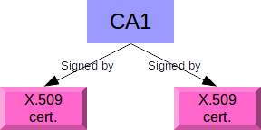
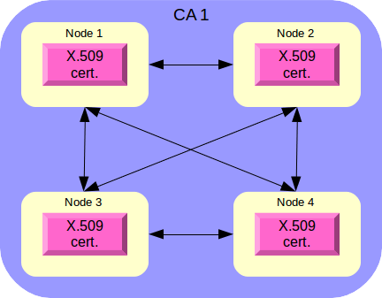

# FLoM security #
FLoM security is based on two features:

* TLS (Transport Layer Security) protocol
* X.509 certificates

### Very Important Note ###
The source code of FLoM has not yet been reviewed by a security expert.
Please pay attention that there's no guarantee related to FLoM security: **you can use it, in accordance with the terms of the GNU General Public License, at your own risk**.
If you are a security expert and you want to collaborate, please post your feedback using the [Discussion forum](https://sourceforge.net/p/flom/discussion/).

## Security levels ##
FLoM provides 3 different security levels:
1. **no security**: this is the default behavior
2. **channel encryption**: this is the easiest security level to configure
3. **mutual authentication**: this is the strongest security level offered by FLoM

### No Security ###
The default behavior of FLoM is to use clear text TCP/IP sessions without any type of security.
With this configuration:

* any FLoM client can connect to any FLoM server (daemon)
* all the network traffic flows without any form of encryption

### Channel Encryption ###
With this configuration FLoM uses TLS to encrypt the TCP/IP network traffic and:

* a FLoM client can connect to a FLoM server (daemon) only if the client and the server use an X.509 certificate signed by the same certification authority
* all the network traffic is encrypted and protected by the algorithms implemented by TLS

#### Configuration example 1 ####
Node 1 uses a X.509 certificate signed by the certification authority CA1.
Node 2 uses a X.509 certificate signed by the certification authority CA1.

#### Configuration example 2 ####
Node 1, 2, 3 and 4 use the *same* X.509 certificate.

You can create a network of secured peers with a set of X.509 certificates signed by a single certification authority. The easiest configuration re-uses the same certificate for many peers.

### Mutual Authentication ###
This configuration extends *Channel Encryption* with a **dedicated** X.509 certificate for every node/system (physical or virtual) that hosts FLoM processes.
This security level requires a more complex setup, but adds a security constraint: only the nodes/systems with a dedicated X.509 certificate signed by a specific certification authority can join and work together.

Every node in the network has its own Unique ID that can be retrieved with the command:

~~~
flom --unique-id
~~~

(FLoM uses [dbus](http://www.freedesktop.org/software/dbus/) to retrieve a system unique identifier).

To set up mutual authetication you have to:

* generate a distinct certificate for every node
* put the *unique ID* value inside the *CN* (*Common Name*) field of the certificate metadata

## Configuration examples ##
Follow these links for a full description of the configuration examples:

* [Channel Encryption](Channel_Encryption.md)
* [Mutual Authentication]

## Debugging tools ##
TLS can be difficult to debug due to many possible issues:

* wrong X.509 certificates
* usage of private and public addresses
* firewalls between networks

FLoM provide an integrate debugging tool that can be used to test a TLS client/server and peer to peer connection.
There are two debugging tutorials available:

* [Channel Encryption Debug](../Deep_Diving/Channel_Encryption_Debug.md)
* [Mutual Authentication Debug](../Deep_Diving/Mutual_Authentication_Debug.md)

