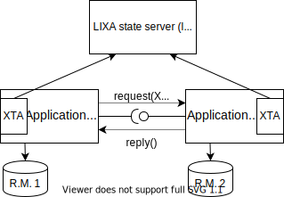

# LIXA History

Every project has its own history and LIXA it's no exception.

## The How, The Why and the When

It was 2009 when in my professional life I had to cope with UNIX applications and 2 phase commit transactions. 
Online applications were not that bad situation because TP monitors typically provided the capability of managing distributed transactions across two or more resource managers.
But batch applications were a completely different beast:

- transforming them in "quite online" applications?
- looking for some sort of transaction manager for batch applications?
- getting rid of 2 phase commit and implementing some sort of "checkpoint/restart" logic at the application level?

No approach satisfied the different stakeholders for one reason or another. In the end I remember that the company used a couple of alternatives:

- for COBOL applications, that at the end of the day were quite similar to C applications, [IBM MQSeries / IBM WebSphere MQ / IBM MQ](https://en.wikipedia.org/wiki/IBM_MQ) was used in the role of *transaction manager*
- for Java applications, [Bitronix Transaction Manager](https://github.com/bitronix/btm) was used

I was not really interested by the second one because it was a pure Java technology for Java applications: using it with a different language, let say C or Python seemed to me a not natural choice.
About the first one, it had a lot of interesting limitations, just to cite a couple:

- only the *bind* mode was supported and that required the application to run inside the same system that hosted the queue manager acting as an XA Transaction Manager
- only one XA configuration per queue manager was possible: if you had two applications that required two different XA configurations, like for example two distinct users and passwords to access the same database, you needed two queue managers with two distinct XA configurations

To make a long story short, the limitations introduced topology and scalability constraints.

At that point I started asking myself: is it possible to create a different type of *XA Transaction Manager* with some peculiar characteristics like:

- it's **not** a *Transaction Monitor*
- it's **fully distributed**, in other words it allows any type of deployment: local or remote as preferred by the user
- it's **flexible to configure**, allowing different applications to use different XA configurations in a *natural* way

After some thinking and intensive reading of the [XA specifications published by the Open Group](https://pubs.opengroup.org/onlinepubs/009680699/toc.pdf) I established there was a positive answer to the above questions.
That exact day I started to develop LIXA, acronym of LIbre XA.

At that time, the first versions of LIXA supported the *traditional pattern* for XA applications: one *Application Program*, many (two or more) *Resource Managers* as in the picture below:

the implementation made a lot of sense and demonstrated that *creating a different type of XA Transaction Manager* was possible, but in the end, it was **just another XA Transaction Manager**.

## *Strange Ideas* Emerge Time to Time

After some year, I was contacted by a [software company](https://www.globetom.com/) that was interested in using LIXA: we exchanged many point of views and opinions, but sometimes I was unable to understand some subtle items. Anyway, we had a constructive collaboration from every point of view: they offered to extend LIXA to support a specific use case that made sense for them. Let me be very frank: I didn't clearly understand what they wanted to implement, but I thought it was a good practice to accept contributions, and they played their game with few, if any, interference on my side.

They named the feature *Transaction Coupling* and they extended the *TX Demarcation Specification* to support a **different pattern**: two (or more) *Application Programs*, many *Resource Managers*. At the beginnings I thought they *were on the wrong path* because such a pattern was already described by the **XA+** specification and it requires a lot of complexity like for example:

- the concept of *Communication Resource Manager*
- the concepts of *Superior Node* and *Subordinate Node*
- a *Transaction Processing* **network protocol** able to coordinate the activities between different *Application Programs* and to propagate the *transactional context*

In the end *XA+* seemed to me like an unicorn, designed in a different age, leveraging a bunch of different standards, like for example ISO/OSI, and with few if any implementations. On the other hand, I was completely aware that some commercial *TP monitors* implemented proprietary protocols to obtain some of the features proposed by the *XA+* standard. I never was brave enough to start developing some support for XA+ in LIXA codebase.

I do think I did the **right thing**: a developer of that software company figured out a different way to use two native capabilities described by the XA standard:

- *suspending and resuming* transactions
- *branching* transactions

At that point in time I really started to understand the big picture: using the XA standard capabilities in a different way in comparison with what the standard specifications explain, a completely different set of *applicative patterns* can be supported.

After several minutes of true excitement, some questions arose in my mind, especially doubts: implementing a standard is conceptually *easy* because every time you have a doubt, you can open a book and search for an answer that makes sense. Implementing something original is a completely different game: sometimes you have no better guidance than your instinct and your experience.

That's why, before implementing something really useful, I implemented LIXAVSR: LIXA Very Stupid Robot; it's just a sandbox to make XA experiments, especially with suspend/resume and branch features. I wanted to be 100% sure some available XA implementations really supported this different way of using the XA functions.

**LIXAVSR** demonstrated that the *intuition* of that developer of that software company was correct, I discovered that the landscape behind the gate was much wider than expected: **three original *applicative patterns* can be supported with the bare *XA* standard, without introducing the complexity of the XA+ specification**.

## The Born of XTA: XA Transaction API ##

A detail was still missing: what API should have used the developer to implement those interesting patterns for XA distributed transactions?

The TX Demarcation Specification was too naive to support modern distributed programming and it was immediately discarded.

Re-inventing the wheel was not my preferred strategy, so I studied JTA, the Java Transaction API, hoping I could reuse at least its semantic. Unfortunately it was not possible, because JTA has not been designed to be used by *Applications*, but by *Application Managers*. Creating a baroque API for the LIXA developers was out of any discussion.

In the end, I decided to pick what could have been re-used of JTA and putting in place all the changes necessary to create a Transaction API easy to use from an *Application Program*: it was the born of XTA.

The above picture can be drawn even in a less abstract way:

that's basically the representation of an XA Distributed Transactions in a Microservice Architecture.

Another interesting thing about the above pictures is the composability: more than two *Application Programs* can be concatenated in a single global distributed transaction! All these magics are explained in [LIXA Reference Guide](manuals/html/index.html).

## The Future of LIXA

The future of LIXA depends on you, *the LIXA user*: use it, report feedback about it, interact, propose what could help more.
