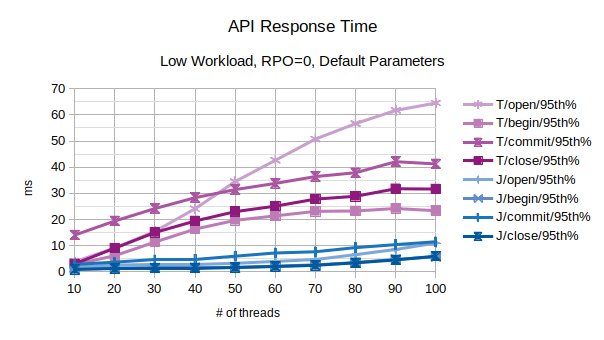
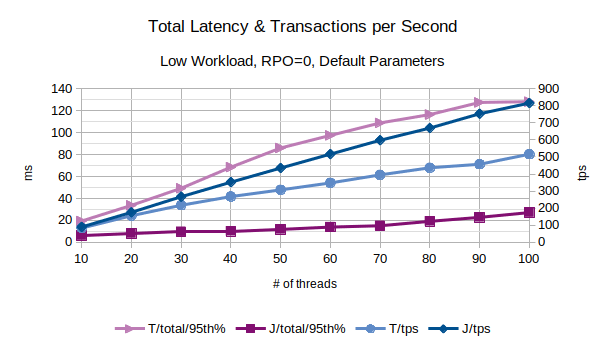

# LIXA Performances

LIXA provides a test tool that can be used to measure performances: lixat.
All the measures reported in this section have been collected using a couple of
VMs in Azure public cloud West Europe region.
The first virtual machine is used to host the LIXA client test program (**lixat**), the second virtual machine is used to host the LIXA state server (**lixad**):

Both the virtual machines are configured as below:
- Operating system: Ubuntu Linux 18.04-LTS
- VM generation: V1
- Size: Standard D2s v3
- vCPUS: 2
- RAM: 8 GiB
- Azure disk encryption: Enabled
- Disk Size: 30 GiB
- Disk Storage account: Premium SSD
- Disk Encryption: SSE with PMK
- Disk Host caching: Read/write

All the above are default parameters for D2s v3 on 2020Q2

## Benchmark Architecture

As shown in the above image, the components used to perform the performance tests are:
- Client VM: a D2s v3 Azure Virtual machine to host the **lixat** program
- **lixat**: an utility provided by LIXA to perform testing
- **liblixac**: the library used to manage the transaction and to communicate with the state server (**lixad**)
- **lixa dummy RM1**, **lixa dummy RM2**: a couple of dummy Resource Managers, they behave as a real XA Resource Manager, but reply to the caller immediately
- Server VM: a D2s v3 Azure Virtual machine to host the **lixad** daemon
- **lixad**: the LIXA state server 
- LIXA daemon: the process of **lixad**
- State: state files on disk used by **lixad** to persist the state in the event of crash/restart

### Important Notes on Benchmark Architecture:

- dummy Resource Managers introduce quite zero delay: real life use cases use Resource Managers that require some time to perform XA functions. This must be considered a *worst case* condition to measure the overhead introduced by LIXA
- **lixat** and **lixad** are deployed in distinct Virtual Machines inside the same Azure region: this is necessary to introduce the network latency and the correlated jitter that's a *noise* from measurement perspective
- state files are saved inside a standard *Premium SSD* disk: **lixad** is a *write only* application and push a lot of work on the disk (this aspect will be further described below)

### How the Benchmark Works

**lixat** is a multithreaded Application Program that uses the TX (Transaction Demarcation) interface to execute XA distributed transaction. Every thread performs the same number of transactions, one after the previous one. The logic can be described as below:

    loop
        wait some time (t1)
        tx_open()
        wait some time (t1)
        tx_begin()
        wait some time (t2)
        tx_commit()
        wait some time (t1)
        tx_close()

- *t1* is used to simulate the "thinking time" of a real Application Program
- *t2* is used to simulate the "thinking time" of the Resource Managers, like for example an SQL statement or a message PUT

Both *t1* and *t2* are randomly distributed in a range to simulate a more realistic scenario.

In every cycle of the loop, the connection is opened (tx_open) and closed (tx_close): this can be considered a typical behavior for an online service; **lixat** can even simulate a batch process with a single pair of tx_open/tx_close and many tx_begin/tx_commit, but the figures presented below are related to an online service behavior.

**Note:** due to the *0-latency* of the dummy Resource Managers, tx_open(), tx_begin(), tx_commit() and tx_close() measure **only the overhead introduced by LIXA**.

Around tx_open(), tx_begin(), tx_commit() and tx_close() a microsecond timer is used to measure how long they takes.

Three parameters are available to change the workload injected in the system:
- the number of concurrent threads: the higher the number, the higher the workload
- t1: the lower t1, the higher the workload, because transactions are executed faster
- t2: as described for t1

### How tests have been performed

For every test the following procedure was used:
- **lixad**: clean-up of */opt/lixa/var/* directory to remove the previous state files
- **lixad**: export of environment variable LIXA_STATE_ENGINE to choose the proper state engine
- **lixad**: start of the state server with */opt/lixa/sbin/lixad*
- **lixat**: start of the benchmark with a command like `for l in 10 20 30 40 50 60 70 80 90 100 ; do /opt/lixa/bin/lixat -b -s -o -l $l -C 1000 ; done`

The number of cycles, for every thread, was fixed to 1000; as a consequence, every collected statistic comes from a number of samples between 10K and 100K. Nevertheless, the collected data are affected by non negligible noise as advised in the below note.

**Note:** the tests have been performed in a public cloud environment and they are affected by non negligible noise. The previous statement should warn the reader to avoid considering *absolute* values the figures reported: all the data must be intended to provide general advices that must be confirmed in a real production environment.

### Special Note Related to XTA:

even if the benchmark uses the TX interface, both TX and XTA use the same common layer (library *liblixac*) and there should not be relevant differences, with regards to the type of distributed transactions depicted in the above image, between TX and XTA.

## LIXA State Server Engines

Starting with version 1.9.0, the LIXA State Server supplies two distinct *State Engines*:
- **TRADITIONAL**: this is the battle tested, original *State Engine*
- **JOURNAL**: a more complex *State Engine* that provides better performances in most situations

The figures reported below compare the behavior of the two *State Engines* when different workloads and different configurations are applied.

### RPO: Recovery Point Objective

LIXA State Server provides parameters that can alter the RPO of the saved state in the event of crash. As a general rule, the lower the RPO, the higher the pressure on the disk subsystem and the lower the workload that a single LIXA State Server can handle.

The figures reported below are classified even from the RPO perspective.

**Note:** default LIXA configuration assumes the user desire RPO=0, but this is not necessarily true, depending on the environment and the use case. Please refer to the [Tuning](https://www.tiian.org/lixa/manuals/html/ch11.html) chapter in the LIXA Reference Guide for more details on this.

### Low Workload, RPO=0, Default Parameters

The first couple of charts are related to the behavior in presence of a low workload with default parameters and RPO=0.

*t1* is in range 500-1500 microseconds
*t2* is in range 50-150 milliseconds: this can be associated to the behavior of *slow* Resource Managers

All the points in the chart are related to the 95th percentile value; series prefixed with "T" are related to the *traditional* state engine, series prefixed with "J" are related to the *journal* state engine. From this chart, the *journal* state engine appear to scale much better when the number of concurrent threads increases.

In this chart are represented the 95th percentile values of the total latency introduced by LIXA in the transactions as the sum of open+begin+commit+close and the number of transaction per seconds that have been executed: from this chart, the *journal* state engine appears to provide an overall better performance. 
