# LIXA Performances

### Abstract

When it comes to Distributed Transactions, **performance matters**. Around the web dozens of articles *explain* that distributed transactions are *slow* and modern programming should *avoid* them. This is not the right place to have such a discussion, but the right place to answer the question *how much latency is introduced by using distributed transactions supported by LIXA*?

You can look at the figures reported in this article to discover that using LIXA you can execute hundreds of transactions per second introducing few milliseconds of latency in your transactions.

### Introduction

LIXA provides a test tool that can be used to measure performances: lixat.
All the measures reported in this section have been collected using a couple of
VMs in Azure public cloud West Europe region.
The first virtual machine is used to host the LIXA client test program (**lixat**), the second virtual machine is used to host the LIXA state server (**lixad**):

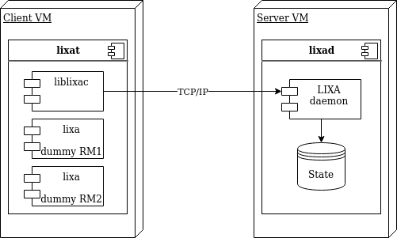

Both the virtual machines are configured as below:
- Operating system: Ubuntu Linux 18.04-LTS
- VM generation: V1
- Size: Standard D2s v3
- vCPUS: 2
- RAM: 8 GiB
- Azure disk encryption: Enabled
- Disk Size: 30 GiB
- Disk Storage account: Premium SSD
- Disk Encryption: SSE with PMK
- Disk Host caching: Read/write

## Benchmark Architecture

As shown in the above image, the components used to perform the performance tests are:
- Client VM: a D2s v3 Azure Virtual machine to host the **lixat** program
- **lixat**: an utility provided by LIXA to perform testing
- **liblixac**: the library used to manage the transaction and to communicate with the state server (**lixad**)
- **lixa dummy RM1**, **lixa dummy RM2**: a couple of dummy Resource Managers, they behave as a real XA Resource Manager, but reply to the caller immediately
- Server VM: a D2s v3 Azure Virtual machine to host the **lixad** daemon
- **lixad**: the LIXA state server 
- LIXA daemon: the process of **lixad**
- State: state files on disk used by **lixad** to persist the state in the event of crash/restart

Here is the measured network latency between *Client VM* and *Server VM*:

    --- 10.139.243.132 ping statistics ---
    1000 packets transmitted, 1000 received, 0% packet loss, time 1014831ms
    rtt min/avg/max/mdev = 0.603/0.923/8.327/0.451 ms

**average round trip time** is about 923 microseconds, with a maximum of 8 milliseconds.

### Important Notes on Benchmark Architecture:

- dummy Resource Managers introduce quite zero delay: real life Resource Managers require some time to perform XA functions. This must be considered a **worst case** condition to measure the overhead introduced by LIXA
- dummy Resource Managers introduce quite zero delay, real life Resource Managers can perform worse when using the XA two phase commit protocol in comparison with non XA single phase commit. This must be considered a **best case** condition with regards of the overhead introduced by real Resource Managers
- **lixat** and **lixad** are deployed in distinct Virtual Machines inside the same Azure region: this is necessary to introduce the network latency and the correlated jitter that's a *noise* from measurement perspective
- state files are saved inside a standard *Premium SSD* disk: **lixad** is a *write mostly* application and generates a lot of stress on the disk (this aspect will be further described below)

### How the Benchmark Works

**lixat** is a multithreaded Application Program that uses the TX (Transaction Demarcation) interface to execute XA distributed transaction. Every thread performs the same number of transactions, one after the previous one. The logic can be described as below:

    loop
        wait some time (t1)
        tx_open()
        wait some time (t1)
        tx_begin()
        wait some time (t2)
        tx_commit()
        wait some time (t1)
        tx_close()

- *t1* is used to simulate the "thinking time" of a real Application Program
- *t2* is used to simulate the "thinking time" of a couple of real Resource Managers, like for example SQL statements or message PUT/GET

Both *t1* and *t2* are randomly distributed to simulate a more realistic scenario.

In every cycle of the loop, the connection is opened (tx_open) and closed (tx_close): this can be considered a typical behavior for an online service; **lixat** can even simulate a batch process with a single pair of tx_open/tx_close and many tx_begin/tx_commit, but the figures presented below are related to an online service behavior.

**Note:** due to the *0-latency* of the dummy Resource Managers, tx_open(), tx_begin(), tx_commit() and tx_close() measure **only the overhead introduced by LIXA**. They do **not** measure the overhead introduced by Resource Managers in performing XA functions.

Three parameters are available to change the workload injected in the system:
- the number of concurrent threads: the higher the number, the higher the workload
- t1: the lower t1, the higher the workload, because transactions are executed faster
- t2: the lower t2, the higher the workload, because transactions are executed faster

### How tests have been performed

For every test the following procedure was used:
- **lixad**: clean-up of */opt/lixa/var/* directory to remove the previous state files
- **lixad**: export of environment variable LIXA_STATE_ENGINE to choose the proper state engine
- **lixad**: start of the state server with */opt/lixa/sbin/lixad*
- **lixat**: start of the benchmark with a command like `for l in 10 20 30 40 50 60 70 80 90 100 ; do /opt/lixa/bin/lixat -b -s -o -l $l -C 1000 ; done`

The number of cycles, for every thread, was fixed to 1000; as a consequence, every collected statistic comes from a number of samples between 10K and 100K. Nevertheless, the collected data are affected by non negligible noise as advised in the below note.

**Note: the tests have been performed in a public cloud environment and they are affected by non negligible noise.** The previous statement should warn the reader to avoid considering *absolute* values the figures reported: all the data must be intended to provide general advices that must be confirmed in a real production environment.

### Special Note Related to XTA:

even if the benchmark uses the TX interface, both TX and XTA use the same common layer (library *liblixac*) and there should not be relevant differences, with regards to the type of distributed transactions depicted in the above image, between TX and XTA.

### LIXA State Server Engines

Starting with version 1.9.0, the LIXA State Server supplies two distinct *State Engines*:
- **TRADITIONAL**: this is the battle tested, original *State Engine*
- **JOURNAL**: a more complex *State Engine* that provides better performances in most situations

The figures reported below compare the behavior of the two *State Engines* when different workloads and different configurations are applied.

### RPO: Recovery Point Objective

LIXA State Server provides parameters that can alter the RPO of the saved state in the event of crash. As a general rule, the lower the RPO, the higher the pressure on the disk subsystem and the lower the workload that a single LIXA State Server can handle.

The figures reported below are classified even from the RPO perspective.

**Note:** default LIXA configuration assumes that the user desire RPO=0, but this is not necessarily true, depending on the environment and the use case. Please refer to the [Tuning](https://www.tiian.org/lixa/manuals/html/ch11.html) chapter in the LIXA Reference Guide for more details on this.

### Data

All the data are available for consultation in [OpenDocument](LIXA_perf.ods) format.

## LIXA Performances Key Points

In this section key figures are reported: all the charts represent the trade-off between the number of **Transactions per Second (tps)** on the Y axis and the **95th percentile** of the **Total Latency** introduced by LIXA in the overall transaction elapsed time. Figures are reported following two analysis paths:
- the quantity of injected workload classified as "Medium", "High" and "Extreme" (exact definition is available in the following sections)
- the RPO configured for the LIXA State Server (much more details are available in the following sections)

### Characteristic Curves for RPO=0ms

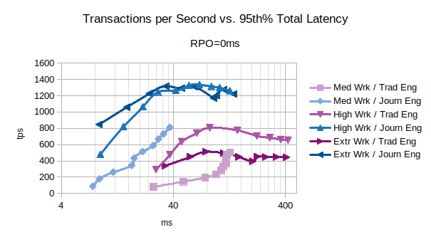

The chart shows that the *Journal* state engine provides a better performances for every type of workload. The curve *Extr Wrk / Journ Eng* shows that the system can execute up to:
- 800 tps introducing 9 ms of latency
- 1000 tps introducing 15 ms of latency
- 1200 tps introducing 24 ms of latency

### Characteristic Curves for RPO about 5ms

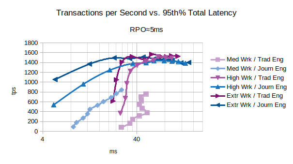

Accepting an RPO about 5ms, the *Journal* state engine provides even better performances reaching 1000 tps introducing about 5 ms of latency.

### Characteristic Curves for RPO about 10ms

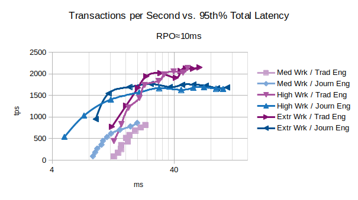

If your use case is compatible with an RPO about 10ms, the *Traditional* state engine can provide a quite astonishing performance reaching 1900 tps introducing about 41 ms of latency with a single LIXA State Server.
Even for this RPO, if low latency is a must, the *Journal* state engine can execute:
- 500 tps introducing 5 ms of latency
- 1000 tps introducing 7 ms of latency

### Characteristic Curves for Medium Workload

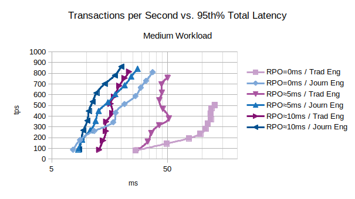

The chart shows that the *Journal* state engine provides a better performances for every RPO in presence of a *medium workload*.

### Characteristic Curves for High Workload

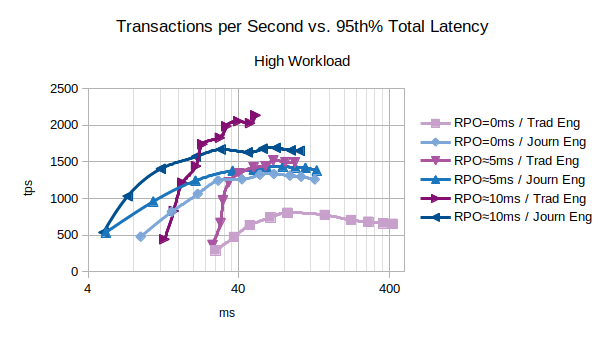

The chart shows that the *Journal* state engine provides the best performance in most cases, but for the higher RPO (about 10ms) the *Traditional* state engine can reach an higher number of transactions per second.

### Characteristic Curves for Extreme Workload

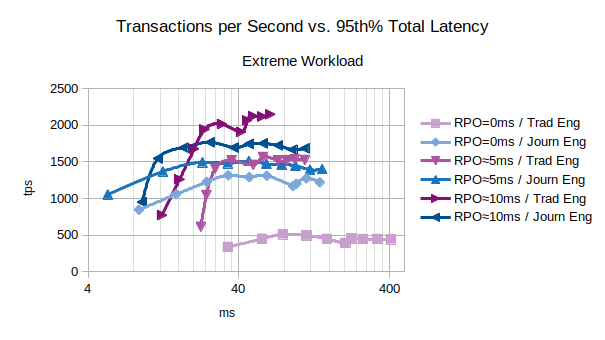

The chart shows that the *Journal* state engine privileges lower latencies and *Traditional* state engine privileges higher tnumbers of tps.

### LIXA Performances Summary

Even in the most severe condition (state server RPO=0ms), **LIXA can reach 800 transactions per second introducing a maximum latency of about 9 ms** considering 95% of the total managed transactions. If your environment requires more transactions per second you can horizontally scale the number of LIXA State Servers accordingly with your needs.

## Figures, Charts & Explanations

In this section detailed figures are reported: all the charts put the *number of (client) threads* on the X axis to show the basic results collected during the tests.

### Medium Workload (slow RMs), RPO=0, Default Parameters

The first series of charts is related to the behavior in presence of a medium workload with default parameters and RPO=0:
- *t1* is in range 500-1500 microseconds
- *t2* is in range 50-150 milliseconds, this can be associated to the behavior of *slow* Resource Managers: both RMs takes 25-75ms, on average, to perform they operation (inserting data, deleting a message, and so on...)

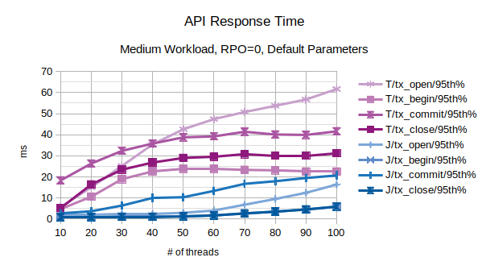

All the points in the above chart are related to the 95th percentile values; series prefixed with "T" are related to the *traditional* state engine, series prefixed with "J" are related to the *journal* state engine. From this chart, the *journal* state engine appears to scale much better when the number of concurrent threads increases.

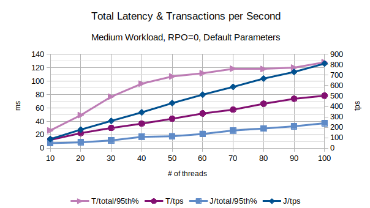

In the above chart are represented the 95th percentile values of the total latency introduced by LIXA in the transactions as the sum of open+begin+commit+close and the number of transactions per second that have been executed; series prefixed with "T" are related to the *traditional* state engine, series prefixed with "J" are related to the *journal* state engine. 
From this chart, the *journal* state engine appears to provide an overall better performance because it introduces a lower latency and provides an higher number of transactions per second.

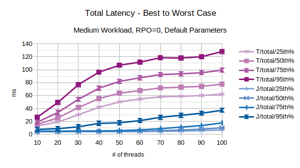

With the exception of the outliers, the above chart represents the characteristic latency introduced by LIXA:
- 25th% percentile can be considered an approximation of the best performance, the lowest latency
- 50th% percentile is the maximum latency of the best 50% transactions
- 75th% percentile is the maximum latency of the best 75% transactions
- 95th% percentile can be considered an approximation of the worst performance, the highest latency.
Series prefixed with "T" are related to the *traditional* state engine, series prefixed with "J" are related to the *journal* state engine.

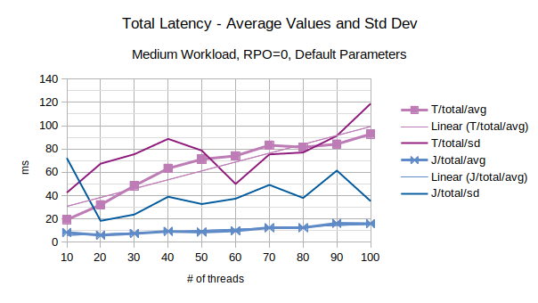

The last chart of the serie shows the average value of the total latency introduced by LIXA and the standard deviation of the total latency; series prefixed with "T" are related to the *traditional* state engine, series prefixed with "J" are related to the *journal* state engine. *Journal* state engine provides in this scenario an overall better performance than *traditional* state engine. It must be noted that standard deviation is very high: this is the consequence of few outliers with very high values.

#### Linux Key Metrics

Peak key metrics of the D2s v3 Azure Virtual machine for *traditional* state engine:
- CPU: 27%
- Disk operations/sec: 845/s

peak key metrics for *journal* state engine:
- CPU: 62%
- Disk operations/sec: 760/s

*Journal* state engine uses much more (user) CPU, but it optimizes the usage of the disk.

### High Workload (normal RMs), RPO=0

The second series of charts is related to the behavior in presence of a high workload and RPO=0:
- *t1* is in range 500-1500 microseconds
- *t2* is in range 5-15 milliseconds, this can be associated to the behavior of *good performance* Resource Managers: both RMs takes 2.5-7.5ms, on average, to perform they operations (inserting data, deleting a message, and so on...).

Log parameters of LIXA state engine have been multiplied by 10 to accomplish the larger workload:
- lixad/log_size: 5242880
- lixad/max_buffer_log_size: 1310720

Log parameters are irrelevant for *traditional* state server because it does not use log files.

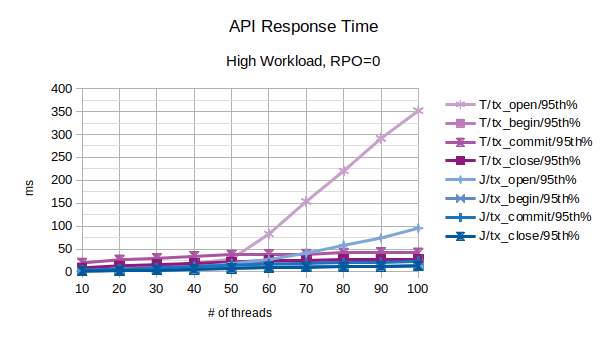

All the points in the above chart are related to the 95th percentile values; series prefixed with "T" are related to the *traditional* state engine, series prefixed with "J" are related to the *journal* state engine. From this chart, the *journal* state engine appears to scale much better when the number of concurrent threads increases.
After 50 concurrent client threads, both the configurations start to slow down, but *journal* state engine performs much better in terms of accepting new clients (tx_open).

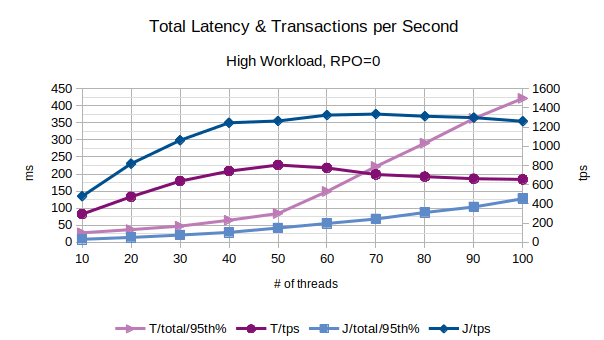

In the above chart are represented the 95th percentile values of the total latency introduced by LIXA in the transactions as the sum of open+begin+commit+close and the number of transactions per second that have been executed; series prefixed with "T" are related to the *traditional* state engine, series prefixed with "J" are related to the *journal* state engine.
The figures clearly show that *traditional* state engine saturate much before than *journal* state engine.

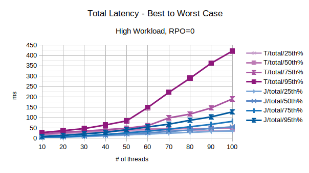

With the exception of the outliers, the above chart represents the characteristic latency introduced by LIXA:
- 25th% percentile can be considered an approximation of the best performance, the lowest latency
- 50th% percentile is the maximum latency of the best 50% transactions
- 75th% percentile is the maximum latency of the best 75% transactions
- 95th% percentile can be considered an approximation of the worst performance, the highest latency.
Series prefixed with "T" are related to the *traditional* state engine, series prefixed with "J" are related to the *journal* state engine.

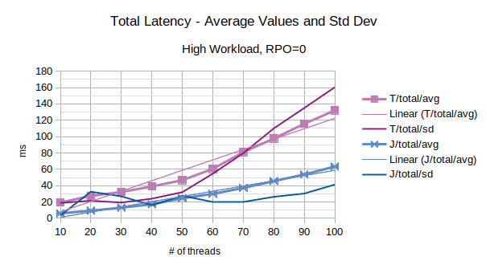

The last chart of the serie shows the average value of the total latency introduced by LIXA and the standard deviation of the total latency; series prefixed with "T" are related to the *traditional* state engine, series prefixed with "J" are related to the *journal* state engine. *Journal* state engine provides in this scenario an overall better performance than *traditional* state engine. It must be noted that standard deviation is very high: this is the consequence of few outliers with very high values.

#### Linux Key Metrics

Peak key metrics of the D2s v3 Azure Virtual machine for *traditional* state engine:
- CPU: 34%
- Disk operations/sec: 852/s

peak key metrics for *journal* state engine:
- CPU: 85%
- Disk operations/sec: 802/s

### Extreme Workload (normal RMs), RPO=0

The third series of charts is related to the behavior in presence of an extreme workload and RPO=0:
- *t1* is in range 500-1500 microseconds
- *t2* is in range 500-1500 microseconds, this can be associated to the behavior of *fast* Resource Managers: both RMs takes 250-750 microseconds, on average, to perform they operation (inserting data, deleting a message, and so on...).

Log parameters of LIXA state engine have been multiplied by 100 to accomplish the larger workload:
- lixad/log_size: 52428800
- lixad/max_buffer_log_size: 13107200

The above parameters are irrelevant for *traditional* state server because it does not use log files.

**Note:** this workload must be considered **extreme** because the time used by each RM is below the network latency and below the storage latency. Only a *colocated* Resource Manager implemented using an *in memory* approach can reach these low latencies. Anyway, the figures are interesting to discover the behavior of LIXA under such extreme conditions.

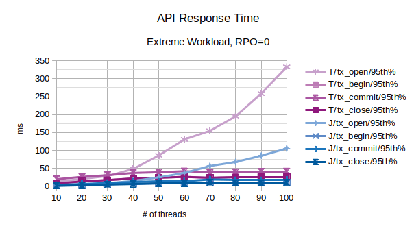

All the points in the above chart are related to the 95th percentile values; series prefixed with "T" are related to the *traditional* state engine, series prefixed with "J" are related to the *journal* state engine. From this chart, the *journal* state engine appears to scale much better when the number of concurrent threads increases.
After 30-50 concurrent client threads, both the configurations start to slow down, but *journal* state engine performs much better in terms of accepting new clients (tx_open).

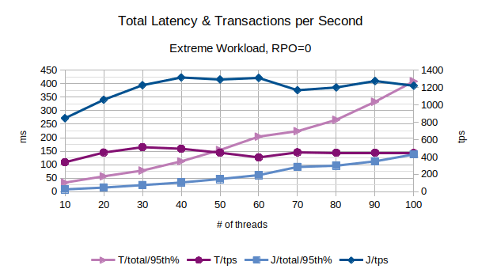

In the above chart are represented the 95th percentile values of the total latency introduced by LIXA in the transactions as the sum of open+begin+commit+close and the number of transactions per second that have been executed; series prefixed with "T" are related to the *traditional* state engine, series prefixed with "J" are related to the *journal* state engine.
The figures show that *journal* state engine reaches a peak of 1300 transactions per second between 40 and 60 concurrent threads, then is sustains around 1200 transactions per second.

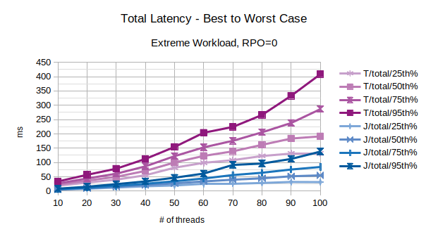

With the exception of the outliers, the above chart represents the characteristic latency introduced by LIXA:
- 25th% percentile can be considered an approximation the best performance, the lowest latency
- 50th% percentile is the maximum latency of the best 50% transactions
- 75th% percentile is the maximum latency of the best 75% transactions
- 95th% percentile can be considered an approximation of the worst performance, the highest latency.
Series prefixed with "T" are related to the *traditional* state engine, series prefixed with "J" are related to the *journal* state engine.

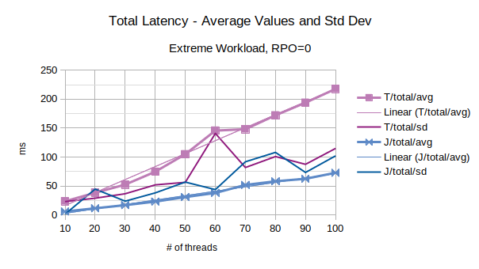

The last chart of the serie shows the average value of the total latency introduced by LIXA and the standard deviation of the total latency; series prefixed with "T" are related to the *traditional* state engine, series prefixed with "J" are related to the *journal* state engine. *Journal* state engine provides in this scenario an overall better performance than *traditional* state engine. It must be noted that standard deviation is very high: this is the consequence of few outliers with very high values.

#### Linux Key Metrics

Peak key metrics of the D2s v3 Azure Virtual machine for *traditional* state engine:
- CPU: 27%
- Disk operations/sec: 970/s

peak key metrics for *journal* state engine:
- CPU: 85%
- Disk operations/sec: 845/s

### Conclusions for RPO=0

RPO=0 requires that LIXA state server persists the transaction state as soon as possible, synchronizing the transaction executor.
RPO=0 requires a lot of Disk Operations per second.

In presence of a medium (moderate) workload, before the system reaches saturation, both *journal* and *traditional* state engine provides linear scalability of the number of transactions per second, but only the *journal* state engine provides linear scalability even for the introduced latency.

In presence of a high workload, the system reaches saturation and neither *journal* nor *traditional* state engine can provide linear scalability, but the behavior of the *journal* state engine is much better because it provides quite linear introduced latency and quite stable maximum number of transactions per second.

In presence of an extreme workload, the *journal* state engine shows its quite good behavior, even if running in saturation for most of the time.

### Not all the times RPO=0 is necessary

LIXA state server does **not** persist the **data** managed by Application Programs, but only the **state** of the distributed transactions performed to change the data: in the end, Resource Managers guarantee data consistency and, if the state of the Transaction Manager (LIXA) vanishes, data consistency can be manually fixed in every single Resource Manager. This is not ah *happy path task*, but it can be done.

*Journal* state engine, in comparison with *traditional* state engine, provides a further feature: **if the underlying Linux Operating System does not crash, RPO is constantly kept to 0 with a continuous checksum of the state table files**. In few words, **if the event of crash for the Linux Operating System** and/or the underlying hypervisor/hardware **is negligible, RPO=0 is guaranteed** by the *journal* state engine even **without** persisting data to disk as soon as possible.

**Note:** the above behavior does **not** apply to the *traditional* state engine.

In the next sections, the performances of the LIXA state server with RPO>0 will be shown.

### Charts for RPO about 5ms

Setting parameter *max_elapsed_sync_time=5* in *lixad_conf.xml* allows the LIXA state manager to postpone disk synchronization up to 5 milliseconds: this does **not** guarantee a precise RPO=5ms, but is equivalent to say "after maximum 5ms, the synchronization of the state to the persistent storage is started". In other words, 5ms is a good approximation of the time window of the *missed states* in the event of **crash**.

Supposing your workload is about 200 transactions per second, you can forecast about 1 transaction to be manually recovered in the event of a crash.

**Note:** as stated above
- for *traditional* state engine any *lixad* state server crash might require transaction manually recovery
- for *journal* state engine only a crash at the operating system level might require transaction manually recovery

### Medium Workload (slow RMs), RPO about 5ms

The first series of charts is related to the behavior in presence of a medium workload with parameter *max_elapsed_sync_time=5* and RPO about 5,s:
- *t1* is in range 500-1500 microseconds
- *t2* is in range 50-150 milliseconds, this can be associated to the behavior of *slow* Resource Managers: both RMs takes 25-75ms, on average, to perform they operation (inserting data, deleting a message, and so on...)

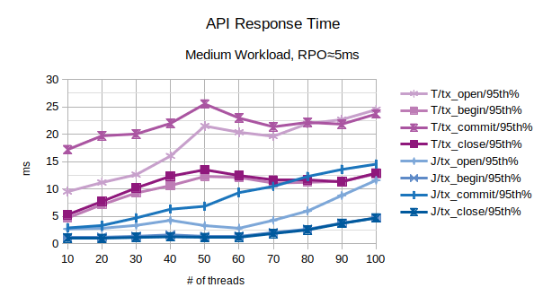

All the points in the above chart are related to the 95th percentile values; series prefixed with "T" are related to the *traditional* state engine, series prefixed with "J" are related to the *journal* state engine. From this chart, the *journal* state engine appears to scale better when the number of concurrent threads increases.

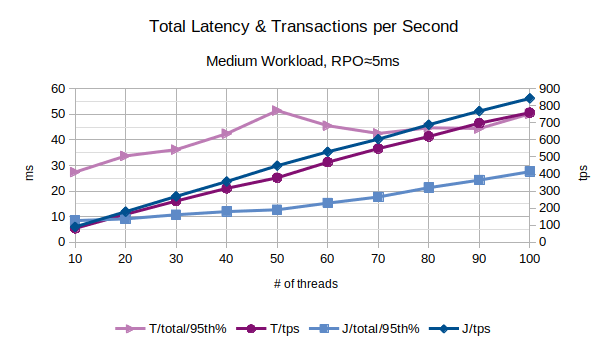

In the above chart are represented the 95th percentile values of the total latency introduced by LIXA in the transactions as the sum of open+begin+commit+close and the number of transactions per second that have been executed; series prefixed with "T" are related to the *traditional* state engine, series prefixed with "J" are related to the *journal* state engine. 
From this chart, the *journal* state engine appears to provide an overall better performance because it introduces a lower latency and provides a slightly higher number of transactions per second.

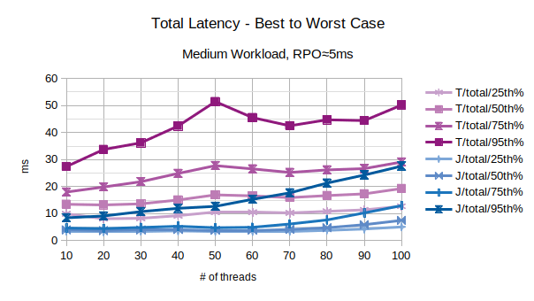

With the exception of the outliers, the above chart represents the characteristic latency introduced by LIXA:
- 25th% percentile can be considered an approximation of the best performance, the lowest latency
- 50th% percentile is the maximum latency of the best 50% transactions
- 75th% percentile is the maximum latency of the best 75% transactions
- 95th% percentile can be considered an approximation of the worst performance, the highest latency.
Series prefixed with "T" are related to the *traditional* state engine, series prefixed with "J" are related to the *journal* state engine.

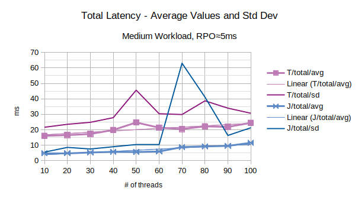

The last chart of the serie shows the average value of the total latency introduced by LIXA and the standard deviation of the total latency; series prefixed with "T" are related to the *traditional* state engine, series prefixed with "J" are related to the *journal* state engine. *Journal* state engine provides in this scenario an overall better performance than *traditional* state engine. It must be noted that standard deviation is very high: this is the consequence of few outliers with very high values.

#### Linux Key Metrics

Peak key metrics of the D2s v3 Azure Virtual machine for *traditional* state engine:
- CPU: 33%
- Disk operations/sec: 815/s

peak key metrics for *journal* state engine:
- CPU: 62%
- Disk operations/sec: 820/s

*Journal* state engine uses much more (user) CPU.

### High Workload (normal RMs), RPO about 5ms

The second series of charts is related to the behavior in presence of a high workload and RPO about 5ms:
- *t1* is in range 500-1500 microseconds
- *t2* is in range 5-15 milliseconds, this can be associated to the behavior of *good performance* Resource Managers: both RMs takes 2.5-7.5ms, on average, to perform they operations (inserting data, deleting a message, and so on...).

Log parameters of LIXA state engine have been multiplied by 10 to accomplish the larger workload:
- lixad/max_elapsed_sync_time: 5
- lixad/log_size: 5242880
- lixad/max_buffer_log_size: 1310720

Log parameters are irrelevant for *traditional* state server because it does not use log files.

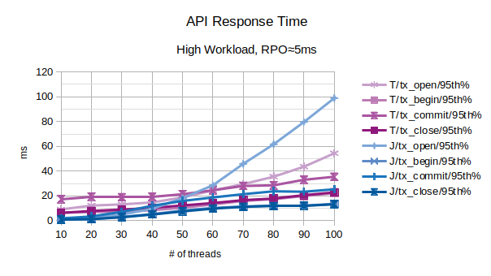

All the points in the above chart are related to the 95th percentile values; series prefixed with "T" are related to the *traditional* state engine, series prefixed with "J" are related to the *journal* state engine. From this chart, the *traditional* state engine appears to scale much better when the number of concurrent threads increases.
After 50 concurrent client threads, both the configurations start to slow down, but *traditional* state engine performs much better in terms of accepting new clients (tx_open).

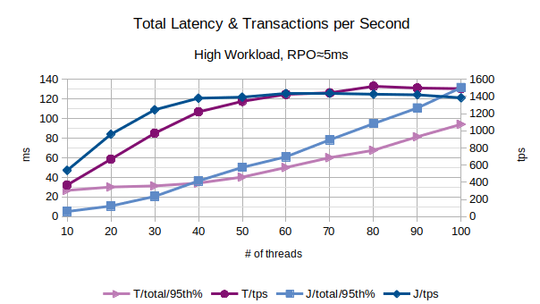

In the above chart are represented the 95th percentile values of the total latency introduced by LIXA in the transactions as the sum of open+begin+commit+close and the number of transactions per second that have been executed; series prefixed with "T" are related to the *traditional* state engine, series prefixed with "J" are related to the *journal* state engine.
The figures show that *journal* state engine saturate before than *traditional* state engine.

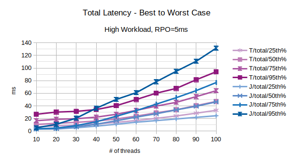

With the exception of the outliers, the above chart represents the characteristic latency introduced by LIXA:
- 25th% percentile can be considered an approximation of the best performance, the lowest latency
- 50th% percentile is the maximum latency of the best 50% transactions
- 75th% percentile is the maximum latency of the best 75% transactions
- 95th% percentile can be considered an approximation of the worst performance, the highest latency.
Series prefixed with "T" are related to the *traditional* state engine, series prefixed with "J" are related to the *journal* state engine.

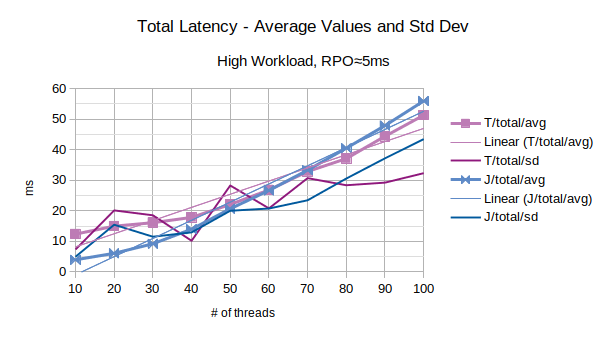

The last chart of the serie shows the average value of the total latency introduced by LIXA and the standard deviation of the total latency; series prefixed with "T" are related to the *traditional* state engine, series prefixed with "J" are related to the *journal* state engine. It must be noted that standard deviation is very high: this is the consequence of few outliers with very high values.

#### Linux Key Metrics

Peak key metrics of the D2s v3 Azure Virtual machine for *traditional* state engine:
- CPU: 50%
- Disk operations/sec: 922/s

peak key metrics for *journal* state engine:
- CPU: 62%
- Disk operations/sec: 820/s

### Extreme Workload (normal RMs), RPO about 5s

The third series of charts is related to the behavior in presence of an extreme workload and RPO about 5ms:
- *t1* is in range 500-1500 microseconds
- *t2* is in range 500-1500 microseconds, this can be associated to the behavior of *fast* Resource Managers: both RMs takes 250-750 microseconds, on average, to perform they operation (inserting data, deleting a message, and so on...).

Log parameters of LIXA state engine have been multiplied by 100 to accomplish the larger workload:
- lixad/max_elapsed_sync_time: 5
- lixad/log_size: 52428800
- lixad/max_buffer_log_size: 13107200

The above parameters related to log are irrelevant for *traditional* state server because it does not use log files.

**Note:** this workload must be considered **extreme** because the time used by each RM is below the network latency and below the storage latency. Only a *colocated* Resource Manager implemented using an *in memory* approach can reach these low latencies. Anyway, the figures are interesting to discover the behavior of LIXA under such extreme conditions.

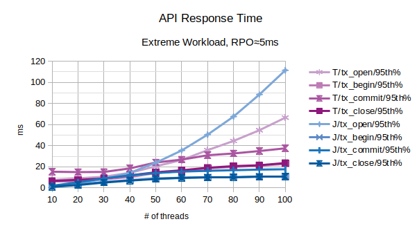

All the points in the above chart are related to the 95th percentile values; series prefixed with "T" are related to the *traditional* state engine, series prefixed with "J" are related to the *journal* state engine. From this chart, the *traditional* state engine appears to scale much better when the number of concurrent threads increases.
After 40 concurrent client threads, both the configurations start to slow down, but *traditional* state engine performs much better in terms of accepting new clients (tx_open).

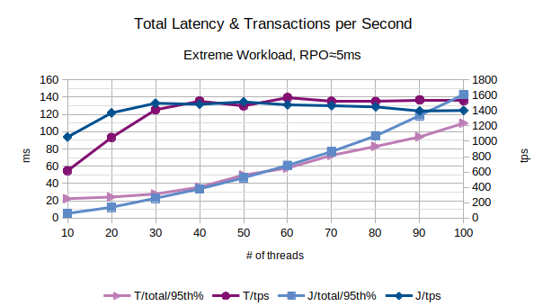

In the above chart are represented the 95th percentile values of the total latency introduced by LIXA in the transactions as the sum of open+begin+commit+close and the number of transactions per second that have been executed; series prefixed with "T" are related to the *traditional* state engine, series prefixed with "J" are related to the *journal* state engine.
The figures show both *journal* and *traditional* state engine sustain the quite the same workload, but the *traditional* state engine introduces a lower latency.

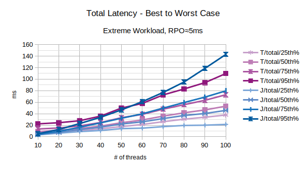

With the exception of the outliers, the above chart represents the characteristic latency introduced by LIXA:
- 25th% percentile can be considered an approximation the best performance, the lowest latency
- 50th% percentile is the maximum latency of the best 50% transactions
- 75th% percentile is the maximum latency of the best 75% transactions
- 95th% percentile can be considered an approximation of the worst performance, the highest latency.
Series prefixed with "T" are related to the *traditional* state engine, series prefixed with "J" are related to the *journal* state engine.
The figures show that the *journal* state engine provides a better *best performance* while the *traditional* state engine provides a better *worst performance*.

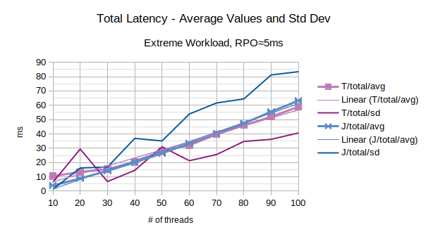

The last chart of the serie shows the average value of the total latency introduced by LIXA and the standard deviation of the total latency; series prefixed with "T" are related to the *traditional* state engine, series prefixed with "J" are related to the *journal* state engine. *Journal* and *traditional* state engines introduce quite the same average latency, but the standard deviation associated to the *journal* state engine is much higher: as a consequence the latency introduced by the *traditional* state engine is more constant.

#### Linux Key Metrics

Peak key metrics of the D2s v3 Azure Virtual machine for *traditional* state engine:
- CPU: 51%
- Disk operations/sec: 931/s

peak key metrics for *journal* state engine:
- CPU: 83%
- Disk operations/sec: 751/s

### Charts for RPO about 10ms

Setting parameters *min_elapsed_sync_time=1* *max_elapsed_sync_time=10* in *lixad_conf.xml* allows the LIXA state manager to postpone disk synchronization from 1 to 10 milliseconds: this does **not** guarantee a precise RPO=10ms, but is equivalent to say "after minimum 1ms and maximum 10ms, the state of the transaction starts to be synchronized on the persistent storage". In other words, 10ms is a good approximation of the time window of the *missed states* in the event of **crash**.
In comparison with the scenario "RPO about 5ms", the additional parameter prevents disk synchronization before 1ms from the previous one.

Supposing your workload is about 200 transactions per second, you can forecast about 2 transaction to be manually recovered in the event of a crash.

**Note:** as stated above
- for *traditional* state engine any *lixad* state server crash might require transaction manually recovery
- for *journal* state engine only a crash at the operating system level might require transaction manually recovery

### Medium Workload (slow RMs), RPO about 10ms

The first series of charts is related to the behavior in presence of a medium workload with parameter *max_elapsed_sync_time=5* and RPO about 5,s:
- *t1* is in range 500-1500 microseconds
- *t2* is in range 50-150 milliseconds, this can be associated to the behavior of *slow* Resource Managers: both RMs takes 25-75ms, on average, to perform they operation (inserting data, deleting a message, and so on...)

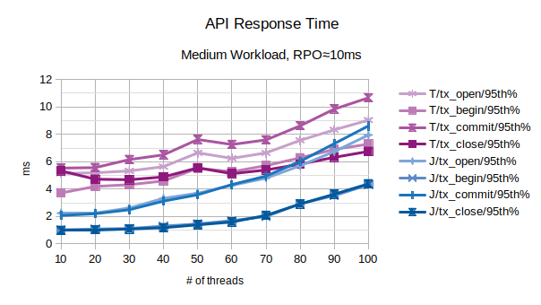

All the points in the above chart are related to the 95th percentile values; series prefixed with "T" are related to the *traditional* state engine, series prefixed with "J" are related to the *journal* state engine. From this chart, the *journal* state engine appears to scale better at any level of concurrent threads.

In the above chart are represented the 95th percentile values of the total latency introduced by LIXA in the transactions as the sum of open+begin+commit+close and the number of transactions per second that have been executed; series prefixed with "T" are related to the *traditional* state engine, series prefixed with "J" are related to the *journal* state engine. 
From this chart, the *journal* state engine appears to provide an overall better performance because it introduces a lower latency and provides a slightly higher number of transactions per second.

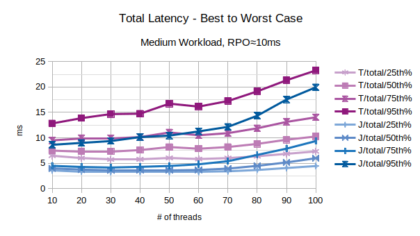

With the exception of the outliers, the above chart represents the characteristic latency introduced by LIXA:
- 25th% percentile can be considered an approximation of the best performance, the lowest latency
- 50th% percentile is the maximum latency of the best 50% transactions
- 75th% percentile is the maximum latency of the best 75% transactions
- 95th% percentile can be considered an approximation of the worst performance, the highest latency.
Series prefixed with "T" are related to the *traditional* state engine, series prefixed with "J" are related to the *journal* state engine.

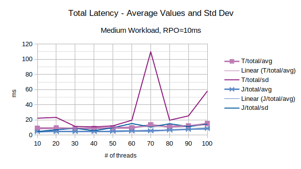

The last chart of the serie shows the average value of the total latency introduced by LIXA and the standard deviation of the total latency; series prefixed with "T" are related to the *traditional* state engine, series prefixed with "J" are related to the *journal* state engine. *Journal* state engine provides in this scenario a slightly better performance than *traditional* state engine. It must be noted that standard deviation is very high: this is symptom of high noise in the measurements.

#### Linux Key Metrics

Peak key metrics of the D2s v3 Azure Virtual machine for *traditional* state engine:
- CPU: 39%
- Disk operations/sec: 563/s

peak key metrics for *journal* state engine:
- CPU: 59%
- Disk operations/sec: 363/s

*Journal* state engine uses much more (user) CPU, but less disk operations.

### High Workload (normal RMs), RPO about 10ms

The second series of charts is related to the behavior in presence of a high workload and RPO about 5ms:
- *t1* is in range 500-1500 microseconds
- *t2* is in range 5-15 milliseconds, this can be associated to the behavior of *good performance* Resource Managers: both RMs takes 2.5-7.5ms, on average, to perform they operations (inserting data, deleting a message, and so on...).

Log parameters of LIXA state engine have been multiplied by 10 to accomplish the larger workload:
- lixad/min_elapsed_sync_time: 1
- lixad/max_elapsed_sync_time: 10
- lixad/log_size: 5242880
- lixad/max_buffer_log_size: 1310720

Log parameters are irrelevant for *traditional* state server because it does not use log files.

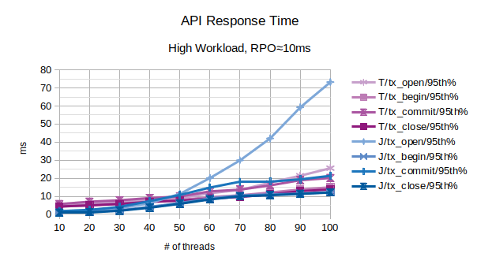

All the points in the above chart are related to the 95th percentile values; series prefixed with "T" are related to the *traditional* state engine, series prefixed with "J" are related to the *journal* state engine. From this chart, the *traditional* state engine appears to scale much better when the number of concurrent threads increases.
After 50 concurrent client threads, both the configurations start to slow down, but *traditional* state engine performs much better in terms of accepting new clients (tx_open).

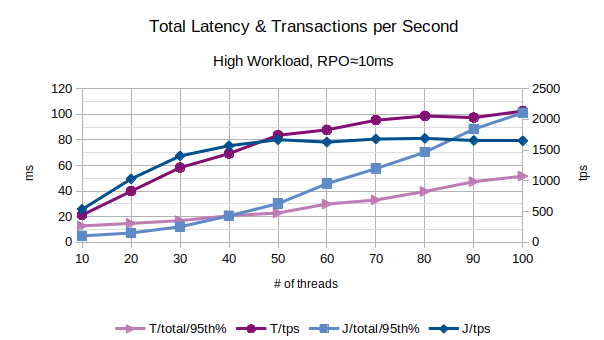

In the above chart are represented the 95th percentile values of the total latency introduced by LIXA in the transactions as the sum of open+begin+commit+close and the number of transactions per second that have been executed; series prefixed with "T" are related to the *traditional* state engine, series prefixed with "J" are related to the *journal* state engine.
The figures show that *journal* state engine saturate before than *traditional* state engine: at about 40 client threads the total latency introduced by the *journal* state engine increases more steeply and the transaction per seconds reaches a lower limit.

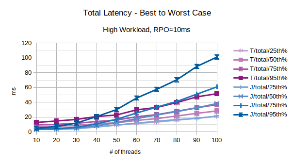

With the exception of the outliers, the above chart represents the characteristic latency introduced by LIXA:
- 25th% percentile can be considered an approximation of the best performance, the lowest latency
- 50th% percentile is the maximum latency of the best 50% transactions
- 75th% percentile is the maximum latency of the best 75% transactions
- 95th% percentile can be considered an approximation of the worst performance, the highest latency.
Series prefixed with "T" are related to the *traditional* state engine, series prefixed with "J" are related to the *journal* state engine.

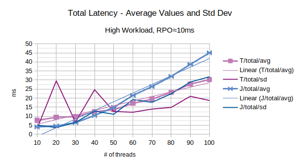

The last chart of the serie shows the average value of the total latency introduced by LIXA and the standard deviation of the total latency; series prefixed with "T" are related to the *traditional* state engine, series prefixed with "J" are related to the *journal* state engine. The *traditional* state engine provides in this scenario a better performance than the *journal* state engine.

#### Linux Key Metrics

Peak key metrics of the D2s v3 Azure Virtual machine for *traditional* state engine:
- CPU: 68%
- Disk operations/sec: 850/s

peak key metrics for *journal* state engine:
- CPU: 89%
- Disk operations/sec: 452/s

### Extreme Workload (normal RMs), RPO about 10s

The third series of charts is related to the behavior in presence of an extreme workload and RPO about 10ms:
- *t1* is in range 500-1500 microseconds
- *t2* is in range 500-1500 microseconds, this can be associated to the behavior of *fast* Resource Managers: both RMs takes 250-750 microseconds, on average, to perform they operation (inserting data, deleting a message, and so on...).

Log parameters of LIXA state engine have been multiplied by 100 to accomplish the larger workload:
- lixad/min_elapsed_sync_time: 1
- lixad/max_elapsed_sync_time: 10
- lixad/log_size: 52428800
- lixad/max_buffer_log_size: 13107200

The above parameters related to log are irrelevant for *traditional* state server because it does not use log files.

**Note:** this workload must be considered **extreme** because the time used by each RM is below the network latency and below the storage latency. Only a *colocated* Resource Manager implemented using an *in memory* approach can reach this sort of latencies. Anyway, the figures are interesting to discover the behavior of LIXA under such extreme conditions.

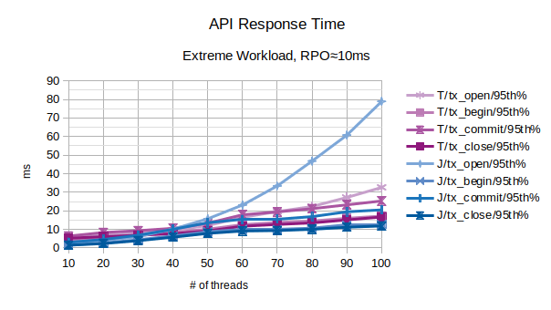

All the points in the above chart are related to the 95th percentile values; series prefixed with "T" are related to the *traditional* state engine, series prefixed with "J" are related to the *journal* state engine. From this chart, the *traditional* state engine appears to scale much better when the number of concurrent threads increases.
After 40 concurrent client threads, both the configurations start to slow down, but *traditional* state engine performs much better in terms of accepting new clients (tx_open).

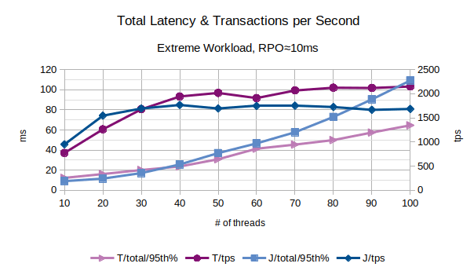

In the above chart are represented the 95th percentile values of the total latency introduced by LIXA in the transactions as the sum of open+begin+commit+close and the number of transactions per second that have been executed; series prefixed with "T" are related to the *traditional* state engine, series prefixed with "J" are related to the *journal* state engine.
The figures show that the *traditional* state engine sustain and higher workload and introduces a lower latency, with the exception of the lower numbers of client threads.

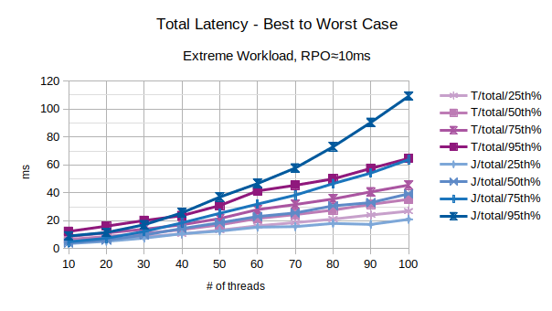

With the exception of the outliers, the above chart represents the characteristic latency introduced by LIXA:
- 25th% percentile can be considered an approximation the best performance, the lowest latency
- 50th% percentile is the maximum latency of the best 50% transactions
- 75th% percentile is the maximum latency of the best 75% transactions
- 95th% percentile can be considered an approximation of the worst performance, the highest latency.
Series prefixed with "T" are related to the *traditional* state engine, series prefixed with "J" are related to the *journal* state engine.
The figures show that only in the best case, 25th percentile, the *journal* state engine provides a better performance than the *traditional* state engine.

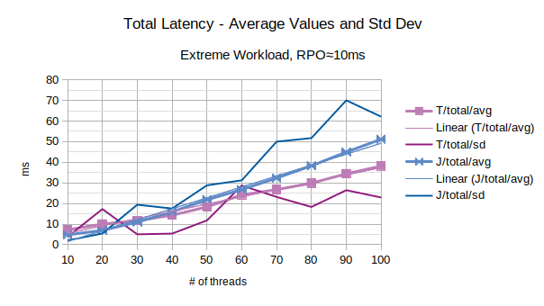

The last chart of the serie shows the average value of the total latency introduced by LIXA and the standard deviation of the total latency; series prefixed with "T" are related to the *traditional* state engine, series prefixed with "J" are related to the *journal* state engine. The *traditional* state engine introduces a lower latency with the exception of the lower numbers of client threads.

#### Linux Key Metrics

Peak key metrics of the D2s v3 Azure Virtual machine for *traditional* state engine:
- CPU: 68%
- Disk operations/sec: 783/s

peak key metrics for *journal* state engine:
- CPU: 92%
- Disk operations/sec: 459/s

### Final Notes on "Figures, Charts & Explanations"

Raw data shows that under some circumstances, the *traditional* state engine provides better figures. The reader must pay attention that such better figures are mainly related to saturation conditions that are of no practical use.

In other words: the *traditional* state engine can sustain higher rates of *transactions per second* in comparison with the *journal* state engine, but the behaviour is related to an oversaturation condition that is of no interest because the latency introduced is too high.

Raw data shows another important fact: the environment used for the benchmark (Microsoft Azure) is **very noisy**. LIXA shows a linear dependency between the injected workload and the average latency in any condition, but the standard deviation is sometime high or very high.
